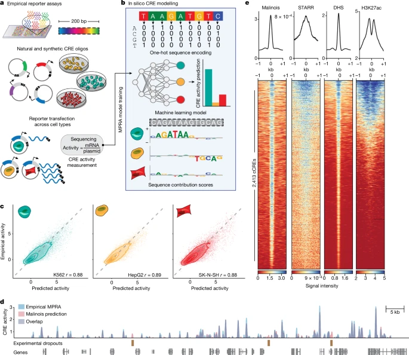
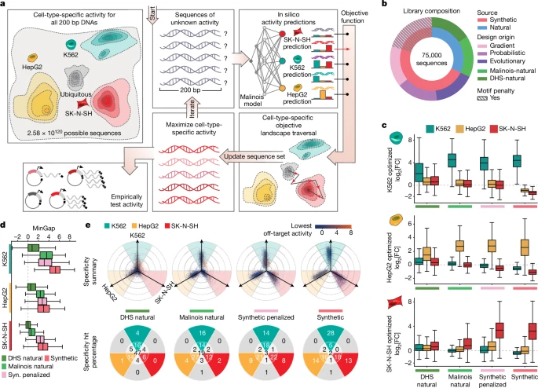
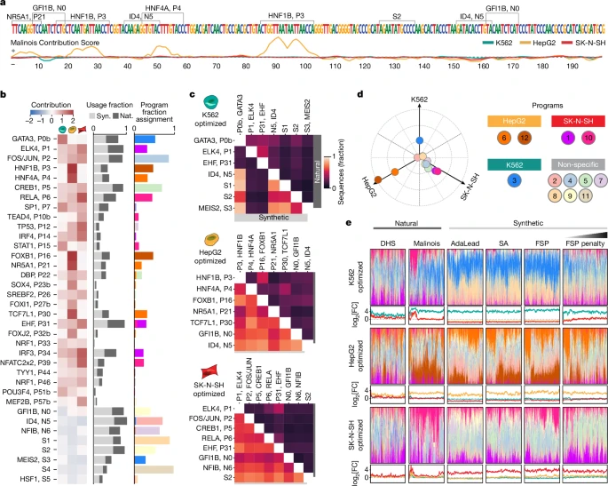
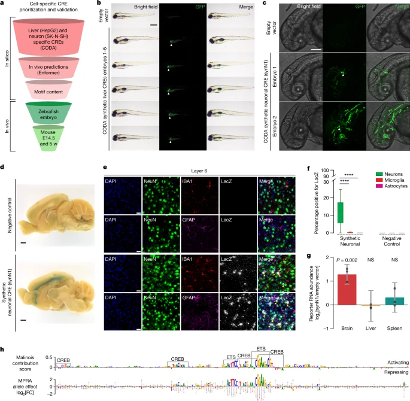
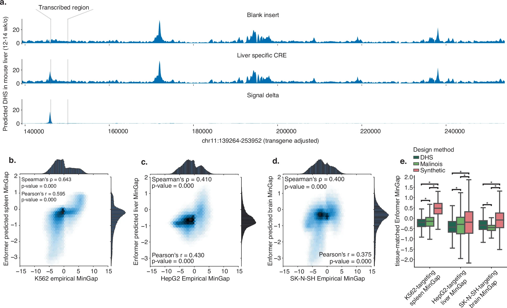
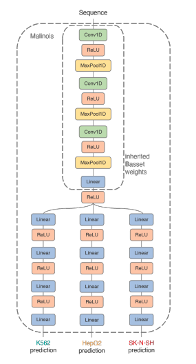

元論文: **[Machine-guided design of cell-type-targeting cis-regulatory elements](https://www.nature.com/articles/s41586-024-08070-z)**

**この記事は、元論文を筆者が理解しやすいようにまとめたものであり、論文の内容を正確に反映しているとは限りません。**

## AI要約

この論文は、機械学習を用いて細胞型特異的なCis-reguratory elements（CREs）を設計し最適化する新しい方法を提案している。研究者らは、Massively Parallele Reporter assay（MPRA）データを使用してCNNベースのモデル「Malinois」を訓練し、このモデルを用いて細胞型特異的なCREsを予測した。さらに、配列最適化フレームワーク「CODA」を開発し、in vitroおよびin vivo実験でその有効性を実証した。

## この論文でやっていること

- MPRA (Massively parallel Reporter Assay) で CREs (Cis-regulatory elements) の活性をCell typeごとに測定
- CNNベースのモデル Malinois を前述の結果を元に構築
- Malinoisの予測結果をguideにして、配列の最適化を行うフレームワーク CODA (Computational Optimization of DNA Activity) を作成
- Integrated Gradientを使ったcontribution scoreを用いることで、どの配列モチーフが重要かを同定
- in vivo (zebrafish / mouse cortex) で実際にCREを発現させた時の挙動確認

## 結果

### Malinois 構築

MPRAを使って776,474の200bpのCREsの活性を3種のCell type; K562 (erythroid precursors), HepG2 (hepatocytes) and SK-N-SH (neuroblastoma) で実験的に確認し、その結果を教師として、配列から3つのCell typeの活性を予測するCNNベースのモデル Malinois を構築している。その結果は、相関 (Fig. 1c) や実際のMPRAの発現とのoverlap (Fig. 1d)、その他epigenetic baseの手法; [STARR-seq](https://genomebiology.biomedcentral.com/articles/10.1186/s13059-020-02156-3) (enhancer)、[DHS](https://www.nature.com/articles/nature11232) (DNase I hypersensitive sites)、H3K27ac (active histon mark)との比較 (Fig. 1e) を見ると、だいたい正しく予測できてそう、というのがわかる。

## Cell-type specific activityを持つ配列の最適化

200bpのCREsを最適化する。基本的には、target cell typeと残り2つのcell typeのactivityの差が最大化するような目的関数を置く (MinGap)。単純な最適化を行うと、特定のモチーフのみに収束してしまう。この実験では、多様なCREsを得たいので、k-mer diversityを最大化するように特定のモチーフにペナルティを与える (Motif penaltiy)。

手法としては、勾配法ベースのFastSeq Props、進化アルゴリズムベースのAdaLead, Simulated Annealingの3つの手法を試している。

結果として、生成した51000のSynthesis, Syn. penalized CREsと実際にDNAに存在する24000のDHSとMarinoisの結果選ばれたCREsが候補になり、これらの配列を使ってMPRAを行った (Fig. 2b)。実験すると、それぞれのCell type specificな発現が実際にin vitroで確認された (Fig. 2c)。MinGapはSynthetic > Syn. penalized > Marinois natural > DHS naturalの順のスコアに平均的にはなっている (Fig. 2d, e)。

Synthetic CREsが実際のDNAのCREsより高い細胞特異性を示すのがなぜかをTF (Transcription Factor) の文脈から分析している。Integrated Gradientsベースの手法で、重要な配列を可視化したあと、いくつかのツール (TF-MoDISco等) を使って重要な配列に含まれるモチーフを抽出した。

36個既知のTFのモチーフがあって、28個がactivation、8個がrepressionだった。基本的には既知の研究でそのCelltypeで重要な役割を果たすTFのものであった。これらのモチーフは、Syn配列でもNatural配列でも少なくとも1回は使われていたが、使用される頻度が異なる (Fig. 3b)。Syn配列では、より多くのモチーフがCREsに含まれていて、Syn. Penalized配列では、non-redunduntなモチーフ構成になっていた。

また、Syn配列では、特異的なモチーフペアが高頻度に使われていた。例えば、K562 cellsでは、GATA3とMEIS2 (S2) のペアが89.2%の配列で使用されていた (Fig. 3d)。

NMFをすると、12の要素に分かれて、Cell type specificな要素とNon specificな要素があった (Fig. 3d)。この要素の使われ方は、Natural配列・Syn配列で構成のされ方がかなり違っていて、また、配列生成の手法によっても異なる使われ方が見られている (Fig. 3e)。

In vivoでの活性を確認するため、まずはEnformerで発現量、epigeneticな状態の予測を行った。その結果、MinGapのスコアは、それぞれK562 → spleen (脾臓)、HepG2 → Liver、SK-N-SH → brainと相関していた (Extended Data Fig. 8)。この結果を実際にZebrafishとMouseで確認すると、それぞれ特異的な発現パターンを示した (Fig. 4)

## Method

### モデルアーキテクチャ

### 配列最適化

手法

- [Fast activation maximization for molecular sequence design](https://bmcbioinformatics.biomedcentral.com/articles/10.1186/s12859-021-04437-5)
	- 勾配法
- [AdaLead: A simple and robust adaptive greedy search algorithm for sequence design](https://arxiv.org/abs/2010.02141)
	- 進化アルゴリズム
- Simulated Annealing

Model penalization

CNNモデルが好むモチーフがあって、そのモチーフだけが生成されると多様性が低くなってしまうので、モチーフが分散するようにlossにpenalizationを入れている。なので、Fast SeqPropsでしかこの手法は使ってない。

## 感想

- 生成というよりは配列の最適化（これはフレームワーク名からもそうだが、タイトルは生成っぽい）
- 200 bpにした理由は少し気になる。単純に合成できるオリゴの限界を考えるとそんなものかもしれない
- 今回はCell typeだったが、Chemicalとかに反応するCREsとか設計できると、実験的には使いやすそう
- 最後にzebrafish使ってるが、enformerでも、この論文のモデルでもzebrafishが学習に使ってなさそうなのにうまくいってるのが不思議。Disucussionでも驚いたって書いてあるけど、何か深堀できる実験があると面白そう
