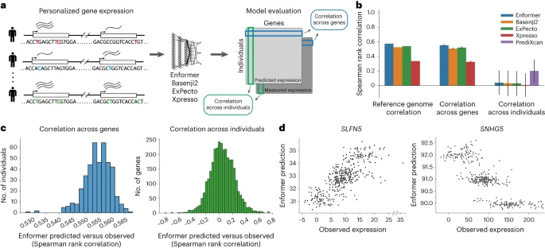
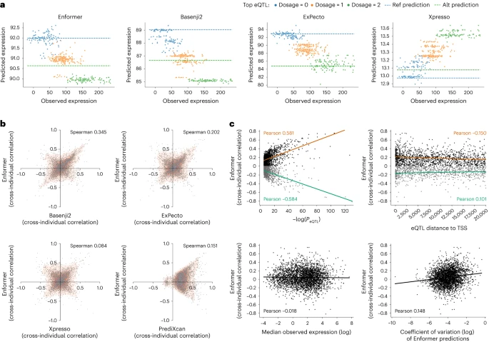
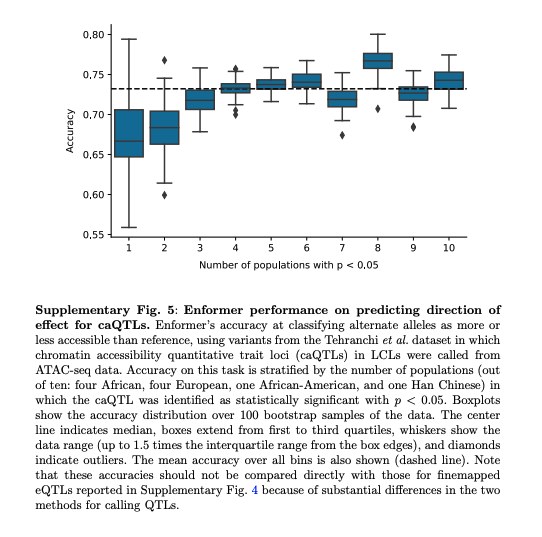

元論文: **[Personal transcriptome variation is poorly explained by current genomic deep learning models](https://www.nature.com/articles/s41588-023-01574-w)**
**[GitHub](https://github.com/ni-lab/personalized-expression-benchmark)**

**この記事は、元論文を筆者が理解しやすいようにまとめたものであり、論文の内容を正確に反映しているとは限りません。**

## この論文でやっていること

- 4つの深層学習モデルについて、個人のゲノムから、個人の発現量を予測できるかを確認している。
- WGS (1000 genome) と RNAseq (lymphoblastoid cell lines) のペア (n = 421) を利用

### 使用されているモデル

- Enformer: CNN + Transformer
  - [Avsec, Ž. et al. Effective gene expression prediction from sequence by integrating long-range interactions. ](https://doi.org/10.1038%2Fs41592-021-01252-x) [_Nat. Methods_](https://doi.org/10.1038%2Fs41592-021-01252-x)  [**18**](https://doi.org/10.1038%2Fs41592-021-01252-x) [, 1196–1203 (2021).](https://doi.org/10.1038%2Fs41592-021-01252-x)
- Basenji2: CNN
  - [Kelley, D. R. Cross-species regulatory sequence activity prediction. ](https://doi.org/10.1371%2Fjournal.pcbi.1008050) [_PLoS Comput. Biol._](https://doi.org/10.1371%2Fjournal.pcbi.1008050)  [**16**](https://doi.org/10.1371%2Fjournal.pcbi.1008050) [, 1008050 (2020).](https://doi.org/10.1371%2Fjournal.pcbi.1008050)
- ExPecto: CNN
  - [Zhou, J. et al. Deep learning sequence-based ab initio prediction of variant effects on expression and disease risk. ](https://doi.org/10.1038%2Fs41588-018-0160-6) [_Nat. Genet._](https://doi.org/10.1038%2Fs41588-018-0160-6)  [**50**](https://doi.org/10.1038%2Fs41588-018-0160-6) [, 1171–1179 (2018).](https://doi.org/10.1038%2Fs41588-018-0160-6)
- Xpresso: CNN
  - [Agarwal, V. & Shendure, J. Predicting mRNA abundance directly from genomic sequence using deep convolutional neural networks. ](https://doi.org/10.1016%2Fj.celrep.2020.107663) [_Cell Rep._](https://doi.org/10.1016%2Fj.celrep.2020.107663)  [**31**](https://doi.org/10.1016%2Fj.celrep.2020.107663) [, 107663 (2020).](https://doi.org/10.1016%2Fj.celrep.2020.107663)

4つのモデルを評価するため、eQTL遺伝子座3259を同定した。

まず、これらの遺伝子の発現量 (正確にはCAGEの結果) をReference genomeを利用してモデルを使って予測し、それぞれの個人の発現量の中央値との相関を調べたところ、基本的に0.5程度の相関係数を示した (reference genome correation; Fig. 1b)。このことから細胞種ごとの遺伝子発現量を4つのモデルがある程度正確に予測できるという結果が再現された。

それぞれの個人の配列について調べるため、TSSをそれぞれの個人の配列にSNP情報を用いて置換した配列と、実測値としての発現量を用意した (Fig. 1a, 1b)。

用意したデータセットについて、4つのモデルを利用して予測を行い、評価を行った。

その結果、各個人の遺伝子全体を予測値と、実測値の相関係数は同じく0.5程度であり、概ねReference genomeの結果が再現された (correation across genes; Fig. 1b)。

一方で遺伝子1つの個人全体の予測値と、個人全体の実測値の相関係数はほぼ0であった (correation across individual; Fig. 1b)。また、線形モデル (PrediXcan) を使って学習を行ったところ、4つのモデルより高い結果が得られた (correation across individual; Fig. 1b)。

correlation across individualとcorrelation across genesを見ると、correlation across genesでは安定して0.55程度の相関係数が見られるのに対し、correlation across individualでは相関係数が-0.8 - 0.8と強い正の相関と負の相関が共に観察された (Fig. 1c, 1d)。このことから、variant effectの方向性をモデルが学習できていない可能性が示唆された。

これらの相関性について調べるため、4つのモデルで_SNHG5_がどういうパターンを示すか調べた (Fig. 2a）。色はvariantがどの程度発現に寄与しているかを示しており、Enformer / Basenji2 / ExPectoは同じ傾向を示しているが、Xpressoは全く反対の予想をしている。これらのモデル間での予測がある程度同じ傾向を示しているかを確認したところ、相関性は大きくなかった (Fig. 2b)。

次にどういう遺伝子について予測がうまくいっているのか、というのを確認した。

2cについてそれぞれ以下のことを示している。

- 左上: pval → 高くても低くても強い負の相関がある。制御の方向性が理解できていない。
- 右上: TSSからの距離 → 近い方が正の相関が多い。プロモーターレベルはある程度捉えているが、長距離の相関がうまくとれていなそう。
- 左下: 発現量の中央値 → トレンド特になし
- 右下: 変動係数 → トレンド特になし

memo:

Fig. 2bについてEnformerとBasenji2の相関は比較的大きいが、ほぼアーキテクチャを共有しているので、それはそうという感じがする。

### その他

open chromatinの予測も微妙そうだが、調査が必要。

## Conclusion

ある程度のvariantの存在や重要な制御配列は認識できてそうだが、その制御の方向を学習できていない。
