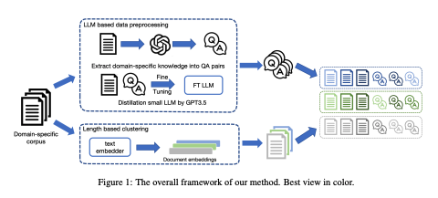
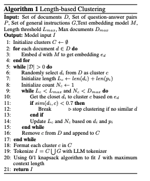
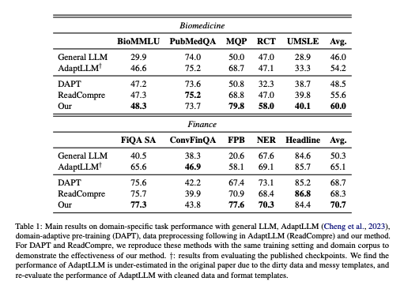
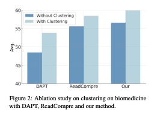
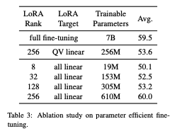

全体として、2024/08/15時点では実験の詳細やコードなどが存在せず、妥当性が判断しにくい。


## AI要約


この研究は、長文読解を通じてドメイン適応の性能を向上させる方法を提案しています。具体的には、LLM（大規模言語モデル）による質問応答（QA）生成と、文書の長さに基づくクラスタリングを組み合わせることで、特定のドメインに適応させる性能を向上させました。LoRA（Low-Rank Adaptation）を用いた微調整（finetune）によって、全パラメータを調整する方法と同等の性能が得られました。具体的な成果として、バイオメディカル分野で6.8%、金融分野で5.6%の性能向上が確認されました。


研究の背景として、ドメイン特化モデルの作成方法にはフルスクラッチと継続学習があります。しかし、従来の継続学習ではプロンプトへの対応能力が損なわれる可能性があることが指摘されています。本研究では、LLMを用いたQA生成により、従来の方法よりも優れた性能が得られることが示されました。


また、文書の長さと数に基づいたクラスタリングを行い、LLMのコンテキスト長の限界まで類似文書を入力することで性能を向上させました。このクラスタリングの有効性はアブレーションスタディによっても確認されており、クラスタリングを行うことで全体的な性能が改善されることが示されました。


さらに、LoRAを用いた微調整においては、全パラメータを調整する方法と同レベルの性能向上が見られました。特に、ドメイン適応の目的でLoRAを適用する場合、全ての線形層をターゲットにしてランクを大きくすることが重要であるとされています。


総じて、この研究はLLMを用いたQA生成とクラスタリングを組み合わせることで、特定のドメインに対して高い適応性能を実現する方法を示しています。


## 背景

- ドメイン特化のモデル作成にはフルスクラッチと継続学習がある
- Cheng et al., 2023
	- raw corporaを用いた継続学習は、プロンプトへの対応能力を損なう可能性があることが明らかになった
	- 正規表現を用いてraw domain corporaを言い換えた読解テキストを学習することでドメイン固有のタスクのパフォーマンスとGeneralなプロンプト能力が増加する
- 質問応答だけではドメイン固有の知識を得るには短すぎる可能性があることが明らかにされている

## 研究成果

- 正規表現ではなく、LLMによるQA生成を用いることで性能が向上した
- 類似の文書をLLMのコンテキスト長の限界まで入力できるように長さとドキュメント数を制限したクラスタリングを行うことで性能が向上した
- LoRAを用いたfinetuneでfull parameter finetuneと同レベルの性能上昇が見られた




## Methods


### LLM-based data preprocessing


以下のようなプロンプトであるドメインのドキュメントに対してQAペアを生成する。


```text
{DOCUMENT} Ask a few questions to help understand the 
above passage about {DOMAIN} and give
the corresponding answers in JSON list
(each JSON contain two keys: question
and answer). 
```


この時、gpt-3.5-turboを使うが、コーパスすべてに使うにはコストが高いので10000文書はAPIで処理し、残りはLLaMa 7Bの蒸留を行い、そのLLMを用いて作成を行った。


### Length based clustering


Embeddingを作成して類似度でクラスタリング。その時、各クラスタには長さとDocument数の制限があり、その制限に達する or 類似する文書がなくなるまでクラスタにDocumentを追加していく。そのあとQAとかAdaptLLMの言い換えとかを行う。最後にLLMのContext長に収まるようにDPする。





### Datasets

- domain specific corpora
	- Pubmed abstracts
	- FinGPT
- General Instruction
	- Lima
	- WizardLM
	- Orca

## Main results

- AdaptLLMより全体的に性能が改善している。(Biomed 6.8%, Finance 5.6%)
- AdaptLLMと同様に作成したReadCompreでも結果が再現し、本論文の手法がそれより優れていることがわかった。



- Length based clusteringの有無についてablation studyを行った結果、raw corpora, readcompre, 本論文の手法すべてでclusteringがあった方が良い結果が得られた



- ドメイン適応の目的でLoRAを行う場合、all linearをターゲットにしてrankを256のような大きな値にするのが大切。翻訳などの下流タスクではrank 8くらいが適切らしい。




## 感想

- Lawドメインに対する比較がない
- AdaptLLMと違って、QAしか形式が用意されていない。AdaptLLMではFLANデータセットなどのGeneralなprompt能力の上昇が確認されているが、そういった実験だとどうなるのか気になる
- LoRAの細かいハイパラが知りたい
