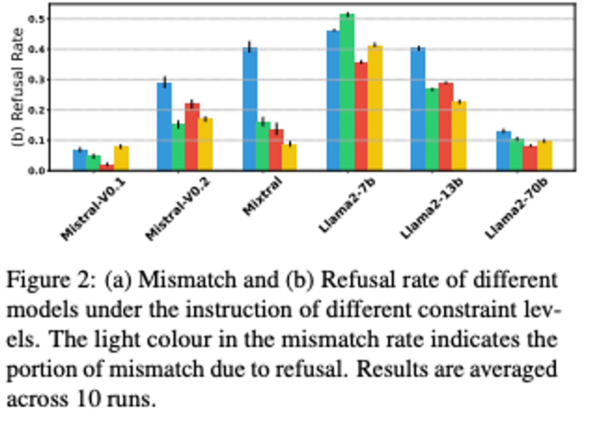

## AI要約

多肢選択問題におけるLLMの評価方法として、First token probability（最初のトークンの確率）と実際のテキスト出力の間にミスマッチがあることが指摘されています。このミスマッチは、Instruction-tunedモデルがユーザーへの応答やポリシーに沿わない回答を拒否する際に発生することが多いです。

この研究では、6つの異なるモデルを用いてFirst token probabilityと実際のテキスト出力の評価を行いました。結果、First token probabilityだけではなく、実際のテキスト出力を評価することが、LLMの性能を正しく評価するために必要であることが示唆されました。特に、モデルのサイズやプロンプトの形式によって結果が大きく変わるため、実際の出力テキストを評価する方が一貫性が高いとされています。

実験では、MMLUとOpinionQAのデータセットが使用され、Llama2-ChatやMistralなどのモデルが評価されました。評価方法としては、MMLUの評価には既存の分類器を使用し、OpinionQAでは手動でラベル付けしたデータを用いてMistral-7bモデルをQLoRAでファインチューニングしたものを使用しました。

結果として、First token probabilityと実際のテキスト出力の間に大きなミスマッチが見られました。特に、モデルサイズが小さいほど、このミスマッチが顕著に現れました。また、プロンプトにExample（一例）を与えると、Llama系列のモデルではミスマッチ率が高くなることも確認されました。

さらに、制約を強化することで拒否率が下がり、モデルサイズが大きくなると拒否率も下がることが分かりました。Mistral v1からv2への移行では、より強い制約がかかっているため、拒否率が高くなっています。

まとめると、First token probabilityはLLMの能力を正確に評価する手法としては不十分であり、実際の出力テキストを評価する方が適切であると結論付けられます。

## 背景

多肢選択問題はLLMの性能を評価する上でメジャーなベンチマークだが、その評価方法であるFirst token probability (logitが最大のtokenを選ぶ) は実際のテキスト生成との間にミスマッチがあることがある。1つの原因として、Instruction modelはユーザーへの応答のためにtuningされており、回答の前置き (Sure etc.,) を行ったり、ポリシーに沿わないものへの解答を拒否する、といった挙動があることあげられる。

この論文では、First token probabilityとテキスト出力のミスマッチについて6つのモデルを用いて評価した。結果として、First token probabilityだけではなく、実際のテキスト出力を評価することが正しいLLMの評価として必要であることが示唆された。

## 実験設定

### 使用したデータセット

- MMLU
- OpinionQA

### Prompt形式

### 評価に使用したモデル

- Llama2-Chat (7B, 13B, 70B)
- Mistral-instruct-v0.1, 0.2
- Mixtral-8x7b-instruct-v0.1

### 出力されたTextの評価

- mmluに関しては先行研究が提供するclassifierを使用
- OpinionQAについては、それぞれ回答をモデルごとに生成し手動でラベルをつけた後、そのデータを用いてMistral-7bをQLoRAでfine-tuningしたものをclassifierとして用いた

PEFTしたモデルはString matchやPEFTしてないモデルに比べて非常に高い精度を示している。

## Results

### Mismatch

- Fig 2-a
	- Mistral系列はLlamaよりよくInstructionに従う
	- 全てのモデルは制約が強くなるに従ってMismatchは減少する
	- モデルサイズの増加に伴い、指示に従うようになる
- Table 3
	- 特に小さいモデルにおいては指示に従わない (Mismatch率が高い) と、TextとFirst tokenの手法による差が大きくなってしまう。

### Example templateがmismatchが高くなる理由について

- Llama系列ではExampleを与えるとMismatch率が高くなる (Fig 2-a)
- これはExampleの `Answer: C` がbiasとしてかかってる (Fig 3 上)
- 実際、`Answer A/B/C` のように入れると、A, Bの確率も高くなる (Fig 3 下)

### Reject動作について

- 制約を強くすると拒否率は下がる
- モデルが大きくなると拒否率が下がる
- mistral v1 → v2で拒否率が高くなっているのはより強いlimitがかかっていると考えられる
- llamaの方が全体的に拒否率が高い
- MMLUでも拒否は起こる
	- 例えばllama 7B chatでは”moral scenario”の問題は拒否される

### Text出力の方がFirst token probabilityより一貫性が高い

- Mixtralを除くと、解答の一貫性はtextを出力させた方が高い (値が低いほど一貫性が高い)。
- Modelのサイズが大きくなると差は少なくなっていく。

## Conclusion

First token probabilityは実際のLLMの能力を実際に測れているかは怪しい。First token probabilityはRejectされる場合にの問題や、プロンプト形式によって結果が大きく変わるなどの問題がある。そのため、LLMの能力を測るには実際の出力テキストを評価するほうが適切であると考えられる。

## 感想

- 結果そのものは、まあそれはそうという感じ
- String matchの結果が悪いので、実際にテキスト出力を評価する場合はclassfierを作らないと悲惨な結果を得そう。ゼロショットでもmistral 7Bクラスだとよくないので、手軽ではない。
- その部分のコストがかかるのがText出力を評価する場合のネック
- GPT4o-miniやGemma2-9Bなど強くて安価 or 小さいモデルが出現してきているのでそういったものでゼロショットでできるようになればText出力評価も現実味が出てくるかもしれない
