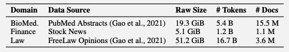

## AI要約

この論文は、ドメイン特化の生データを読解テキストに変換する新しい方法を提案しています。この方法により、生物医学、経済、法律など特定の分野における能力の向上と、汎用的なプロンプト対応能力の獲得が確認されました。具体的には、通常の継続事前学習(DAPT)ではプロンプト能力が低下することがある一方で、提案された読解テキストを用いる方法が最も良い結果を示しました。

実験結果によれば、読解テキストを用いることで、ドメイン知識の習得とプロンプト解釈能力の両方が向上します。これは、ドメイン特有のコーパスフォーマットの多様性が少ないことに起因する問題を解決するためのアプローチとして有効であることが示されています。具体的なタスクとしては、要約、単語変換、自然言語推論、常識的な推論、パラフレーズ検出、テキスト補完などが含まれます。

さらに、正規表現を用いたタスク評価や一般的な指示学習データセット(LIMA, WizardLM, Orca)を用いた学習も行われています。メインの結果としては、提案手法(AdaptLLM)が他の手法よりも良い結果を示しており、特定のタスクにおいても優れた性能を発揮しています。アブレーションスタディでも、読解テキストを用いる手法が最も良い結果を示しており、ドメイン知識とプロンプト解釈能力の両方が向上することが確認されました。

最後に、FLANデータセットを用いて評価を行った結果、読解テキストを用いるとプロンプト能力が大幅に向上することが示されています。特に、生物医学と法律の分野では、読解テキストを使用することで大幅な性能向上が見られました。

## この論文で述べられていること

- domain specificなraw corporaで学習すると、ドメイン知識は習得できるが、汎用的なプロンプトへの対応能力がなくなる
- 本論文では、raw corporaを読解テキストに変換する方法を提案する
- この方法で、生物医学、経済、法律分野での能力向上と汎用的なプロンプトへの対応能力の獲得が認められた

## 課題感

LLaMaを使った実験。DAPT (通常の継続事前学習) を行うと、Prompting能力が下がってしまうことがある。単純にPromptを与えて解いた時と、それぞれの問題にFinetuneした時の結果の比較。


これはドメイン特有のコーパスの中にはフォーマットの多様性がないことに起因するのではないかという仮説。

### Domain specific corpus



## 読解テキストへの変換


Raw textを以下のTaskごとにそれぞれの生成を行い、Raw textの後に繋げる。繋げたことを示すために `\n\n` を入れる。この生成は完全にルールベースで行われる (LLMは用いない)。

c.f. [https://github.com/microsoft/LMOps/blob/main/adaptllm/utils/read.py](https://github.com/microsoft/LMOps/blob/main/adaptllm/utils/read.py)

- Summarization
- Word to text
  - ドメイン特有のwordの判定は、generalなtextとdomain specific
  - なデータから作られたtokenizer (sentence piece)を比較して、generalなtextに含まれていない10文字以上の単語を選択する。
- Natural Language Inference
- Commonsense Reasoning
- Paraphrase Detection
- Text Completion
  - LLMではなく、半分を切って、その半分に何が続くかを作成する

  ```javascript
  "Please complete an article about {domain}: {context_1st_half} {context_2nd_half}{qa_demos}";
  ```

### Examples


## 実装の詳細

正規表現を使ってそれぞれのタスクがraw corpusに含まれているか評価し、含まれている場合規定の言い換えを行う。

SENTxは文章、VERBALは正規表現の表に入っているもの、WORDはなんらかの単語


正規表現は以下の表のようになっている。


## General Instructions

[LIMA](https://arxiv.org/abs/2305.11206), [WizardLM](https://arxiv.org/abs/2304.12244), [Orca](https://huggingface.co/datasets/Open-Orca/OpenOrca)のデータセットを用いて一般的な指示学習を行っている。

## Main Results

General Instruction + 読解テキストを用いた学習を評価している。比較対象は、ベースモデル、存在する場合はベースモデルから作成された特化モデル、raw corpusを使って訓練されたモデル、提案手法。


AVERAGEでは基本的にAdaptLLM (今回の手法を使って訓練したもの) が良い結果を収めている。必ずしもそれぞれのタスクで全てよくなっているというわけではない。例えばUMSLEはよくなってないが、UMSLEが上がらないのはコーパスがPubmedだからな気もする。

DAPTは普通の継続学習をしたもの。ベースモデルはそれぞれのセクションの一番上

### Task詳細


## Ablation study


提案手法が一番良い結果を示している。Gen. Insが結構強く見えるが、Rawと比べると一応上昇しているので良いのか。少なくとも相乗的な効果はある。

## ドメイン知識とプロンプトの解釈能力


### Domain Knowledgeの評価

右の図は以下の表の平均を表している。基本的に読解テキストを使うのが一番良くなっている。


### Domain knowledge probing

多肢問題のtoken probabilityを見ている。

Bio: MedMCQA

Law: LEDGAR dataset

### Prompt ability

FLANデータセットを使って評価。

- Raw textだとGeneral LLMより悪くなる部分がある (Read Compre, Close QA, Paraphrase, NLI, Common Reason)。
- 読解テキストを使うと、Prompt abilityもGeneral LLMより大幅に伸びていたりする(Paraphraseだけ若干悪くなっている)。
  - Ablation studyがあって、Paraphraseを外すと性能が上がる
  - ただしDomain taskにはparaphraseも寄与している

  

実際の結果は以下の表 (Appendix E)


## 関連ページ

- [open review](https://openreview.net/forum?id=y886UXPEZ0)
- [Github](https://github.com/microsoft/LMOps)
