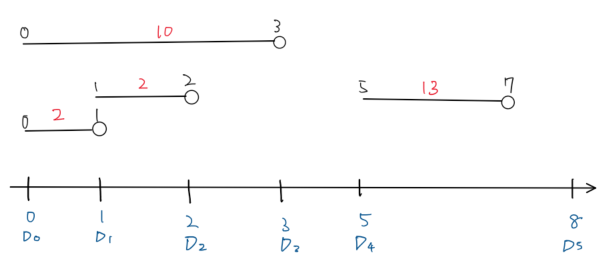
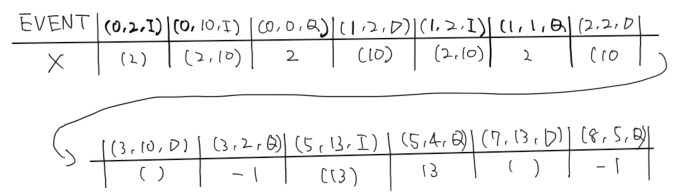

## 概要

半開区間$[S_i, T_i)$の集合が与えられます。区間ごとに値$X_i$が与えられているとします。これらの区間は重なっていることもあります。

このとき、以下のクエリが与えられます。
地点$D_i$の位置に定義されている$X_i$の最小値（または最大値）を答えてください。

## 考え方

[ABC128-E](https://atcoder.jp/contests/abc128/tasks/abc128_e)の例を考えます。



図としてはこのようになっており、それぞれのクエリの最小値を求める必要があります。
このとき、$X_i$についての集合$X$を考えます。そして、左端の部分を$X_i$の$X$への挿入、右端の部分を$X_i$の$X$からの削除というイベントとしてとらえます。また、クエリはクエリというイベントとして処理してみます。

このとき、

1. 挿入イベント $(S_i, X_i, I)$
2. 削除イベント $(T_i, X_i, D)$
3. クエリイベント $(D_i, Index, Q)$

というイベントがあることになります。これらのイベントを場所順に処理していきます。挿入イベントと削除イベントは順不同ですが、クエリイベントは同じ場所の挿入・削除終了後に処理される必要があります。

ABC128の例を処理してみると以下のようになることがわかります。



こうすると、場所$D_i$における範囲の持つ値は、集合$X$に入っている値になります。なので、クエリイベントでは、集合$X$の最小値がその場所における答え、ということになります。Indexを用意しておくと、答えの配列に直接最小値を書き込めます。

上の例では複数回同じ値が集合$X$に挿入されませんでしたが、実際には複数回の挿入があり得ます。そこで、集合$X$を扱うためのデータ構造としては、`multiset`を使う必要があります。

## 実装 in Rust

[例](https://atcoder.jp/contests/abc128/submissions/26250585)

### multiset

Rustでは`multiset`はないので自分で実装する必要があるようです。

`BtreeMap`を使えば比較的簡単に順序付き`multiset`もどきを実装できます。keyとして集合として扱いたい値を持ち、valueとしてカウントを持ちます。カウントが0になれば、keyを削除します。

```rust
use std::collections::BTreeMap;

/// Ordered MultiSet
#[derive(Debug, Clone)]
pub struct BMultiSet<T> {
    pub inner_map: BTreeMap<T, usize>,
}

impl<T: Ord> BMultiSet<T> {
    pub fn new() -> Self {
        Self {
            inner_map: BTreeMap::new(),
        }
    }

    /// Insert Value
    pub fn insert(&mut self, x: T) {
        *self.inner_map.entry(x).or_insert(0) += 1;
    }

    /// Decrement count of the value.  
    /// If count is zero, remove this value.
    pub fn erase_one(&mut self, x: T) -> Option<T> {
        if let Some(count) = self.inner_map.get_mut(&x) {
            *count -= 1;
            if *count == 0 {
                self.inner_map.remove(&x);
            }
            Some(x)
        } else {
            None
        }
    }

    /// Return count of value
    pub fn count(&self, x: &T) -> Option<&usize> {
        self.inner_map.get(x)
    }

    /// Remove value regradless of count
    pub fn erase_all(&mut self, x: T) -> Option<T> {
        self.inner_map.remove(&x);
        Some(x)
    }

    pub fn min(&self) -> Option<&T> {
        self.inner_map.iter().nth(0).map(|x| x.0)
    }

    pub fn max(&self) -> Option<&T> {
        self.inner_map.iter().last().map(|x| x.0)
    }

    pub fn is_empty(&self) -> bool {
        self.inner_map.is_empty()
    }
}
```

### enumにおけるPartialOrd

`Action`は`enum`として定義できると嬉しいです。Rustのenumに`PartialOrd`を`derive`すると、上から順番に大きいと判断されます。

```rust
#[derive(Debug, PartialEq, PartialOrd)]
enum Action {
    Insert,
    Delete,
    Query,
}

#[test]
fn test_partialeq() {
    assert!(Action::Insert > Action::Query);
    assert!(Action::Delete > Action::Query);
}
```
