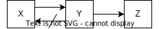

## TL;DR

正規化は、関係データベースにおける更新時異常（挿入、更新、削除に伴う不整合）を排除するために行います。
第一正規形（1NF）では原子的な値を持たせ、第二正規形（2NF）では部分関数従属を排除し、第三正規形（3NF）では推移的関数従属を取り除きます。さらに、ボイス・コッド正規形（BCNF）や第四、第五正規形ではより高度な従属性を扱い、データの整合性を強化します。

## 実行環境

以下の`docker-compose.yaml`を利用します。

```yaml title=docker-compose.yaml
services:
  postgres:
    image: postgres:16
    environment:
      - POSTGRES_USER=postgres
      - POSTGRES_PASSWORD=postgres
      - POSTGRES_DB=postgres
```

## 関係データベースにおける正規化 (Normalization) の目的

正規化の目的は、**更新時異常**を排除することです。

更新とは、データの**挿入**、**更新**、**削除**のことを指します。正規化を行うことによって、1つのデータが1つの場所にのみ存在することを保証することができます。これによって、データの重複がなくなり、更新時に複数の場所を更新する必要がなくなり、データの整合性が担保されます。

## 正規化の種類

代表的な正規化の種類は以下の通りです。
第一から第三正規形までが一般的に使われることが多いです。
これは、情報無損失分解かつ関数従属性保存が保証され、更新時異常のほとんどがこの段階で排除されるためです。

- 第一正規形 (1NF, The First Normal Form)
- 第二正規形 (2NF, The Second Normal Form)
- 第三正規形 (3NF, The Third Normal Form)

---

- ボイス・コッド正規形 (BCNF, Boyce-Codd Normal Form)
- 第四正規形 (4NF, The Fourth Normal Form)
- 第五正規形 (5NF, The Fifth Normal Form)

## 正規化による性質の保存可否

| 変換元               | 変換先               | 関数従属性 | 多値従属性 | 結合従属性 | 情報無損失 |
| -------------------- | -------------------- | ---------- | ---------- | ---------- | ---------- |
| 第一正規形           | 第二正規形           | ◯          | ◯          | ◯          | ◯          |
| 第二正規形           | 第三正規形           | ◯          | ◯          | ◯          | ◯          |
| 第三正規形           | ボイス・コッド正規形 | x          | ◯          | ◯          | ◯          |
| ボイス・コッド正規形 | 第四正規形           | x          | ◯          | ◯          | ◯          |
| 第四正規形           | 第五正規形           | x          | x          | ◯          | ◯          |

## 第一正規形 (1NF, The First Normal Form)

第一正規形とは、全ての属性が**原子的な値** (不可分な値、単一の値)を持つことです。つまり、繰り返しグループや複数の値を持つセルを持たないことを指します。

### 非正規形の例

以下の表は、非正規形の例です。直積集合や冪集合を持っているため、第一正規形を満たしていません。
また、この状態ではRDBのテーブルへの格納が困難です。

- 直積集合: 山田太郎 (1) や、りんご (1) などの複数の値を持つセルを指します。
- 冪集合: 1行に複数の値を持つことを指します。Excelでいうところの結合セルのようなものです。

| 伝票番号 | 顧客名 (顧客番号) | 商品名 (商品番号) | 数量 | 単価 |
| -------- | ----------------- | ----------------- | ---- | ---- |
| 1        | 山田太郎 (1)      | りんご (1)        | 2    | 100  |
|          |                   | みかん (2)        | 3    | 200  |
| 2        | 田中花子 (2)      | バナナ (3)        | 1    | 150  |
|          |                   | りんご (1)        | 4    | 100  |

### 第一正規形への変換

第一正規形への変換は、以下のように行います。

1. 直積集合の排除: 顧客名 (顧客番号) や、商品名 (商品番号) のような複数の値を持つセルを分割します。

| 伝票番号 | 顧客名   | 顧客番号 | 商品名 | 商品番号 | 数量 | 単価 |
| -------- | -------- | -------- | ------ | -------- | ---- | ---- |
| 1        | 山田太郎 | 1        | りんご | 1        | 2    | 100  |
|          |          | 1        | みかん | 2        | 3    | 200  |
| 2        | 田中花子 | 2        | バナナ | 3        | 1    | 150  |
|          |          | 2        | りんご | 1        | 4    | 100  |

2. 冪集合の排除: 1行に複数の値を持つことを排除します。

| 伝票番号 | 顧客名   | 顧客番号 | 商品名 | 商品番号 | 数量 | 単価 |
| -------- | -------- | -------- | ------ | -------- | ---- | ---- |
| 1        | 山田太郎 | 1        | りんご | 1        | 2    | 100  |
| 1        | 山田太郎 | 1        | みかん | 2        | 3    | 200  |
| 2        | 田中花子 | 2        | バナナ | 3        | 1    | 150  |
| 2        | 田中花子 | 2        | りんご | 1        | 4    | 100  |

### 候補キー

SQL文を考えましょう。SQLでは基本的には主キーを指定する必要があります。主キーは、そのテーブルのレコードを一意に識別するためのキーです。主キーは、候補キーの中から選択され、主キー属性は`NOT NULL`制約を満たす必要があります。

主キーを指定するために、候補キーを考えます。候補キーは、そのテーブルのレコードを一意に識別できる属性、もしくは属性の組み合わせのうち極小の組み合わせです。

今回の場合は、`{伝票番号, 商品番号}` や、`{伝票番号, 商品名}` が候補キーとなります。候補キーは1つとは限らないため、複数の候補キーを列挙する必要があります。

例えば、`{伝票番号, 商品番号}` が候補キーである場合、以下のように主キーを指定してテーブルが作成できます。

```sql
CREATE TABLE 伝票 (
  伝票番号 INT,
  顧客名 TEXT,
  顧客番号 INT,
  商品名 TEXT,
  商品番号 INT,
  数量 INT,
  単価 INT,
  PRIMARY KEY (伝票番号, 商品番号)
);
```

データを挿入します。

```sql
INSERT INTO 伝票 (伝票番号, 顧客名, 顧客番号, 商品名, 商品番号, 数量, 単価)
VALUES (1, '山田太郎', 1, 'りんご', 1, 2, 100),
       (1, '山田太郎', 1, 'みかん', 2, 3, 200),
       (2, '田中花子', 2, 'バナナ', 3, 1, 150),
       (2, '田中花子', 2, 'りんご', 1, 4, 100);
```

### 第一正規形における更新時異常

#### 1. 挿入

例えば、商品番号が未定の場合、SQLは以下のようになりますが、商品番号を主キーに指定しているため、挿入時にエラーが発生します。

```sql
INSERT INTO 伝票 (伝票番号, 顧客名, 顧客番号, 商品名, 数量, 単価)
VALUES (3, '佐藤次郎', NULL, NULL, NULL, NULL);

-- ERROR:  null value in column "商品番号" of relation "伝票" violates not-null constrain
```

#### 2. 更新

伝票番号1の顧客名を更新する場合、全てのレコードを更新する必要があります。

以下のようなSQLである単一の列を更新した場合、`伝票番号 = 1 AND 商品番号 = 2`のレコードの顧客名が更新されず、更新時異常が発生します。

```sql
UPDATE 伝票
SET 顧客名 = '佐藤次郎'
WHERE 伝票番号 = 1 AND 商品番号 = 1;

SELECT * FROM 伝票;
```

```
 伝票番号 |  顧客名  | 顧客番号 | 商品名 | 商品番号 | 数量 | 単価 
----------+----------+----------+--------+----------+------+------
        1 | 山田太郎 |        1 | みかん |        2 |    3 |  200
        2 | 田中花子 |        2 | バナナ |        3 |    1 |  150
        2 | 田中花子 |        2 | りんご |        1 |    2 |  100
        1 | 佐藤次郎 |        1 | りんご |        1 |    2 |  100
```

#### 3. 削除

伝票番号2のレコードを削除すると、顧客情報と商品情報が全て失われます。

```sql
DELETE FROM 伝票
WHERE 伝票番号 = 2;

SELECT * FROM 伝票;
```

```
 伝票番号 |  顧客名  | 顧客番号 | 商品名 | 商品番号 | 数量 | 単価 
----------+----------+----------+--------+----------+------+------
        1 | 山田太郎 |        1 | りんご |        1 |    2 |  100
        1 | 山田太郎 |        1 | みかん |        2 |    3 |  200
```

## 第二正規形 (2NF, The Second Normal Form)

実際のRDBを運用する上では、上述のように第一正規形ではかなりSQLを発行する際に考えなければならないことが多いです。
第一正規形で起こる更新時異常を解消するために、第二正規形への正規化を行います。

第二正規形では、各候補キーの非キー属性への**部分関数従属**を排除します。部分関数従属とは、候補キーの一部の属性が他の属性に関数従属していることを指します。
また、部分関数従属が排除された状態を**完全関数従属**と言います。

非キー属性とは、全ての候補キーに含まれない属性のことを指します。

### 部分関数従属の例

今回の第一正規形のデータについて考えます。

この時、候補キーは`{伝票番号, 商品番号}` or `{伝票番号, 商品名}`です。そのため、非キー属性は、`顧客名`、`顧客番号`、`数量`、`単価`です。

`{伝票番号, 商品番号} -> 顧客名` という関数従属を考えます。これは、伝票番号と商品番号が決まれば、顧客名が一意に決まるという関係です。

これは、以下のように表せて、実際に一意に決まっています。

- `{2, 3} -> 山田花子`
- `{1, 1} -> 田中太郎`
- `{1, 2} -> 田中太郎`
- `{2, 1} -> 山田花子`

さて、ここで、`{伝票番号} -> 顧客名`という関数従属を考えます。

- `{1} -> 田中太郎`
- `{2} -> 山田花子`

という関係があります。つまり、候補キーである`{伝票番号, 商品番号}`の一部である`{伝票番号}`が、他の属性である`顧客名`に関数従属しているということです。
この関係が成り立っているため、部分関数従属が存在していることになります。

### 完全関数従属の例

完全関数従属とは、部分関数従属が排除された状態を指します。言い換えると、関数従属 `X -> Y` において、Xの真部分集合`X'`に対して `X' -> Y` が成り立たないことを指します。ここで、真部分集合とは、部分集合のうち、元の集合と等しくない集合のことを指します。

例えば、`{伝票番号, 商品番号} -> 数量` という関数従属を考えます。

- `{1, 1} -> 2`
- `{1, 2} -> 3`
- `{2, 3} -> 1`
- `{2, 1} -> 4`

この時、`{伝票番号} -> 数量` と `{商品番号} -> 数量` という関数従属を考えると以下のようになります。

#### `{伝票番号} -> 数量`

- `{1} -> 2 or 3`
- `{2} -> 2 or 4`

#### `{商品番号} -> 数量`

- `{1} -> 2 or 4`
- `{2} -> 3`
- `{3} -> 1`

このように、`{伝票番号}`や`{商品番号}`の真部分集合に対して、`数量`が一意に決まらないため、完全関数従属が成り立っていると言えます。

### 第二正規形への変換

部分関数従属を排除するために、候補キーに対して部分関数従属となっている関数従属性を別のテーブルに分割します。

先ほど示したように、`{伝票番号} -> 顧客名` という関数従属が存在しています。また、`{伝票番号} -> 顧客番号`という部分関数従属も同様に存在します。
そのため、`{伝票番号, 顧客名, 顧客番号}` というテーブルに分割します。

```sql
CREATE TABLE 伝票明細 (
  伝票番号 INT,
  商品番号 INT,
  商品名 TEXT,
  数量 INT,
  単価 INT,
  PRIMARY KEY (伝票番号, 商品番号)
);

CREATE TABLE 伝票 (
  伝票番号 INT,
  顧客名 TEXT,
  顧客番号 INT,
  PRIMARY KEY (伝票番号)
);
```

ここで、伝票明細の非キー属性は、`数量`、`単価`であることに注意が必要です。商品名は第二正規形においては分解する必要はありません。

データの挿入を行います。

```sql
INSERT INTO 伝票 (伝票番号, 顧客名, 顧客番号)
VALUES (1, '山田太郎', 1),
       (2, '田中花子', 2);

INSERT INTO 伝票明細 (伝票番号, 商品番号, 商品名, 数量, 単価)
VALUES (1, 1, 'りんご', 2, 100),
       (1, 2, 'みかん', 3, 200),
       (2, 3, 'バナナ', 1, 150),
       (2, 1, 'りんご', 4, 100);
```

### 第二正規形における更新時異常

#### 1. 挿入

例えば新しい顧客名と顧客番号のみを挿入することができません。

```sql
INSERT INTO 伝票 (伝票番号, 顧客名, 顧客番号)
VALUES (NULL, '佐藤次郎', 3);

-- ERROR:  null value in column "伝票番号" of relation "伝票" violates not-null constraint
```

#### 2. 更新

伝票明細では伝票番号と商品番号を指定して、単価を更新すると、他のレコードの単価が更新されません。

```sql
UPDATE 伝票明細
SET 単価 = 200
WHERE 伝票番号 = 1 AND 商品番号 = 1;

SELECT * FROM 伝票明細;
```

```
 伝票番号 | 商品番号 | 商品名 | 数量 | 単価 
----------+----------+--------+------+------
        1 |        2 | みかん |    3 |  200
        2 |        3 | バナナ |    1 |  150
        2 |        1 | りんご |    4 |  100
        1 |        1 | りんご |    2 |  200
```

#### 3. 削除

ある一つの伝票を削除すると、それに関連する顧客情報も削除されます。

```sql
DELETE FROM 伝票
WHERE 伝票番号 = 1;

SELECT * FROM 伝票;
```

```
 伝票番号 |  顧客名  | 顧客番号
----------+----------+----------
        2 | 田中花子 |        2
```

## 第三正規形 (3NF, The Third Normal Form)

第三正規形では、**推移的関数従属**を排除します。
推移的関数従属とは、`X -> Y` AND `Y -> Z` AND `Y -!> X` の関係を示します。ここで`Y -!> X` は、`Y`から`X`への関数従属が成り立たないことを示します。



先ほどの第二正規形のデータについて考えると、`伝票`テーブルについて、`伝票番号 -> 顧客番号` と `顧客番号 -> 顧客名` という関数従属が成り立っています。
しかしながら、`顧客番号 -> 伝票番号` という関数従属は成り立っていません。

`X = 伝票番号`、`Y = 顧客番号`、`Z = 顧客番名` と定義すると、これは推移的関数従属となります。

### 第三正規形への変換

推移的関数従属を排除するためには、`X -> Y -> Z` の関係において、 `Y -> Z` を別の関係として定義します。
また、`Y` は元の関係においても外部キーとして定義します。

よって、テーブルは以下のように分割されます。

```sql
CREATE TABLE 顧客 (
  顧客番号 INT,
  顧客名 TEXT,
  PRIMARY KEY (顧客番号)
);

CREATE TABLE 伝票 (
  伝票番号 INT,
  顧客番号 INT,
  PRIMARY KEY (伝票番号),
  FOREIGN KEY (顧客番号) REFERENCES 顧客(顧客番号)
);
```

### 第三正規形における更新時異常

第三正規形では更新時異常は発生しにくいですが、以下のような場合に起こりえます。

現時点での伝票明細を考えます。伝票明細は以下のSQLで定義されています。

```sql
CREATE TABLE 伝票明細 (
  伝票番号 INT,
  商品番号 INT,
  商品名 TEXT,
  数量 INT,
  単価 INT,
  PRIMARY KEY (伝票番号, 商品番号)
);
```

この時、商品番号と商品名が1:1対応の関係にあるとします。つまり、商品番号が決まれば商品名が一意に決まり、商品名が決まれば商品番号が一意に決まるという関係です。

この場合、候補キーは`{伝票番号, 商品番号}` or `{伝票番号, 商品名}`で、非キー属性は、`数量`、`単価`です。
そのため、推移的従属は存在していないため、この表は第三正規形を満たしています。

この場合は、商品番号と商品名を同時に更新する必要があり、複数列を更新する必要性があります。
そのため、更新時異常が発生する可能性があります。

## ボイスコッド正規形 (BCNF, Boyce-Codd Normal Form)

ボイスコッド正規形の条件は、X -> Yという関数従属性が存在する時、以下のどちらかを満たすことです。

1. X -> Y は自明な関数従属である
2. X はスーパーキーである

ここで、自明な関数従属とは、X -> YでYがXの部分集合である場合を指します。例えば、`{伝票番号, 商品番号} -> 商品番号` という関数従属は自明な関数従属です。

スーパーキーとは、そのテーブルのレコードを一意に識別できる属性、もしくは属性の組み合わせです。候補キーと異なり、極小の組み合わせである必要はありません。

### ボイスコッド正規形への変換

`{商品番号} -> {商品名}`の関数従属性は、`商品名`が候補キーであるため第三正規形では分解する必要がありません。
しかし、ボイスコッド正規形では、自明な関数従属ではなく、`商品番号`はスーパーキーでもないため、分解する必要があります。

伝票明細は以下のように分解できます。

```sql
CREATE TABLE 商品 (
  商品番号 INT,
  商品名 TEXT,
  PRIMARY KEY (商品番号)
);

CREATE TABLE 伝票明細 (
  伝票番号 INT,
  商品番号 INT,
  数量 INT,
  単価 INT,
  PRIMARY KEY (伝票番号, 商品番号),
  FOREIGN KEY (商品番号) REFERENCES 商品(商品番号)
);
```

この分解によって、第三正規形における更新時異常が解消されます。
このように、関数従属性が損失しない場合は、ボイスコッド正規形に変換することにより、更新時異常を解消することができます。

### ボイスコッド正規形におけける関数従属性の損失

ボイスコッド正規形では、関数従属性が損失する可能性があります。

例えば、以下のようなテーブルを考えます。

```sql
CREATE TABLE 学生科目教員 (
  学生名 TEXT,
  科目名 TEXT,
  教員名 TEXT,
  PRIMARY KEY (学生名, 科目名)
);
```

ここでは、以下の間数従属性が成り立つとします。

- `{学生名, 科目名} -> 教員名`
- `{教員名} -> 科目名`

この時、`{教員名} -> 科目名`は自明な関数従属ではなく、スーパーキーでもないため、ボイスコッド正規形を満たしていません。

分解すると以下になります。

```sql
CREATE TABLE 学生 (
  学生名 TEXT,
  教員名 TEXT,
  PRIMARY KEY (学生名)
);

CREATE TABLE 教員 (
  教員名 TEXT,
  科目名 TEXT,
  PRIMARY KEY (教員名)
);
```

この分解によって、`{学生名, 科目名} -> 教員名`の関数従属性が損失してしまいます。
JOIN等の処理では、元のテーブルを復元することはできません。

## 第四正規形 (4NF, The Fourth Normal Form)

第四正規形では、**多値従属性**を排除します。具体的には、`X -> Y | Z` という関数従属性が存在する時、`X -> Y` と `X -> Z` に分解します。

## 第五正規形 (5NF, The Fifth Normal Form)

第五正規形では、**結合従属性**を排除します。結合従属性とは、関係が3つ以上に分解可能な従属性です。
