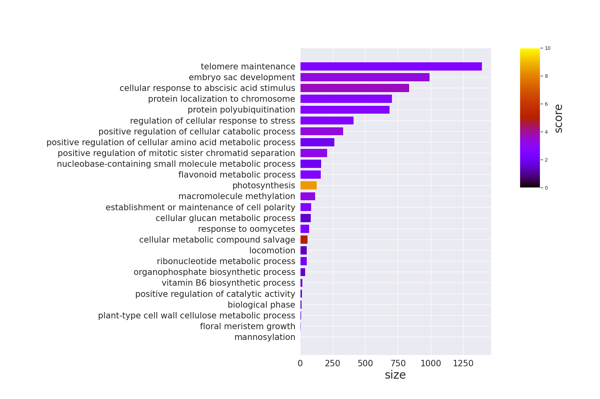
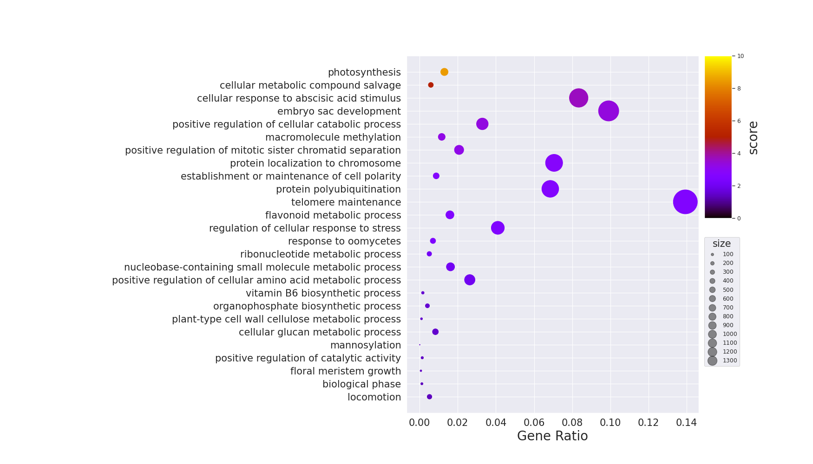
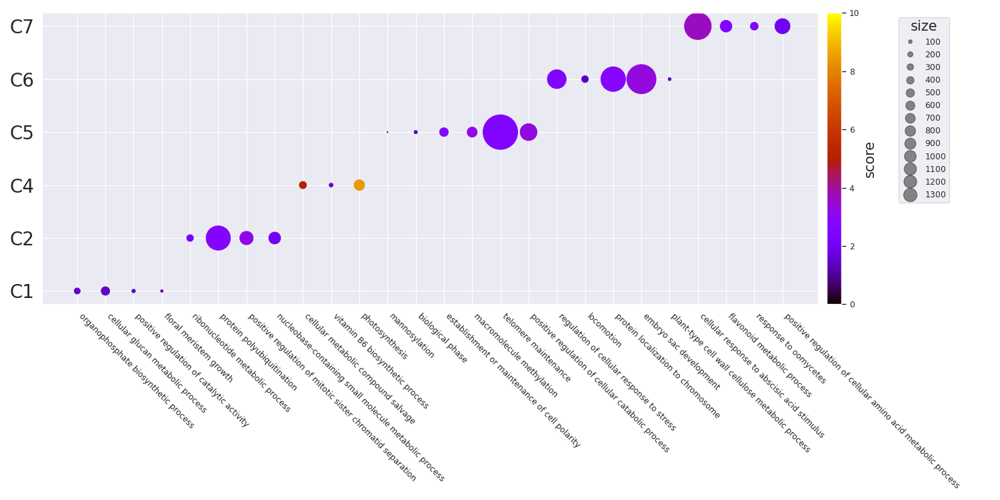

## TL;DR

RにはGO Enrichmentの結果をいい感じに図示してくれるライブラリがいくつかありますが(e.g., clusterProfiler, rrvgo etc.,)、Pythonにはありません。そこで、似たような図の作成方法をメモとしてまとめます。

個人的に図の微調整などはPythonのほうが知識もあって楽なのでPythonで書きたいという動機がありますが、ggplotが好きな人/Rに詳しい人は最初からRを使うのがおすすめです。

また、個人の趣味でpandasではなくpolarsを使用しています。polars、非常に体験がよいのでおすすめです。

## Dataset

列の意味としては以下を想定しています。

- term: GO Term ID
- score: -log10(padj)を想定
- size: アノテーションに含まれる遺伝子数)
- name: Go Termの名前。ラベルに使う。
- cluster: 適当なクラスターの名前

:::details[CSV data]

`example.csv`

```csv
term,score,size,name,cluster
GO:0090407,1.5297085894511266,41,organophosphate biosynthetic process,C1
GO:0006073,1.5163222189613395,83,cellular glucan metabolic process,C1
GO:0043085,1.44498285471817,14,positive regulation of catalytic activity,C1
GO:0010451,1.42343275529096,7,floral meristem growth,C1
GO:0009259,2.08444273888555,51,ribonucleotide metabolic process,C2
GO:0000209,2.626510646478822,685,protein polyubiquitination,C2
GO:1901970,3.197995679060633,207,positive regulation of mitotic sister chromatid separation,C2
GO:0055086,2.043050310202272,162,nucleobase-containing small molecule metabolic process,C2
GO:0043094,4.978646909720386,59,cellular metabolic compound salvage,C4
GO:0042819,1.5612111272483267,17,vitamin B6 biosynthetic process,C4
GO:0015979,8.466807502800558,130,photosynthesis,C4
GO:0097502,1.45417892854421,1,mannosylation,C5
GO:0044848,1.36510627820935,12,biological phase,C5
GO:0007163,2.6923744596164827,87,establishment or maintenance of cell polarity,C5
GO:0043414,3.215776159654917,116,macromolecule methylation,C5
GO:0000723,2.572069750528699,1393,telomere maintenance,C5
GO:0031331,3.2990295934320666,329,positive regulation of cellular catabolic process,C5
GO:0080135,2.5196148192030727,410,regulation of cellular response to stress,C6
GO:0040011,1.35544252617625,52,locomotion,C6
GO:0034502,2.739128030964704,705,protein localization to chromosome,C6
GO:0009553,3.35598374726875,991,embryo sac development,C6
GO:0052541,1.5212716561130444,10,plant-type cell wall cellulose metabolic process,C6
GO:0071215,3.6449534934267973,834,cellular response to abscisic acid stimulus,C7
GO:0009812,2.5663773876723597,159,flavonoid metabolic process,C7
GO:0002239,2.42790703640653,70,response to oomycetes,C7
GO:0045764,1.9573492416484901,263,positive regulation of cellular amino acid metabolic process,C7
```

:::

## Import & 設定

defaultでは以下の設定・ライブラリを利用している。

```python
import seaborn as sns
import matplotlib.pyplot as plt
import matplotlib as mpl
import polars as pl

print(sns.__version__)
# 0.11.2
print(pl.__version__)
# 0.13.36
print(mpl.__version__)
# 3.4.3

# seabornの設定。お好みで
sns.set(style="darkgrid", palette="muted", color_codes=True)
sns.set_context("paper")
```

## 単純なプロット

### Barplot



:::details[Code]

```python
# y軸にGO Termの名前を置きたいので、余白を多めにとる
plt.rcParams['figure.subplot.left'] = 0.5

df = pl.read_csv("./example.csv").sort("size")

terms = df.select("name").to_series().to_list()
sizes = df.select("size").to_series().to_list()

fig = plt.figure(figsize=(15, 10))
xgs = 10

# colorbarを手動で置く必要があるので、gridspecを使う
# colorbarは上半分くらいでいいので、y側も2分割
gs = fig.add_gridspec(2, xgs)

# colorbar部分を開けておく
ax = fig.add_subplot(gs[0:2, 0:xgs-2])

# scoresをrgbaに変換
cmap = plt.get_cmap("gnuplot")
norm = mpl.colors.Normalize(vmin=0, vmax=10)
scores = df.select("score").to_series().apply(lambda x: cmap(norm(x))).to_list()

# barplot
ax.barh(terms, sizes, color=scores)
ax.tick_params(axis="x", labelsize=15)
ax.set_xlabel("size", fontsize=20)
ax.tick_params(axis="y", labelsize=15)

# colorbar作成
cbar = fig.add_subplot(gs[0, xgs-1])
mpl.colorbar.Colorbar(
    cbar,
    mappable=mpl.cm.ScalarMappable(norm=norm, cmap=cmap),
    orientation="vertical",
).set_label("score", fontsize=20)

plt.show()
```

:::

### dotplot



:::details[Code]

```python
# y軸にGO Termの名前を置きたいので、余白を多めにとる
plt.rcParams['figure.subplot.left'] = 0.5

background_gene = 10000

df = pl.read_csv("./example.csv").sort("score")

terms = df.select("name").to_series().to_list()
sizes = df.select("size").to_series().to_list()
ratio = list(map(lambda x: x / background_gene, sizes))

vmin = 0
vmax = 10

fig = plt.figure(figsize=(17.5, 10))
xgs = 10

# colorbarを手動で置く必要があるので、gridspecを使う
# colorbarは上半分くらいでいいので、y側も2分割
gs = fig.add_gridspec(2, xgs)

# colorbar部分を開けておく
ax = fig.add_subplot(gs[0:2, 0:xgs-1])

cmap = plt.get_cmap("gnuplot")
scores = df.select("score").to_series().to_list()

# barplot
scatter = ax.scatter(ratio, terms, c=scores, s=sizes, cmap=cmap, vmin=vmin, vmax=vmax)
ax.tick_params(axis="x", labelsize=15)
ax.set_xlabel("Gene Ratio", fontsize=20)
ax.tick_params(axis="y", labelsize=15)

handles, labels = scatter.legend_elements(prop="sizes", alpha=0.5)
legend = ax.legend(
    handles,
    labels,
    # 単純な位置指定だといい位置にいかないので、bbox_to_anchorでマニュアル調整
    bbox_to_anchor=(1.15, 0.5),
    title="size",
    title_fontsize=15,
    markerscale=0.4
)

cbar = fig.add_subplot(gs[0, xgs-1])

# colorbarをつける
# 位置を好き勝手したいので、ColorbarBaseを使用
norm = mpl.colors.Normalize(vmin=vmin, vmax=vmax)
mpl.colorbar.Colorbar(
    cbar,
    mappable=mpl.cm.ScalarMappable(norm=norm, cmap=cmap),
    orientation="vertical",
).set_label("score", fontsize=20)

plt.show()
```

:::

### グループごとのdotplot



:::details[Code]

```python
# seabornの設定はお好みで
sns.set(style="darkgrid", palette="muted", color_codes=True)
sns.set_context("paper")

# x軸にGO Termの名前を置きたいので、余白を多めにとる
plt.rcParams['figure.subplot.bottom'] = 0.5

df = pl.read_csv("example.csv")

terms = df.select("name").to_series().to_list()
clusters = df.select("cluster").to_series().to_list()

fig = plt.figure(figsize=(15, 7.5))
ax = fig.add_subplot(111)

# 後でcolorbarを加えるために取得する
cmap = plt.get_cmap("gnuplot")
scatter = ax.scatter(
    terms,
    clusters,
    s=df.select(pl.col("size")).to_series().to_list(),
    c=df.select("score"),
    cmap=cmap,
    vmin=0,
    vmax=10,
)

# axisのラベル制御
# rotationするときは開始位置をhaで適切に指定する必要がある
# e.g., 315 -> left, 45 -> right
ax.set_xticklabels(terms, rotation=315, ha="left")
ax.tick_params(axis="y", labelsize=20)

# sizeのlegendを作成しておく
handles, labels = scatter.legend_elements(prop="sizes", alpha=0.5)
legend = ax.legend(
    handles,
    labels,
    # 単純な位置指定だといい位置にいかないので、bbox_to_anchorでマニュアル調整
    bbox_to_anchor=(1.175, 1),
    title="size",
    title_fontsize=15,
    markerscale=0.4
)

# colorbarをつける
fig.colorbar(scatter, ax=ax, pad=0.01).set_label("score", size=15)

fig.tight_layout()

plt.show()
```

:::

## Similarityを利用したプロット

GO Termにはsimilarityがあります。[Overview of semantic similarity analysis](https://yulab-smu.top/biomedical-knowledge-mining-book/semantic-similarity-overview.html)あたりが詳しいです。これは、Pythonでは`goatools`を利用することで計算できます。Rだと`GoSemSim`が利用できます。

`goatools`では、以下の手法をサポートしているようです。

**IC Base**

- Resnik
  - Philip, Resnik. 1999. “Semantic Similarity in a Taxonomy: An Information-Based Measure and Its Application to Problems of Ambiguity in Natural Language.” Journal of Artificial Intelligence Research 11: 95–130.
- Lin
  - Lin, Dekang. 1998. “An Information-Theoretic Definition of Similarity.” In Proceedings of the 15th International Conference on Machine Learning, 296—304. https://doi.org/10.1.1.55.1832.

**Graph Base**

- wang
  - Wang, James Z, Zhidian Du, Rapeeporn Payattakool, Philip S Yu, and Chin-Fu Chen. 2007. “A New Method to Measure the Semantic Similarity of GO Terms.” Bioinformatics (Oxford, England) 23 (May): 1274–81. https://doi.org/btm087.

### TODO
