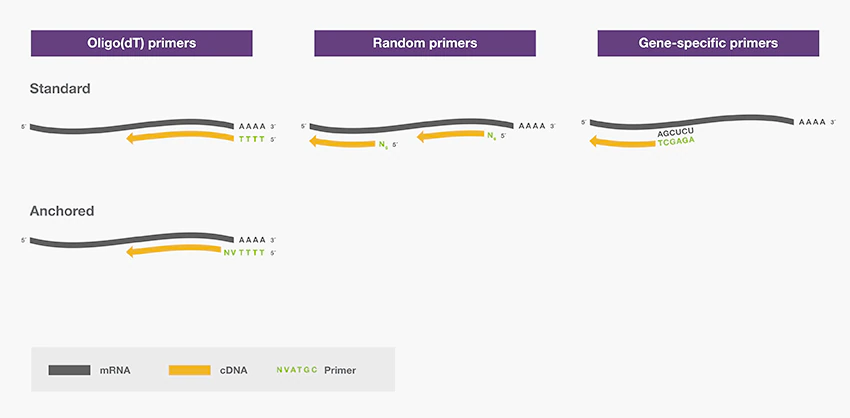
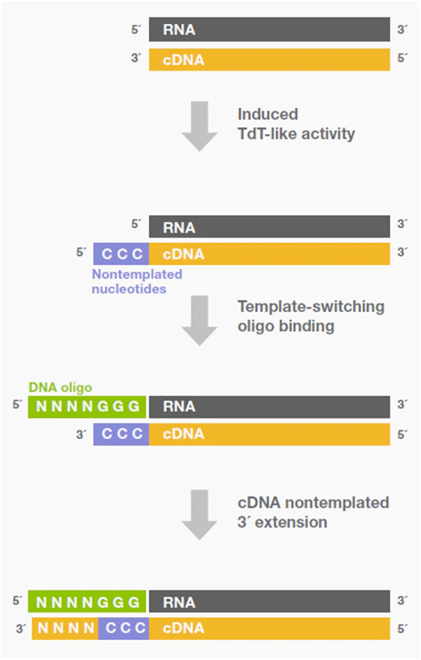
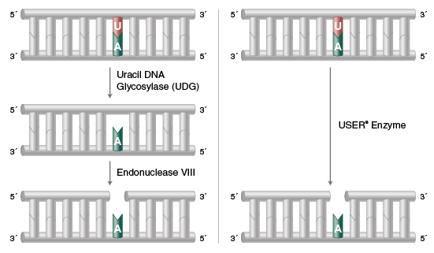

## TL;DR

An era has arrived where many experimental biologists use next-generation sequencers (NGS). Library preparation is essential for performing NGS in the laboratory, but I did not have a detailed understanding of the reactions used during library preparation. Therefore, I have summarized the commonly used reactions.

## PCR

This is a fundamental reaction in molecular biology. It is explained in [this article](./ngs_matome.md).

Briefly, it is a method that exponentially amplifies nucleic acids such as DNA and RNA at $O(2^n)$.

## RT (Reverse Transcription)

The central dogma refers to:

```
DNA -> RNA -> Protein
↓↑
DNA
```

This reaction system is fundamentally carried out in living organisms such as animals. However, viruses and other organisms possess reverse transcriptase, which catalyzes:

```
RNA -> DNA
```

By using this enzyme, cDNA (DNA derived from RNA is called cDNA) can be synthesized from RNA. After conversion to DNA, PCR amplification becomes possible, enabling detection of extremely small amounts of RNA.

This reaction is performed as the first step in RNA-seq. Primers are required for this reaction, and the amplification pattern differs depending on the type of primer used. By appending additional sequences (such as barcodes or adapters) to these primers, cDNA with those sequences attached can be synthesized.

### 1. Oligo-dT Primers with polyA Sequences

The 3' end of eukaryotic mRNA has a continuous A (polyA) sequence. Therefore, by using primers with a continuous T (polyT) sequence to amplify cDNA, it is possible to selectively amplify only mRNA. However, this method cannot be used for prokaryotic cells or miRNA. For RNA-seq, this primer is most commonly used.

### 2. Random Primers

These are primers with random sequences. Since they bind to anything, amplification is possible even without polyA sequences.

### 3. Gene-Specific Primers

Only the cDNA of the targeted gene can be synthesized. These are basically used only for RT-PCR and similar applications.



## TSO (Template Switching Oligo)

Some reverse transcriptases possess Terminal nucleotidyl transferase (TdT) activity. This activity adds specific sequences to the 3' end of DNA in a template-independent manner. This reaction is generally undesirable because it adds unnecessary sequences. However, many methods exist that utilize these sequences.

During cDNA synthesis, a polyC sequence is added to the 3' end, and a DNA oligo (template switching oligo) with a complementary polyG sequence at its 3' end is used. This enables second strand synthesis while modifying the 3' end. Through this reaction, barcodes and adapters are added to the 3' end. Such enzymes are induced during cDNA synthesis or in the latter half of the reaction in the presence of high concentrations of magnesium or magnesium ions.



## Klenow Fragment

This is used for blunt-ending protruding ends and adding A-tails to blunt ends. It is actually DNA polymerase I, which synthesizes DNA complementary to the template using dNTPs as substrates in the presence of a template and primer. By reacting with dATP, A-tails can be added. It lacks 5' -> 3' exonuclease activity and possesses single-strand-specific 5' -> 3' exonuclease activity.

1. 5' -> 3' DNA polymerase activity
   

2. Single-strand-specific 3' -> 5' exonuclease activity
   

## Ligation

Ligation is a reaction that joins DNA fragments together and is used in various applications besides library preparation, such as vector construction. A commonly used method involves joining a vector cut with restriction enzymes to an insert DNA with complementary overhanging ends. As shown in the figure below, DNA fragments with complementary overhanging ends can be joined together. Some enzymes can also join blunt ends. When processing blunt ends, phosphorylation is generally performed ([reference](https://lifescience.toyobo.co.jp/upload/upld86/protocol-c/cloning86pc01.pdf)).


## USER

This is an enzyme with both Uracil DNA Glycosylase and Endonuclease VIII activities. It can remove U from double-stranded DNA and introduce nicks.



It is sometimes used for adapter cleavage and USER cloning.


## Second Strand Synthesis (Gubler and Hoffman Procedure)

cDNA is single-stranded DNA, but double-stranded DNA is generally easier to handle. Therefore, methods exist for converting it to double-stranded DNA. Recent methods commonly use RNase H + DNA polymerase I. RNase H introduces nicks into RNA. DNA polymerase I is a DNA synthesis enzyme with double-strand-specific 5'->3' exonuclease activity and single-strand-specific 3'->5' exonuclease activity.


First, nicks are introduced by RNase H. The resulting RNA fragments serve as primers for DNA polymerase I to synthesize the complementary second strand of DNA.

Finally, the ligation reaction for joining blunt ends is used to repair the nicked sites to produce the finished product. I learned about this step for the first time while researching this topic.

## Tagmentation

This is a reaction using Tn5, a type of transposon. It randomly fragments DNA. Tn5 is loaded with a double-stranded sequence consisting of an activation sequence called the mosaic sequence and an attached adapter sequence.


The mosaic sequence + adapter sequence can then be added to both ends of the cleaved fragments. A library can be created by amplifying with primers that have sequences complementary to those adapter sequences.

## Reference

- [Setting Up Reverse Transcription: 7 Important Considerations](https://www.thermofisher.com/jp/ja/home/life-science/cloning/cloning-learning-center/invitrogen-school-of-molecular-biology/rt-education/reverse-transcription-setup.html)
- [Reverse Transcriptase Attributes: 6 Important Considerations](https://www.thermofisher.com/jp/ja/home/life-science/cloning/cloning-learning-center/invitrogen-school-of-molecular-biology/rt-education/reverse-transcriptase-attributes.html)
- [DNA Ligation](https://www.addgene.org/protocols/dna-ligation/)
- [Dropseq/seq-well](https://teichlab.github.io/scg_lib_structs/methods_html/Drop-seq.html)
- [Library construction for next-generation sequencing: Overviews and challenges Head et al., 2018](https://www.future-science.com/doi/10.2144/000114133)
- [USER® Enzyme](https://www.neb.com/products/m5505-user-enzyme)
- [Applications of USER® and Thermolabile USER II Enzymes](https://www.neb.com/applications/cloning-and-synthetic-biology/user-cloning/applications-of-user-and-thermolabile-user-ii-enzymes)
- [Klenow Fragment](https://catalog.takara-bio.co.jp/product/basic_info.php?unitid=U100003145)
- [A-Tailing with Klenow Fragment (3'-->5' exo-)](https://international.neb.com/protocols/2013/11/06/a-tailing-with-klenow-fragment-3-5-exo)
