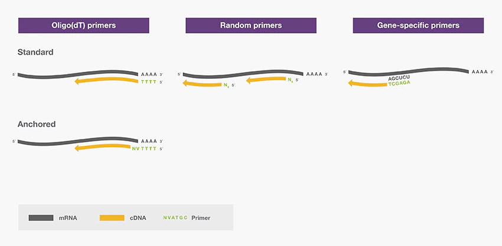
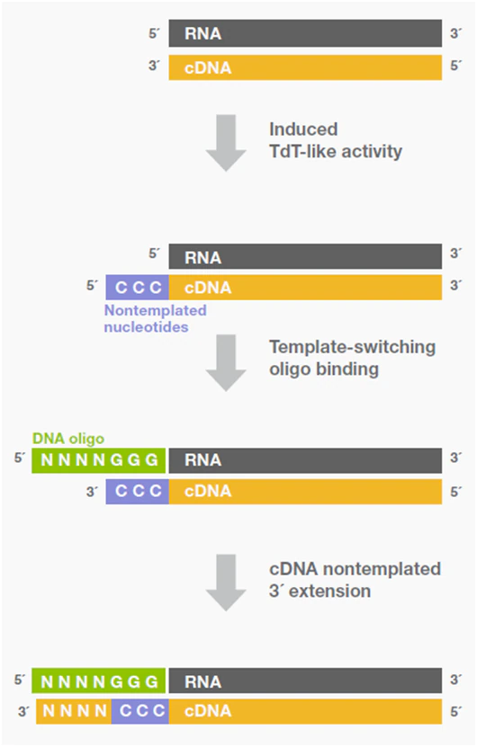
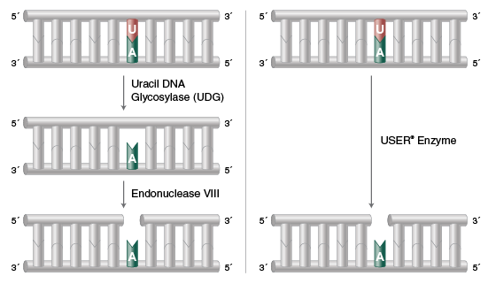

## TL;DR

実験系生物学者の多くが次世代シーケンサー(NGS)を使う時代が到来してきています。研究室でNGSを行うためには、ライブラリ調製が不可欠ですが、ライブラリ調製の際に使われている反応について詳細に把握していませんでした。そこで、よく使われていそうな反応についてまとめてみました。

## PCR

分子生物学の基礎とも言える反応です。[こちらの記事](https://illumination-k.dev/posts/biology/ngs_matome)で説明しています。

簡単に説明しておくと、DNAやRNAなどの塩基を$O(2^n)$で爆発的に増幅させる手法です。

## RT (Reverse Transcript)

セントラルドグマは

```
DNA -> RNA -> Protein
↓↑
DNA
```

という反応のことを指し、動物等の生体内ではこの反応系が基本的に行われています。しかし、ウィルスなどは

```
RNA -> DNA
```

という反応を起こす逆転写酵素(Reverse Transcriptase)を持ちます。この酵素を用いることで、RNAからcDNA (RNA由来のDNAをcDNAと呼ぶ) を合成できます。DNAに変換したあと、PCR反応させることが可能になり、極微量のRNAを検出することが可能になります。

RNA-seqのときの最初のステップとして行われる反応です。この反応にもプライマーが必要で、プライマーの種類によって増幅され方が違います。これらのプライマーにさらに何らかの配列（例えばバーコードやアダプター）を付加することで、それらの配列が付加されたcDNAを合成できます。

### 1. polyA配列を付加したオリゴdTプライマー

真核生物のmRNAの3'末端には連続したA (polyA) 配列を持ちます。なので、連続したT (polyT) 配列を持つプライマーを用いてcDNAを増幅することでmRNAのみを狙って増幅が可能です。ただ、この方法では原核細胞やmiRNAなどには使用できません。RNA-seqの場合は基本的にこのプライマーを使うことが多です。

### 2. ランダムプライマー

ランダム配列を持ったプライマーです。なんにでもくっつくので、polyA配列がなくても増幅できます。

### 3. 遺伝子特異的なプライマー

狙った遺伝子のcDNAのみを合成できます。基本的にはRT-PCRとかのときだけ使われます。



## TSO (template switching oligo)

逆転写酵素には、Terminal nucleotidyl transferase (TdT) 活性を持つものが存在しています。この活性は、DNAの3'末端にテンプレート非依存で特定の配列を付加します。この反応は本来不要な配列が付加されてしまうので望ましい反応ではありません。しかし、この配列を活用する方法が多数存在しています。

cDNAを合成する際に、3'末端にpolyC配列を付加し、それと相補的なpolyG配列を3'末端側にもつDNA oligo (template swithching oligo) を用います。これによって、3'末端を修飾しつつSecond strand synthesisを行うことができます。この反応によって、3'末端側にバーコードやアダプターが付加されます。こういった酵素は高濃度のマグネシウムやマグネシウムイオン存在下で、cDNA合成中、あるいは反応後半に誘導されます。



## Klenow Fragment

突出末端を平滑化する際や、平滑末端にA tailを付加する際に使われます。実際にはDNA polymerase Ⅰで、鋳型、プライマー存在下でdNTPを基質として鋳型に相補的なDNAを合成します。dATPと一緒に反応させることで、A tailを付加できます。5'-> 3' exonuclease活性を持たず、一本鎖特異的な5' -> 3'exonuclease活性を持ちます。

1. 5' -> 3' DNA polymerase活性
   

2. 一本鎖特異的な3' -> 5'exonuclease活性
   

## Ligation

ligationはDNA同士をつなげる反応で、ライブラリ調製以外にもベクター作成など様々な場所で利用されます。よく使われるのは制限酵素で切断したベクターと、その突出末端を相補的に持つ挿入用のDNAを繋げる方法です。下図にあるように、相補的な突出末端を持つDNA同士を繋げることができます。酵素によっては平滑末端でも繋げられます。平滑末端で処理する場合はリン酸化等を行うのが一般的です([参考](https://lifescience.toyobo.co.jp/upload/upld86/protocol-c/cloning86pc01.pdf))。


## USER

Uracil DNA GlycosylaseとEndonuclease VIIIの両方の活性を持つ酵素です。二本鎖DNAの中のUを除去し、nickを入れることができます。



Adaptorの切断やUSER cloningなどに使われることがあります。


## Second Strand Synthesis (Gubler and Hoffman Procedure)

cDNAは一本鎖DNAなわけですが、基本的には二本鎖DNAのほうが扱いやすいです。なので、二本鎖DNAにするための方法があります。近年の方法はRNaseH + DNA polymerase Iを使うことが多いです。RNaseHはRNAにnickを入れる反応を起こします。DNA polymerase Iは二本鎖特異的5’→3’ exonuclease活性および一本鎖特異的3’→5’ exonuclease活性を有するDNA合成酵素です。


まず、RNaseHによってnickが作られます。作られたRNA断片をプライマーとしてDNA polymerase Iが相補的な二本鎖DNAを合成してくれます。

最後にLigationの平滑末端をつなぐ反応を用いて、切れた部分を修復することで完成品ができるようです。このステップに関しては調べていて初めて知りました。

## Tagmentation

Transposonの一種であるTn5を用いる反応です。DNAをランダムにフラグメントにします。Tn5にはモザイク配列と呼ばれる活性化配列と、それに繋がったアダプター配列を付加した2本鎖配列がロードされています。


そして、切断された部分の両端にモザイク配列+アダプター配列を付加できます。そのアダプター配列に相補的な配列を持つプライマーを用いて増幅することでライブラリを作成できます。


## Reference

- [逆転写反応のセットアップ：重要な7つの注意点](https://www.thermofisher.com/jp/ja/home/life-science/cloning/cloning-learning-center/invitrogen-school-of-molecular-biology/rt-education/reverse-transcription-setup.html)
- [逆転写酵素の特性：重要な6つの注意点](https://www.thermofisher.com/jp/ja/home/life-science/cloning/cloning-learning-center/invitrogen-school-of-molecular-biology/rt-education/reverse-transcriptase-attributes.html)
- [DNA Ligation](https://www.addgene.org/protocols/dna-ligation/)
- [Dropseq/seq-well](https://teichlab.github.io/scg_lib_structs/methods_html/Drop-seq.html)
- [Library construction for next-generation sequencing: Overviews and challenges Head et al., 2018](https://www.future-science.com/doi/10.2144/000114133)
- [USER® Enzyme](https://www.neb.com/products/m5505-user-enzyme)
- [Applications of USER® and Thermolabile USER II Enzymes](https://www.neb.com/applications/cloning-and-synthetic-biology/user-cloning/applications-of-user-and-thermolabile-user-ii-enzymes)
- [Klenow Fragment](https://catalog.takara-bio.co.jp/product/basic_info.php?unitid=U100003145)
- [A-Tailing with Klenow Fragment (3'-->5' exo-)](https://international.neb.com/protocols/2013/11/06/a-tailing-with-klenow-fragment-3-5-exo)
