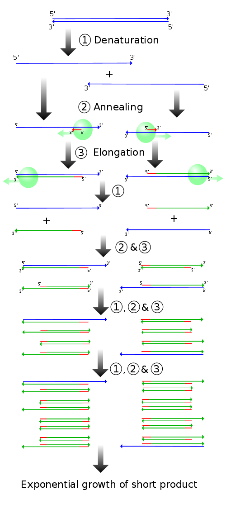
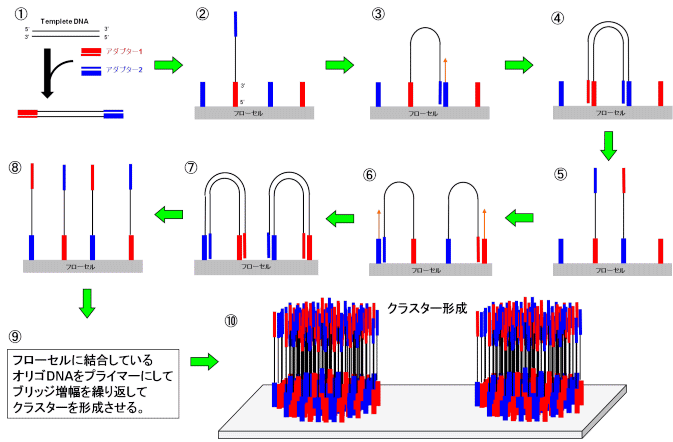
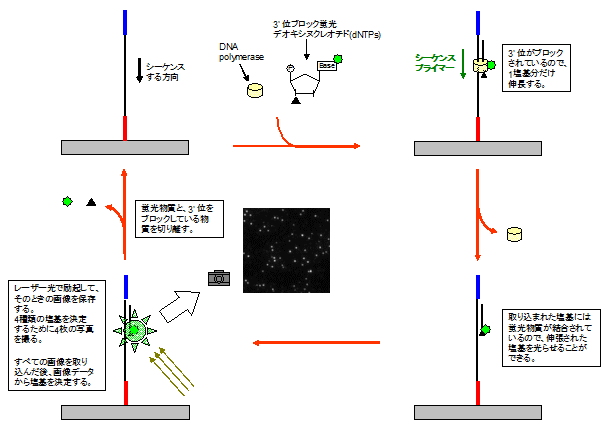

## TL;DR

次世代シーケンサーの解析原理についてまとめます。生物わからない人でもわかるように頑張ります。

## 全ての基本、PCR法

PCR法は、極微量しかとれないDNAをin vitroで爆発的に増やす手法です。数がないと話にならないので、分子生物学という分野ではたぶん最頻出の手法の1つです。

この手法は

1. DNAを熱することで一本鎖にする。
2. DNAポリメラーゼ（新しいDNAを伸長させる酵素）をプライマー（DNAの一部にくっつく配列）結合部位にリクルートしてきます。
3. DNAポリメラーゼによってDNAを伸長させます。
4. 1~3を繰り返すことで$2^n$個の同一のDNAを得ます。

ということで$O(2^n)$のオーダーでDNAを増やすことできます。すごい。

PCRで特定の配列を増幅させたい場合、増幅したい配列の5'末端と3'末端に順鎖と逆鎖の2つのプライマーを設計します。DNAポリメラーゼは5'末端のみを認識しますが、サイクルが進むに従い、プライマーが設計された場所から複製されたDNAのみが濃縮されていき、プライマー間の配列のみが増幅されるようになっていきます。このようなDNA鎖をアンプリコンと呼びます。基本的に、数サイクルの反応で狙った配列のDNA鎖ができるようになります。そういう意味で、1,2サイクルくらいしか反応させない場合、狙った配列が増幅されていない可能性が高いです。

## そもそも次世代シーケンサーとは

もともとDNAの配列決定にはサンガー法という方法がとられてきました。サンガー法の手順は、以下です。

1. DNAをPCR法によって増幅する際に取り込むとDNAの伸長反応が停止するジデオキシヌクレオチドを同時に取り込ませることでランダムにDNAの伸長反応を停止させ、長さの違うDNAを合成します。
2. 電気泳動などの手法によってDNAの長さごとに分離し、その長さによってDNA配列を決定する。

下の図の場合は`ACGACGTTCGTCA`という配列が決定されます。現在では技術の進歩によって１日くらいあれば500 bp(base pair)程度のリードを200サンプル近く読むことができます（経験談なので最新機器使えばもっといける可能性があります）。

この方法も十分に画期的であったのですが、近年では次世代シーケンサーと呼ばれる数百万から数十億もの膨大なシーケンシング反応を同時並行して実行できる技術が普及してきました。ここでは、次世代シーケンサーで主に使われているブリッジPCR法とSequencing-by-synthesisという手法に絞って説明します。

### ブリッジPCR

まず、増やしたいDNAの両端にアダプター（プライマーの進化版みたいなやつ）をつけます。このアダプターにはフローセル（DNA置く場所）にくっつく（ハイブリダイズされる）配列が含まれているので、フローセル上に固定できます(1-2)。このとき太い方の青いアダプターと細い方の青いアダプター同士が結合できるようになっていて、その部分で結合し橋渡し構造（ブリッジ）をとります（3）。アダプターを起点としてPCRを行うことで、DNAを増幅します（4）。この状態で、熱変性させると、アダプター同士の結合が切れることで量が元の倍になります（5）。この方法で局所的に（フローセルの一部のみで）DNAを多量合成できます（9）。この手法によって1回の解析で40 Gb~200 Gb程度の配列が得られます。

### Sequencing-by-synthesis

さて、材料が揃ったので塩基配列を決定します。ブリッジPCRで増やした部分に3'位（DNAが伸長する方向）をブロックした蛍光dNTPを取り込ませ、一塩基（一配列）だけ伸長させます。取り込ませた蛍光dNTPを光らせてその塩基がなんなのか確認します。確認した後、蛍光物質と3'位をブロックした物質を取り除きます。このサイクルを繰り返すことで配列全てを決定できます。

### 次に読む

- [NGSライブラリ調製の時に使用される反応まとめ](https://illumination-k.dev/posts/biology/library_construction_reaction)
- [ライブラリ調整とシーケンスの基本について](https://illumination-k.dev/posts/biology/seq_summary)

## 結論

Qiitaで書いてたのをブログに移しました。

## 参考文献

1. [次世代シーケンシング（NGS）とは](https://www.cosmobio.co.jp/support/technology/a/next-generation-sequencing-introduction-apb.asp)
2. [次世代シーケンシングの原理](http://infobio.co.jp/?portfolio=%E6%AC%A1%E4%B8%96%E4%BB%A3dna%E3%82%B7%E3%83%BC%E3%82%B1%E3%83%B3%E3%82%B7%E3%83%B3%E3%82%B0%E3%81%AE%E5%8E%9F%E7%90%86)
