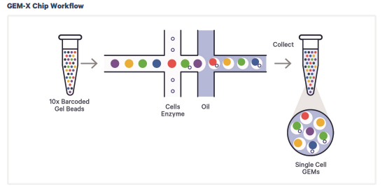
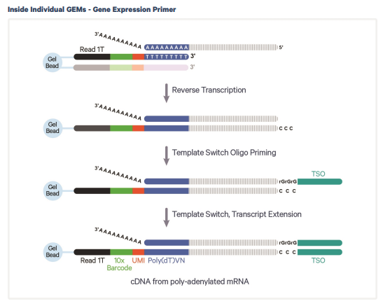
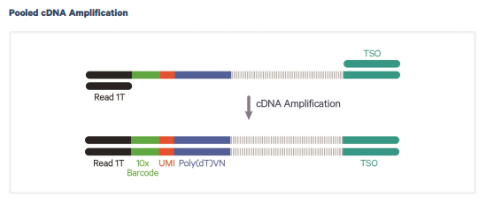
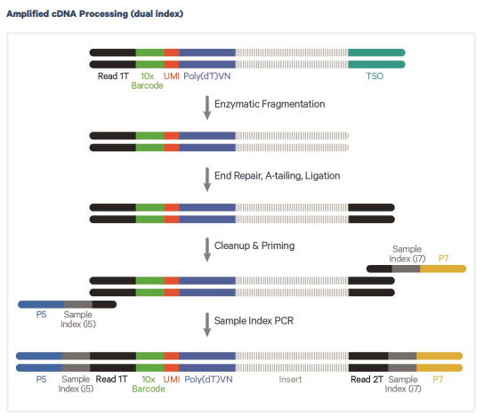
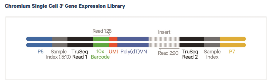

## TL;DR

single cell RNA-seq (scRNAseq) のライブラリ調整は、通常のbulk RNA-seq とは違い、細胞単位の識別を目的としたindexingが行われます。このため、生成されるFASTQファイルやBAMファイルも、bulk RNA-seqで得られるものとは異なる構造を持っています。その違いを正しく理解するには、まずscRNAseqにおけるライブラリ調整の基本を把握することが重要です。

この記事では主に10x Genomicsのライブラリ調整について解説しますが、他の手法についても基本的な概念は共通しています。
scRNAseqの生データの解析は、基本的にはツールによって自動化され、隠蔽されているので普段意識することは多くないですが、応用的な解析を行う際には、データの構造を正しく把握しておく必要があります。

なので、単純にscRNAseqの標準的な解析を行うだけの場合、この記事の知識はそれほど必要ありません。

**関連記事**

- [ライブラリ調整とシーケンスの基本について](https://illumination-k.dev/techblog/post/dbb49f31-2bca-4a97-857e-a1d7a95b645d)
- [NGSライブラリ調製の時に使用される反応まとめ](https://illumination-k.dev/techblog/post/65c054ed-bee1-46df-b849-9a7f92ac6d6c)

## scRNAseqにおけるライブラリ調整の概要

scRNAseqのライブラリ調整には幾つかの手法があります。

代表的なものには以下のようなものがあります。

- Plate-based method（SMART-seq2, etc.,）
- Droplet-based method（10x Genomics etc.,）
- Split and Pool method (sci-RNA-seq, etc.,)

これらの手法で共通しているのは、すべてのリードに細胞を一意に識別するためのindexが付与されていることです。

scRNAseqの手法の確立に置いて重要なのは、どうやって細胞を認識し、識別して、indexを付与するかということです。

## Droplet base の scRNAseq (10x Genomics) のライブラリ調整

基本的には、[10x Genomicsのライブラリ調整ページ](https://www.10xgenomics.com/jp/support/single-cell-gene-expression/documentation/steps/library-prep)を見れば詳細な手順が記述されています。

今回は、[Chromium GEM-X Single Cell 3' v4 Gene Expression](https://www.10xgenomics.com/jp/support/single-cell-gene-expression/documentation/steps/library-prep/chromium-gem-x-single-cell-3-v4-gene-expression-user-guide)について説明します。

## 10x Genomicsのライブラリ調整の流れ

### dropletによる細胞単位の識別

Droplet basedのscRNAseqでは、まずCellとBarcoded Gel Beadをmicrofluidに流します。最初の流路で、細胞とBarcoded Gel Beadが一緒になり、その後、Oil層を通ることでdroplet (GEMs) として分離されます。

通常、Beadsには、ライブラリ調整に必要なプライマーやRT enzymeなどが付与されています。

10xの場合は、Truseq Read 1, 10x Barcode (cell barcode), UMI (Unique Molecular Identifier), poly dTからなるprimerと、cell lysate、RT enzyme with master mixが付与されています。この後の反応では、droplet内で独立して酵素反応が起こるので、各droplet内の細胞が1つであれば、細胞単位のindexを付与することができます。

ただし、droplet内には必ずしも1つの細胞だけが入ってくるわけではないので、1つのcell barcodeに2つの細胞という状況は起こりえます。こういった細胞については、データ解析の際に除外することが一般的であり、多くの手法が提案されています。

### droplet内での反応

各droplet内では、通常のライブラリ調整とほぼ同じ反応が起こります。Truseq Read 1に各種indexがついているのと、Second strand synthesisを行うために、TSO (Template Switching Oligonucleotide) によってアダプターが付与されます。

### cDNA Amplification

droplet内の反応が終わると、dropletをすべて破棄して、必要であればclean up等を行います。

そのあとは基本的に通常のライブラリ調整と同様です。

まず、TSOと、Trueseq Read1を使って、Second strand synthesisをしてcDNA amplificationします。

### Library Construction

cDNAをFragmentazeを使用して、断片化します。その後、End repair (kelnowみたいな反応で、切断箇所にA-tailを付与)を行ってA-tailを付与した後、LigationによってTruseq Read 2を付与します。

Truseq Read1, Truseq Read2を使って、P5, P7を使ってPCRを行い、ライブラリ調整します。この際Dual indexがつきます。このDual indexはバルクRNA-seqと同様に、サンプル間の識別に使われます。

このFragmentationでは、3'側にTruseq Read1, barcode類がついてないものに関しても大量に発生するはずですが、それらはP5, P7によってPCRでほぼ増幅されないので、最終的にはほぼ存在しないものになります。

## Sequencing

最終的なリード構造は以下になり、Read1では、cell barcodeとUMIが、Read2では実際のcDNAのシーケンスが得られます。

ここで注意すべきは、pairエンドのように二つのfastqが得られるわけですが、1はcell barcodeとUMIなので、実質的にはsingle endのようなものです。そのため、これらのファイルをpair endとして扱うと基本的には解析できません。
