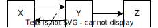

## TL;DR

Normalization is performed to eliminate update anomalies (inconsistencies during insertion, update, and deletion) in relational databases.
First normal form (1NF) ensures atomic values, second normal form (2NF) eliminates partial functional dependencies, and third normal form (3NF) removes transitive functional dependencies. Furthermore, Boyce-Codd normal form (BCNF), fourth, and fifth normal forms handle more advanced dependencies, strengthening data integrity.

## Execution Environment

The following `docker-compose.yaml` is used.

```yaml title=docker-compose.yaml
services:
  postgres:
    image: postgres:16
    environment:
      - POSTGRES_USER=postgres
      - POSTGRES_PASSWORD=postgres
      - POSTGRES_DB=postgres
```

## Purpose of Normalization in Relational Databases

The purpose of normalization is to eliminate **update anomalies**.

Updates refer to data **insertion**, **update**, and **deletion**. By performing normalization, we can guarantee that a single piece of data exists in only one place. This eliminates data duplication, removes the need to update multiple locations during updates, and ensures data integrity.

## Types of Normalization

The representative types of normalization are as follows.
First through third normal forms are the most commonly used in practice.
This is because they guarantee lossless-join decomposition and functional dependency preservation, and most update anomalies are eliminated at this stage.

- First Normal Form (1NF)
- Second Normal Form (2NF)
- Third Normal Form (3NF)

---

- Boyce-Codd Normal Form (BCNF)
- Fourth Normal Form (4NF)
- Fifth Normal Form (5NF)

## Property Preservation Through Normalization

| Source               | Target               | Functional Dependency | Multi-valued Dependency | Join Dependency | Lossless-join |
| -------------------- | -------------------- | --------------------- | ----------------------- | --------------- | ------------- |
| First Normal Form    | Second Normal Form   | O                     | O                       | O               | O             |
| Second Normal Form   | Third Normal Form    | O                     | O                       | O               | O             |
| Third Normal Form    | Boyce-Codd NF        | x                     | O                       | O               | O             |
| Boyce-Codd NF        | Fourth Normal Form   | x                     | O                       | O               | O             |
| Fourth Normal Form   | Fifth Normal Form    | x                     | x                       | O               | O             |

## First Normal Form (1NF)

First normal form requires that all attributes hold **atomic values** (indivisible values, single values). In other words, there should be no repeating groups or cells containing multiple values.

### Example of Unnormalized Form

The following table is an example of unnormalized form. It does not satisfy first normal form because it contains Cartesian products and power sets.
Additionally, this state makes it difficult to store in an RDB table.

- Cartesian product: Refers to cells containing multiple values, such as "Yamada Taro (1)" or "Apple (1)".
- Power set: Refers to a single row containing multiple values. It is similar to merged cells in Excel.

| Slip No. | Customer Name (Customer No.) | Product Name (Product No.) | Quantity | Unit Price |
| -------- | ---------------------------- | -------------------------- | -------- | ---------- |
| 1        | Yamada Taro (1)              | Apple (1)                  | 2        | 100        |
|          |                              | Orange (2)                 | 3        | 200        |
| 2        | Tanaka Hanako (2)            | Banana (3)                 | 1        | 150        |
|          |                              | Apple (1)                  | 4        | 100        |

### Converting to First Normal Form

The conversion to first normal form is done as follows.

1. Eliminate Cartesian products: Split cells containing multiple values such as "Customer Name (Customer No.)" and "Product Name (Product No.)".

| Slip No. | Customer Name | Customer No. | Product Name | Product No. | Quantity | Unit Price |
| -------- | ------------- | ------------ | ------------ | ----------- | -------- | ---------- |
| 1        | Yamada Taro   | 1            | Apple        | 1           | 2        | 100        |
|          |               | 1            | Orange       | 2           | 3        | 200        |
| 2        | Tanaka Hanako | 2            | Banana       | 3           | 1        | 150        |
|          |               | 2            | Apple        | 1           | 4        | 100        |

2. Eliminate power sets: Eliminate having multiple values in a single row.

| Slip No. | Customer Name | Customer No. | Product Name | Product No. | Quantity | Unit Price |
| -------- | ------------- | ------------ | ------------ | ----------- | -------- | ---------- |
| 1        | Yamada Taro   | 1            | Apple        | 1           | 2        | 100        |
| 1        | Yamada Taro   | 1            | Orange       | 2           | 3        | 200        |
| 2        | Tanaka Hanako | 2            | Banana       | 3           | 1        | 150        |
| 2        | Tanaka Hanako | 2            | Apple        | 1           | 4        | 100        |

### Candidate Keys

Let's think about the SQL statements. In SQL, you generally need to specify a primary key. The primary key is a key that uniquely identifies records in a table. The primary key is selected from candidate keys, and primary key attributes must satisfy the `NOT NULL` constraint.

To specify the primary key, we consider candidate keys. A candidate key is the minimal set of attributes (or combination of attributes) that can uniquely identify records in the table.

In this case, `{Slip No., Product No.}` or `{Slip No., Product Name}` are candidate keys. Since there can be multiple candidate keys, we need to enumerate all of them.

For example, if `{Slip No., Product No.}` is the candidate key, the table can be created with the following primary key:

```sql
CREATE TABLE slip (
  slip_no INT,
  customer_name TEXT,
  customer_no INT,
  product_name TEXT,
  product_no INT,
  quantity INT,
  unit_price INT,
  PRIMARY KEY (slip_no, product_no)
);
```

Insert the data.

```sql
INSERT INTO slip (slip_no, customer_name, customer_no, product_name, product_no, quantity, unit_price)
VALUES (1, 'Yamada Taro', 1, 'Apple', 1, 2, 100),
       (1, 'Yamada Taro', 1, 'Orange', 2, 3, 200),
       (2, 'Tanaka Hanako', 2, 'Banana', 3, 1, 150),
       (2, 'Tanaka Hanako', 2, 'Apple', 1, 4, 100);
```

### Update Anomalies in First Normal Form

#### 1. Insertion

For example, if the product number is undetermined, the SQL would be as follows, but since the product number is specified as a primary key, an error occurs during insertion.

```sql
INSERT INTO slip (slip_no, customer_name, customer_no, product_name, quantity, unit_price)
VALUES (3, 'Sato Jiro', NULL, NULL, NULL, NULL);

-- ERROR:  null value in column "product_no" of relation "slip" violates not-null constraint
```

#### 2. Update

When updating the customer name for slip number 1, all records need to be updated.

If you update a single row with the following SQL, the customer name for the record with `slip_no = 1 AND product_no = 2` will not be updated, causing an update anomaly.

```sql
UPDATE slip
SET customer_name = 'Sato Jiro'
WHERE slip_no = 1 AND product_no = 1;

SELECT * FROM slip;
```

```
 slip_no | customer_name | customer_no | product_name | product_no | quantity | unit_price
---------+---------------+-------------+--------------+------------+----------+------------
       1 | Yamada Taro   |           1 | Orange       |          2 |        3 |        200
       2 | Tanaka Hanako |           2 | Banana       |          3 |        1 |        150
       2 | Tanaka Hanako |           2 | Apple        |          1 |        2 |        100
       1 | Sato Jiro     |           1 | Apple        |          1 |        2 |        100
```

#### 3. Deletion

Deleting records for slip number 2 causes all customer and product information to be lost.

```sql
DELETE FROM slip
WHERE slip_no = 2;

SELECT * FROM slip;
```

```
 slip_no | customer_name | customer_no | product_name | product_no | quantity | unit_price
---------+---------------+-------------+--------------+------------+----------+------------
       1 | Yamada Taro   |           1 | Apple        |          1 |        2 |        100
       1 | Yamada Taro   |           1 | Orange       |          2 |        3 |        200
```

## Second Normal Form (2NF)

In practice, when operating an actual RDB, there are many things to consider when issuing SQL in first normal form as shown above.
To resolve the update anomalies that occur in first normal form, we normalize to second normal form.

In second normal form, we eliminate **partial functional dependencies** of non-key attributes on each candidate key. A partial functional dependency means that a subset of the candidate key functionally determines other attributes.
The state where partial functional dependencies have been eliminated is called **full functional dependency**.

Non-key attributes are attributes that are not included in any candidate key.

### Example of Partial Functional Dependency

Let's consider the first normal form data from our example.

In this case, the candidate keys are `{Slip No., Product No.}` or `{Slip No., Product Name}`. Therefore, the non-key attributes are `Customer Name`, `Customer No.`, `Quantity`, and `Unit Price`.

Consider the functional dependency `{Slip No., Product No.} -> Customer Name`. This means that when the slip number and product number are determined, the customer name is uniquely determined.

This can be expressed as follows, and indeed the values are uniquely determined:

- `{2, 3} -> Tanaka Hanako`
- `{1, 1} -> Yamada Taro`
- `{1, 2} -> Yamada Taro`
- `{2, 1} -> Tanaka Hanako`

Now, consider the functional dependency `{Slip No.} -> Customer Name`.

- `{1} -> Yamada Taro`
- `{2} -> Tanaka Hanako`

This relationship holds. In other words, `{Slip No.}`, which is a subset of the candidate key `{Slip No., Product No.}`, functionally determines the attribute `Customer Name`.
Since this relationship holds, a partial functional dependency exists.

### Example of Full Functional Dependency

Full functional dependency is the state where partial functional dependencies have been eliminated. In other words, for a functional dependency `X -> Y`, there is no proper subset `X'` of X such that `X' -> Y` holds. Here, a proper subset is a subset that is not equal to the original set.

For example, consider the functional dependency `{Slip No., Product No.} -> Quantity`.

- `{1, 1} -> 2`
- `{1, 2} -> 3`
- `{2, 3} -> 1`
- `{2, 1} -> 4`

When we consider the functional dependencies `{Slip No.} -> Quantity` and `{Product No.} -> Quantity`, we get the following:

#### `{Slip No.} -> Quantity`

- `{1} -> 2 or 3`
- `{2} -> 2 or 4`

#### `{Product No.} -> Quantity`

- `{1} -> 2 or 4`
- `{2} -> 3`
- `{3} -> 1`

As you can see, `Quantity` is not uniquely determined by the proper subsets `{Slip No.}` or `{Product No.}`, so we can say that full functional dependency holds.

### Converting to Second Normal Form

To eliminate partial functional dependencies, we split the functional dependencies that are partially dependent on the candidate key into separate tables.

As shown earlier, the functional dependency `{Slip No.} -> Customer Name` exists. Similarly, the partial functional dependency `{Slip No.} -> Customer No.` also exists.
Therefore, we split into a table with `{Slip No., Customer Name, Customer No.}`.

```sql
CREATE TABLE slip_detail (
  slip_no INT,
  product_no INT,
  product_name TEXT,
  quantity INT,
  unit_price INT,
  PRIMARY KEY (slip_no, product_no)
);

CREATE TABLE slip (
  slip_no INT,
  customer_name TEXT,
  customer_no INT,
  PRIMARY KEY (slip_no)
);
```

Note that the non-key attributes of slip_detail are `Quantity` and `Unit Price`. Product Name does not need to be decomposed in second normal form.

Insert the data.

```sql
INSERT INTO slip (slip_no, customer_name, customer_no)
VALUES (1, 'Yamada Taro', 1),
       (2, 'Tanaka Hanako', 2);

INSERT INTO slip_detail (slip_no, product_no, product_name, quantity, unit_price)
VALUES (1, 1, 'Apple', 2, 100),
       (1, 2, 'Orange', 3, 200),
       (2, 3, 'Banana', 1, 150),
       (2, 1, 'Apple', 4, 100);
```

### Update Anomalies in Second Normal Form

#### 1. Insertion

For example, you cannot insert only a new customer name and customer number.

```sql
INSERT INTO slip (slip_no, customer_name, customer_no)
VALUES (NULL, 'Sato Jiro', 3);

-- ERROR:  null value in column "slip_no" of relation "slip" violates not-null constraint
```

#### 2. Update

In slip_detail, when you update the unit price by specifying the slip number and product number, the unit prices of other records are not updated.

```sql
UPDATE slip_detail
SET unit_price = 200
WHERE slip_no = 1 AND product_no = 1;

SELECT * FROM slip_detail;
```

```
 slip_no | product_no | product_name | quantity | unit_price
---------+------------+--------------+----------+------------
       1 |          2 | Orange       |        3 |        200
       2 |          3 | Banana       |        1 |        150
       2 |          1 | Apple        |        4 |        100
       1 |          1 | Apple        |        2 |        200
```

#### 3. Deletion

Deleting a single slip also deletes all associated customer information.

```sql
DELETE FROM slip
WHERE slip_no = 1;

SELECT * FROM slip;
```

```
 slip_no | customer_name | customer_no
---------+---------------+-------------
       2 | Tanaka Hanako |           2
```

## Third Normal Form (3NF)

Third normal form eliminates **transitive functional dependencies**.
A transitive functional dependency is a relationship where `X -> Y` AND `Y -> Z` AND `Y -!> X`. Here, `Y -!> X` means that the functional dependency from `Y` to `X` does not hold.



Considering the second normal form data from earlier, in the `slip` table, the functional dependencies `Slip No. -> Customer No.` and `Customer No. -> Customer Name` hold.
However, the functional dependency `Customer No. -> Slip No.` does not hold.

Defining `X = Slip No.`, `Y = Customer No.`, `Z = Customer Name`, this is a transitive functional dependency.

### Converting to Third Normal Form

To eliminate transitive functional dependencies, for the relationship `X -> Y -> Z`, we define `Y -> Z` as a separate relation.
Additionally, `Y` is defined as a foreign key in the original relation.

Therefore, the tables are split as follows.

```sql
CREATE TABLE customer (
  customer_no INT,
  customer_name TEXT,
  PRIMARY KEY (customer_no)
);

CREATE TABLE slip (
  slip_no INT,
  customer_no INT,
  PRIMARY KEY (slip_no),
  FOREIGN KEY (customer_no) REFERENCES customer(customer_no)
);
```

### Update Anomalies in Third Normal Form

Update anomalies are unlikely in third normal form, but they can occur in cases like the following.

Consider the current slip_detail. The slip_detail is defined by the following SQL:

```sql
CREATE TABLE slip_detail (
  slip_no INT,
  product_no INT,
  product_name TEXT,
  quantity INT,
  unit_price INT,
  PRIMARY KEY (slip_no, product_no)
);
```

Suppose that product number and product name have a 1:1 correspondence. That is, when the product number is determined, the product name is uniquely determined, and when the product name is determined, the product number is uniquely determined.

In this case, the candidate keys are `{Slip No., Product No.}` or `{Slip No., Product Name}`, and the non-key attributes are `Quantity` and `Unit Price`.
Therefore, no transitive dependency exists, and this table satisfies third normal form.

In this case, the product number and product name need to be updated simultaneously, requiring updates to multiple columns.
As a result, update anomalies can occur.

## Boyce-Codd Normal Form (BCNF)

The condition for Boyce-Codd normal form is that for any functional dependency X -> Y, one of the following must hold:

1. X -> Y is a trivial functional dependency
2. X is a superkey

Here, a trivial functional dependency is when Y is a subset of X in X -> Y. For example, `{Slip No., Product No.} -> Product No.` is a trivial functional dependency.

A superkey is an attribute or combination of attributes that can uniquely identify records in the table. Unlike a candidate key, it does not need to be a minimal combination.

### Converting to Boyce-Codd Normal Form

The functional dependency `{Product No.} -> {Product Name}` does not need to be decomposed in third normal form because `Product Name` is part of a candidate key.
However, in Boyce-Codd normal form, since this is not a trivial functional dependency and `Product No.` is not a superkey, decomposition is necessary.

The slip_detail can be decomposed as follows.

```sql
CREATE TABLE product (
  product_no INT,
  product_name TEXT,
  PRIMARY KEY (product_no)
);

CREATE TABLE slip_detail (
  slip_no INT,
  product_no INT,
  quantity INT,
  unit_price INT,
  PRIMARY KEY (slip_no, product_no),
  FOREIGN KEY (product_no) REFERENCES product(product_no)
);
```

This decomposition resolves the update anomalies in third normal form.
In this way, when functional dependencies are not lost, converting to Boyce-Codd normal form can eliminate update anomalies.

### Loss of Functional Dependencies in Boyce-Codd Normal Form

In Boyce-Codd normal form, functional dependencies may be lost.

For example, consider the following table.

```sql
CREATE TABLE student_subject_teacher (
  student_name TEXT,
  subject_name TEXT,
  teacher_name TEXT,
  PRIMARY KEY (student_name, subject_name)
);
```

Here, assume the following functional dependencies hold:

- `{student_name, subject_name} -> teacher_name`
- `{teacher_name} -> subject_name`

In this case, `{teacher_name} -> subject_name` is not a trivial functional dependency and is not a superkey, so it does not satisfy Boyce-Codd normal form.

The decomposition results in the following:

```sql
CREATE TABLE student (
  student_name TEXT,
  teacher_name TEXT,
  PRIMARY KEY (student_name)
);

CREATE TABLE teacher (
  teacher_name TEXT,
  subject_name TEXT,
  PRIMARY KEY (teacher_name)
);
```

This decomposition causes the loss of the functional dependency `{student_name, subject_name} -> teacher_name`.
The original table cannot be restored through operations like JOIN.

## Fourth Normal Form (4NF)

Fourth normal form eliminates **multi-valued dependencies**. Specifically, when a functional dependency `X -> Y | Z` exists, it is decomposed into `X -> Y` and `X -> Z`.

## Fifth Normal Form (5NF)

Fifth normal form eliminates **join dependencies**. A join dependency is a dependency where a relation can be decomposed into three or more relations.
