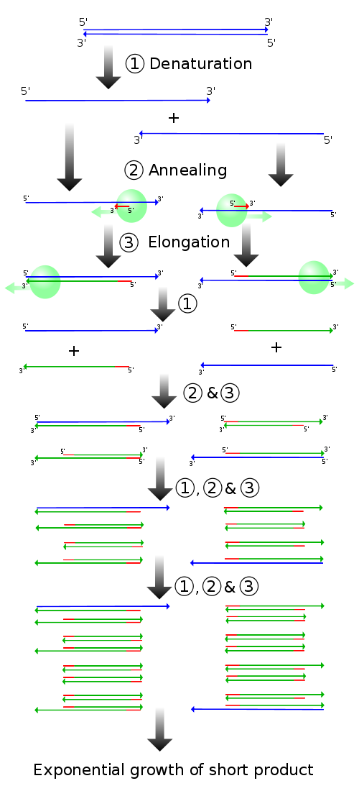
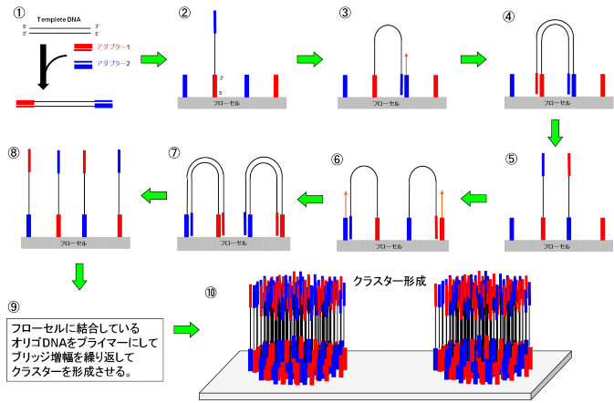
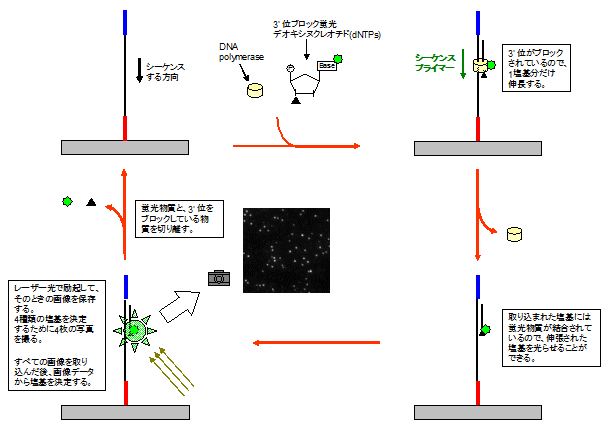

## TL;DR

This article summarizes the analysis principles of next-generation sequencers. I will do my best to make it understandable even for those without a biology background.

## The Foundation of Everything: PCR

PCR is a method for explosively amplifying DNA in vitro from extremely small quantities. Since you cannot do anything without sufficient quantities, it is probably one of the most frequently used techniques in the field of molecular biology.

This technique works as follows:

1. DNA is heated to separate it into single strands.
2. DNA polymerase (an enzyme that extends new DNA) is recruited to the primer (a sequence that binds to a part of the DNA) binding site.
3. DNA polymerase extends the DNA.
4. By repeating steps 1-3, $2^n$ copies of identical DNA are obtained.

So DNA can be amplified at an order of $O(2^n)$. Impressive.

When you want to amplify a specific sequence with PCR, you design two primers -- a forward strand primer and a reverse strand primer -- at the 5' and 3' ends of the sequence you want to amplify. DNA polymerase recognizes only the 5' end, but as cycles progress, only the DNA replicated from the primer-designed positions becomes enriched, and eventually only the sequence between the primers is amplified. Such a DNA strand is called an amplicon. Basically, the targeted DNA strand is produced after several cycles of the reaction. In that sense, if only 1 or 2 cycles of reaction are performed, the targeted sequence is likely not yet amplified.

## What Is a Next-Generation Sequencer?

Originally, a method called Sanger sequencing was used for DNA sequence determination. The procedure for Sanger sequencing is as follows:

1. When amplifying DNA by PCR, dideoxynucleotides -- which stop DNA elongation when incorporated -- are simultaneously incorporated to randomly terminate DNA elongation, synthesizing DNA fragments of varying lengths.
2. The DNA fragments are separated by length using methods such as electrophoresis, and the DNA sequence is determined based on their lengths.

In the figure below, the sequence `ACGACGTTCGTCA` is determined. With current technological advances, it is possible to read about 200 samples of approximately 500 bp (base pair) reads in about one day (based on my experience; newer instruments may be capable of more).

While this method was sufficiently groundbreaking, in recent years, technologies called next-generation sequencers have become widespread. These can execute millions to billions of massive sequencing reactions simultaneously in parallel. Here, I will focus on explaining bridge PCR and sequencing-by-synthesis, the main methods used in next-generation sequencers.

### Bridge PCR

First, adapters (an evolved version of primers) are attached to both ends of the DNA to be amplified. These adapters contain sequences that bind (hybridize) to the flow cell (the surface where DNA is placed), allowing fixation on the flow cell (1-2). At this point, the thick blue adapter and the thin blue adapter can bind to each other, forming a bridge structure (3). PCR is performed starting from the adapters to amplify the DNA (4). When heat denaturation is applied in this state, the bonds between adapters break, doubling the quantity (5). This method enables local (only in a portion of the flow cell) mass synthesis of DNA (9). This technique yields approximately 40 Gb to 200 Gb of sequence data per analysis run.

### Sequencing-by-Synthesis

Now that the materials are ready, the nucleotide sequence is determined. Fluorescently labeled dNTPs with the 3' position (the direction of DNA elongation) blocked are incorporated into the regions amplified by bridge PCR, extending by just one base (one nucleotide) at a time. The incorporated fluorescent dNTP is illuminated to confirm which base it is. After confirmation, the fluorescent substance and the blocking agent at the 3' position are removed. By repeating this cycle, the entire sequence can be determined.

### Further Reading

- [Summary of Reactions Used in NGS Library Preparation](./library_construction_reaction.md)
- [Basics of Library Preparation and Sequencing](./seq_summary.md)

## Conclusion

I migrated this content from Qiita to my blog.

## References

1. [What Is Next-Generation Sequencing (NGS)](https://www.cosmobio.co.jp/support/technology/a/next-generation-sequencing-introduction-apb.asp)
2. [Principles of Next-Generation Sequencing](http://infobio.co.jp/?portfolio=%E6%AC%A1%E4%B8%96%E4%BB%A3dna%E3%82%B7%E3%83%BC%E3%82%B1%E3%83%B3%E3%82%B7%E3%83%B3%E3%82%B0%E3%81%AE%E5%8E%9F%E7%90%86)
