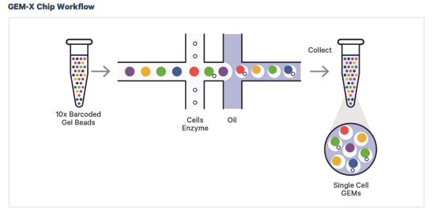
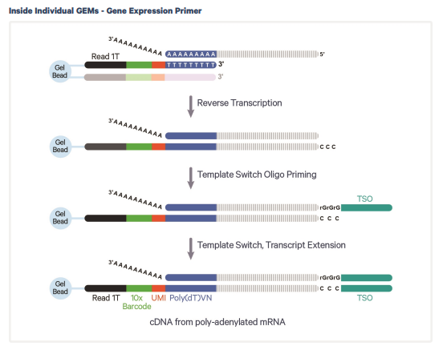
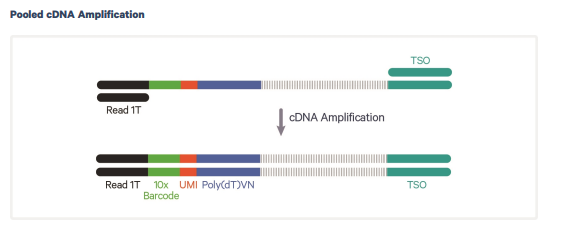
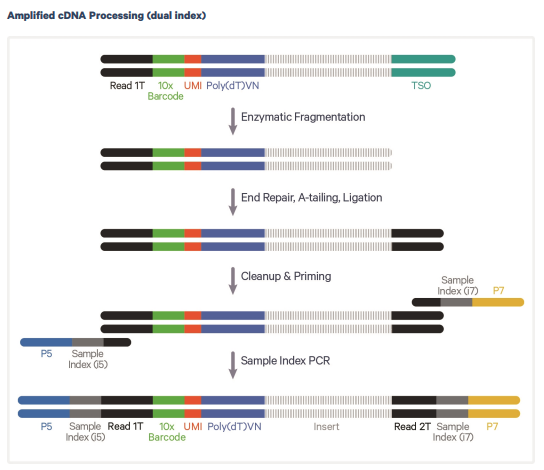
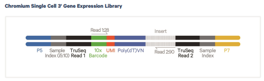

## TL;DR

Library preparation for single-cell RNA-seq (scRNAseq) differs from conventional bulk RNA-seq in that it involves indexing designed to identify individual cells. As a result, the generated FASTQ and BAM files have a different structure from those obtained in bulk RNA-seq. To properly understand these differences, it is important to first grasp the basics of library preparation in scRNAseq.

This article primarily covers library preparation for 10x Genomics, although the fundamental concepts are shared across other methods as well.
Raw data analysis in scRNAseq is generally automated and abstracted away by dedicated tools, so you rarely need to think about it in everyday work. However, when performing advanced analyses, a proper understanding of the data structure becomes essential.

Therefore, if you are only performing standard scRNAseq analyses, the knowledge in this article is not strictly necessary.

**Related Articles**

- [Basics of Library Preparation and Sequencing](./seq_summary.md)
- [Summary of Reactions Used in NGS Library Preparation](./library_construction_reaction.md)

## Overview of Library Preparation in scRNAseq

There are several methods for library preparation in scRNAseq.

Representative methods include the following:

- Plate-based method (SMART-seq2, etc.)
- Droplet-based method (10x Genomics, etc.)
- Split and Pool method (sci-RNA-seq, etc.)

What these methods have in common is that all reads are assigned an index that uniquely identifies the cell of origin.

The key challenge in establishing scRNAseq methods is how to recognize, distinguish, and assign an index to each cell.

## Library Preparation for Droplet-Based scRNAseq (10x Genomics)

The detailed procedure is described on the [10x Genomics library preparation page](https://www.10xgenomics.com/jp/support/single-cell-gene-expression/documentation/steps/library-prep).

Here, we will explain the [Chromium GEM-X Single Cell 3' v4 Gene Expression](https://www.10xgenomics.com/jp/support/single-cell-gene-expression/documentation/steps/library-prep/chromium-gem-x-single-cell-3-v4-gene-expression-user-guide) workflow.

## Workflow of 10x Genomics Library Preparation

### Cell-Level Identification via Droplets

In droplet-based scRNAseq, cells and Barcoded Gel Beads are first loaded into a microfluidic device. In the initial channel, cells and Barcoded Gel Beads are combined, and then separated into droplets (GEMs) by passing through an oil layer.

Typically, the beads carry the primers and RT enzymes needed for library preparation.

In the case of 10x, a primer consisting of Truseq Read 1, 10x Barcode (cell barcode), UMI (Unique Molecular Identifier), and poly dT is provided, along with cell lysate and RT enzyme with master mix. In subsequent reactions, enzymatic reactions occur independently within each droplet, so if each droplet contains a single cell, a cell-level index can be assigned.

However, it is not always the case that only one cell enters each droplet, so a situation where two cells share the same cell barcode can occur. Such cells are typically excluded during data analysis, and many methods have been proposed for this purpose.

### Reactions Inside the Droplet

Inside each droplet, reactions occur that are largely similar to standard library preparation. The key difference is that Truseq Read 1 carries various indices, and a TSO (Template Switching Oligonucleotide) is used to attach an adapter for second strand synthesis.

### cDNA Amplification

Once the reactions inside the droplets are complete, all droplets are broken and cleanup is performed if necessary.

After that, the process is essentially the same as standard library preparation.

First, second strand synthesis is performed using the TSO and Truseq Read 1, followed by cDNA amplification.

### Library Construction

The cDNA is fragmented using Fragmentase. After that, end repair (a Klenow-like reaction that adds an A-tail at the cleavage sites) is performed to add A-tails, and then Truseq Read 2 is attached by ligation.

Using Truseq Read 1 and Truseq Read 2, PCR is performed with P5 and P7 to complete library preparation. During this step, dual indices are added. These dual indices are used for distinguishing between samples, just as in bulk RNA-seq.

During fragmentation, a large number of fragments without Truseq Read 1 and barcode sequences on the 3' end are also generated, but since these are barely amplified by PCR with P5 and P7, they become virtually absent in the final library.

## Sequencing

The final read structure is as shown below. Read 1 contains the cell barcode and UMI, while Read 2 contains the actual cDNA sequence.

An important point to note is that while two FASTQ files are obtained similar to paired-end sequencing, Read 1 contains the cell barcode and UMI, so it is essentially single-end in nature. Therefore, treating these files as paired-end reads will generally not work for analysis.
