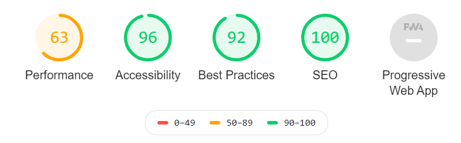
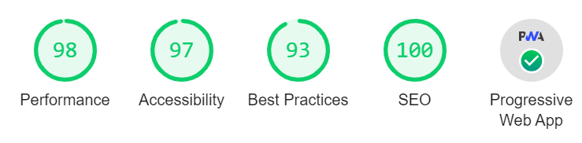

## TL;DR

WordPress was extremely slow and had way more features than I needed, so I decided to build a blog from scratch.
Also, I wanted to write articles in VSCode, so I wanted to just push markdown files and be done. No copy-pasting.
I couldn't customize WordPress because I didn't know PHP. Too many black boxes.

Here's what the WordPress top page looked like -- I wanted to do better than this. Also, WordPress doesn't fully support AMP (e.g., mathematical formulas), so I wanted to tackle that too.

The current blog code is here:

[illumination-k/blog](https://github.com/illumination-k/blog)

**Before**

**After 2020/09/30**

## Requirements

So the requirements are as follows. That said, if I waited until everything was done before publishing, it would never end, so I'll build things incrementally.

### Blog Features

- [x] Hosting on Vercel
- [x] Custom domain
- [x] Write articles in markdown/MDX and push to GitHub for automatic updates
- [x] Table of contents
- [x] Qiita-style sidebar
- [x] Article listing by category
- [x] Article search functionality
- [ ] Tag functionality
- [x] Git-integrated history feature
- [ ] Series feature (articles with a series tag can be paginated in order -- I tend to write long articles)

### Styling

- [x] material-ui
- [x] Code syntax highlighting with Prism.js
- [x] Mathematical formulas with amp-mathml
- [x] GitHub markdown CSS

### Google-Related

- [x] SEO
- [x] Google Analytics
- [x] AMP support
- [x] PWA support
- [x] Google AdSense

### Other Wishes

- Build it with a reasonable level of understanding

## Framework

Since I frequently work with `React`, I wanted to choose from `React` frameworks. The ones that come up most often are:

- Gatsby
- Next.js

For just building a blog, `Gatsby` seems like the stronger candidate, but I chose Next.js for the following reasons:

- AMP support seems easier
- More applicable to future projects
- I like the simple architecture
- Using Gatsby would likely result in black boxes due to plugin dependencies

So let's build the blog. Since I'm at it, I want to document my struggles along the way.

## Links to Actual Work

- [#2 MDX or Markdown?](./make_blog_2.md)
- [#3 Applying Styles to a Next.js Blog](./make_blog_3.md)
- [#4 Making MDX AMP-Compatible with a Custom Loader in Next.js](./make_blog_4.md)
- [#5 Adding Search Functionality to a Next.js Blog](./make_blog_5.md)
- [#6 Adding amp-sidebar to a Next.js Blog](./make_blog_6.md)
- [#7 Making a Next.js Blog Support Both AMP and PWA](./make_blog_7.md)
