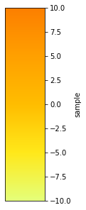

## TL;DR

When using matplotlib, sometimes you want to create just a colorbar and find out what color a particular value corresponds to on that colorbar.

**Example use case:**
You have some SVG and want to color it based on values, and you also want a colorbar.

> Python 3.7.4

## How to Do It

Use [matplotlib.colorbar.Colorbar](https://matplotlib.org/stable/api/colorbar_api.html). Also, use [matplotlib.colors.Normalize](https://matplotlib.org/stable/api/_as_gen/matplotlib.colors.Normalize.html) to define the value range of the colorbar and to determine what color a given value corresponds to.

First, define the range.

```python
import matplotlib as mpl
import matplotlib.pyplot as plt

print(mpl.__version__)
# 3.4.3

vmin = -10
vmax = 10

norm = mpl.colors.Normalize(vmin=vmin, vmax=vmax)
```

Draw the colorbar. Use [matplotlib.pyplot.get_cmap](https://matplotlib.org/3.3.1/tutorials/colors/colormaps.html) to retrieve the colormap information. The `norm` we prepared earlier is used to define the range.

When saving, note that you need to specify `bbox_inches="tight"` as an option, otherwise ticks and label information will be cut off.

```python
fig, cbar = plt.subplots(figsize=(1, 5))
cmap = plt.get_cmap("Wistia")
mpl.colorbar.Colorbar(
    ax=cbar,
    mappable=mpl.cm.ScalarMappable(norm=norm, cmap=cmap),
    orientation="vertical",
).set_label("sample", fontsize=20)

plt.savefig("sample_colormap.png", bbox_inches="tight")
```



Retrieve the corresponding RGBA color.

```python
norm_value = norm(5)
rgba = cmap(norm_value)
print(rgba)
# (0.9998615916955017, 0.6259284890426758, 0.0, 1.0)
```
