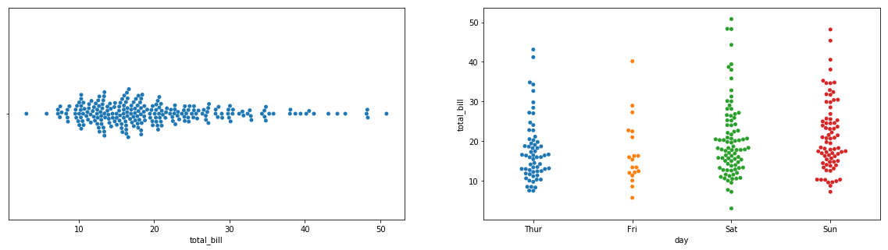
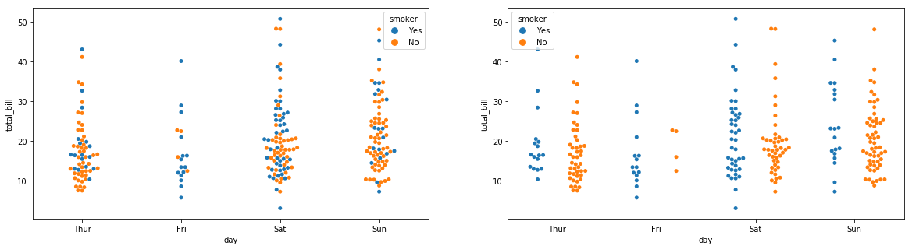
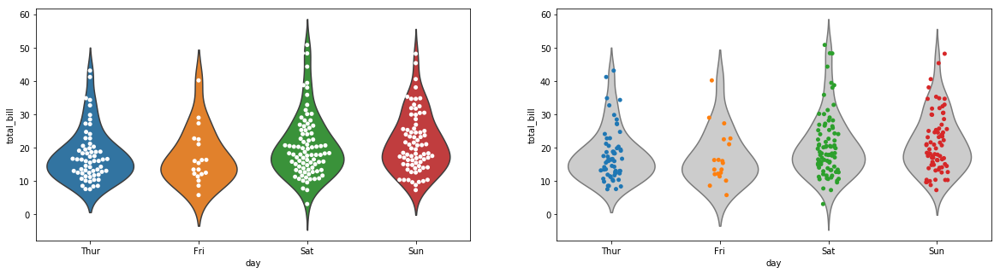

## TL;DR

Sometimes you want to get an overview of your data without worrying about summary statistics. Beeswarm plots are useful for visualizing data distributions. With seaborn, beeswarm plots can be easily created in Python.

Additionally, when combined with violin plots and similar visualizations, beeswarm plots can elegantly represent both data distribution and summary statistics.

For R, please refer to [this site](https://stats.biopapyrus.jp/r/graph/beeswarm.html). The [official documentation](https://seaborn.pydata.org/generated/seaborn.swarmplot.html) is also well-written and recommended.

## Preparation

### Installing seaborn

```bash
pip install seaborn
```

### Loading Data

```python
import seaborn as sns

tips = sns.load_dataset("tips")
print(tips.head())

"""
   total_bill   tip     sex smoker  day    time  size
0       16.99  1.01  Female     No  Sun  Dinner     2
1       10.34  1.66    Male     No  Sun  Dinner     3
2       21.01  3.50    Male     No  Sun  Dinner     3
3       23.68  3.31    Male     No  Sun  Dinner     2
4       24.59  3.61  Female     No  Sun  Dinner     4
"""
```

This tips dataset is perfect for seaborn demos, as you would expect from an officially provided dataset. I considered replacing it with something from sklearn, but tips was just too good.

## Basic Plot

```python
import matplotlib.pyplot as plt
fig = plt.figure(figsize=(20, 5))

# Beeswarm plot for a single category
ax1 = fig.add_subplot(121)
ax1 = sns.swarmplot(x=tips["total_bill"]) #
# Beeswarm plot for multiple categories
ax2 = fig.add_subplot(122)
ax2 = sns.swarmplot(x="day", y="total_bill", data=tips) #
plt.show()
```

**Output**



## Splitting by hue

Like other seaborn charts, you can color-code using hue. The dodge argument lets you choose whether to mix or separate the groups within the chart.

```python
fig = plt.figure(figsize=(20, 5))
ax1 = fig.add_subplot(121)

# Color-coded by hue (dodge is False by default)
ax1 = sns.swarmplot(x="day", y="total_bill", hue="smoker",
                    data=tips) #

ax2 = fig.add_subplot(122)
# Display separated by hue
ax2 = sns.swarmplot(x="day", y="total_bill", hue="smoker",
                    data=tips, dodge=True) #
plt.show()
```

**Output**



## Combining with Violin Plots

Combining with other plots gives a more data-science feel.
Let's use violin plots. We also compare with stripplot, which is used for similar purposes.

```python
fig = plt.figure(figsize=(20, 5))

# beeswarm plot with violin plot
ax1 = fig.add_subplot(121)
ax1 = sns.violinplot(x="day", y="total_bill", data=tips, inner=None)
ax1 = sns.swarmplot(x="day", y="total_bill", data=tips,
                    color="white", edgecolor="gray")

# strip plot with violin plot
ax2 = fig.add_subplot(122)
ax2 = sns.violinplot(x="day", y="total_bill", data=tips,
                     inner=None, color=".8")
ax2 = sns.stripplot(x="day", y="total_bill", data=tips, jitter=True)
plt.show()
```

**Output**



The beeswarm plot seems more readable since it also shows the distribution pattern. The downside is that it cannot display everything when there are too many data points. The best choice depends on the data you want to represent, but beeswarm plots are a strong option to consider.

## Reference

- [seaborn.swarmplot](https://seaborn.pydata.org/generated/seaborn.swarmplot.html)
