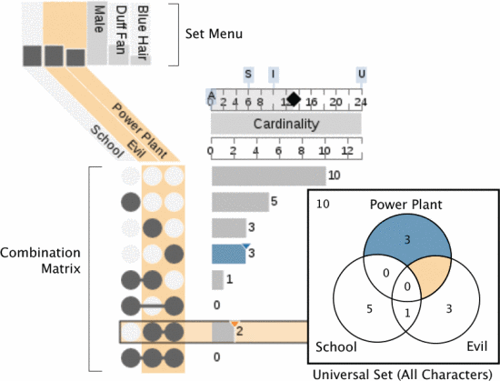
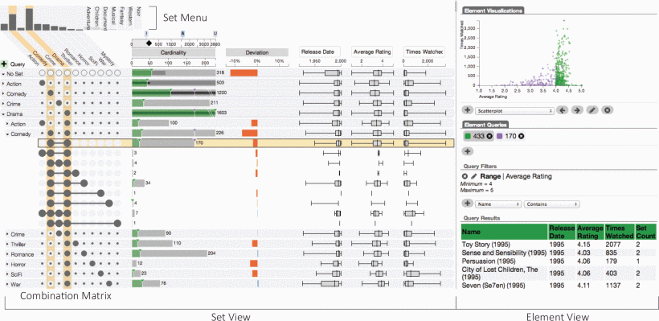
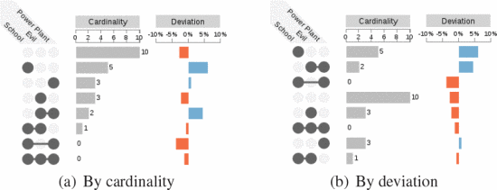
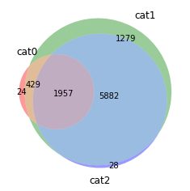
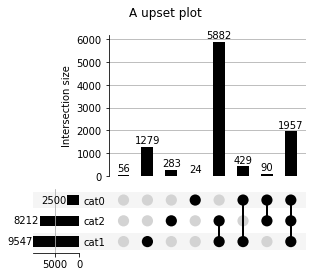
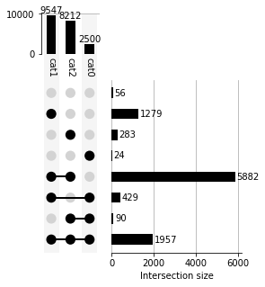
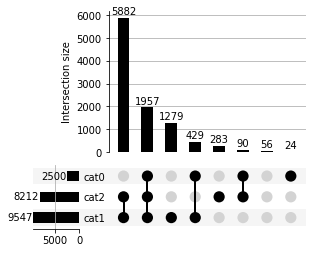
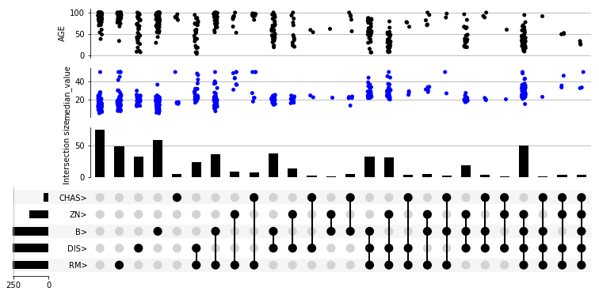
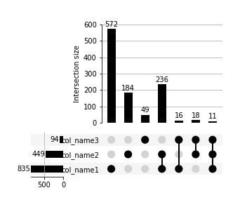

## TL;DR

When showing inclusion relationships between sets, Venn diagrams are easy to understand for two or three sets, but as the number of sets increases, Venn diagrams become harder to interpret. A useful alternative is the UpSet plot, proposed by Alexander Lex in 2014. For Python, the following package is regularly maintained and reliable (as of August 2021):

::gh-card[jnothman/UpSetPlot]

For an R implementation example, please refer to [this site](https://stats.biopapyrus.jp/r/graph/upset.html).

## UpSet Plots vs. Venn Diagrams

First, let's look at a comparison between Venn diagrams and UpSet plots.


Figure 1. Venn diagram and UpSet plot (Lex et al., 2014 Fig. 4)

With around three sets, each has its pros and cons. UpSet plots seem more suitable for viewing quantitative relationships between sets.

Also, a merit of UpSet plots is their high extensibility. Since set relationships are represented as rows, additional data can be inserted into those rows. For example, they can be extended as follows:


Figure 2. Extensibility of UpSet plots (Lex et al., 2014 Fig. 1)

Additionally, to express quantitative relationships between sets, you can sort by the number of elements in each set. Of course, you can also sort by the extended data.


Figure 3. Sorting in UpSet plots (Lex et al., 2014 Fig. 6)

## Python Implementation

### Install

```bash
pip install upsetplot
```

### Generating Sample Data

The upsetplot package can generate sample data, so let's start by trying it with sample data.

```python
from upsetplot import generate_counts

examples = generate_counts()
print(examples)

""" Output
cat0   cat1   cat2
False  False  False      56
              True      283
       True   False    1279
              True     5882
True   False  False      24
              True       90
       True   False     429
              True     1957
Name: value, dtype: int64
"""
```

### Basic UpSet Plot and Venn Diagram

#### Venn Diagram

Let's create a Venn diagram using the sample data. We use matplotlib's venn3 to create the Venn diagram.

```python
from matplotlib_venn import venn3
venn3(subsets=(24, 1279, 429, 28, 90, 5882, 1957),
                set_labels=("cat0", "cat1", "cat2"))
plt.show()
```

**Output**


When the quantities are skewed, it becomes a bit hard to understand.

#### UpSet Plot

Let's create an UpSet plot using the same sample data.

```python
from upsetplot import plot

plot(examples, show_counts="%d")
plt.suptitle("A upset plot")
plt.show()
```

**Output**



By separating quantitative relationships from set relationships, the visual understanding of quantitative relationships becomes easier. Conversely, the set relationships become slightly harder to understand.

Changing orientation and sorting are also easy.

```python
plot(examples, orientation="vertical", show_counts="%d")
plot(examples, sort_by="cardinality", show_counts="%d")
plt.show()
```





### Extending UpSet Plots

Let's try extending UpSet plots using the Boston housing dataset from scikit-learn.

Install scikit-learn if you don't have it. We also use pandas for data manipulation, so install that too.

```bash
pip install scikit-learn pandas
```

For extensions, create an `UpSet` class and use the `add_catplot` method.

```python
import pandas as pd
from sklearn.datasets import load_boston
import matplotlib.pyplot as plt
from upsetplot import UpSet

boston = load_boston()
boston_df = pd.DataFrame(boston.data, columns=boston.feature_names)

# Get the top 5 features with highest Spearman correlation
correls = boston_df.corrwith(pd.Series(boston.target), method="spearman").sort_values()
top_features = correls.index[-5:]

# For the selected features, get True/False for whether they are above the median
boston_above_avg = boston_df > boston_df.median(axis=0)
boston_above_avg = boston_above_avg[top_features]
boston_above_avg = boston_above_avg.rename(columns=lambda x: x + '>')

# Set the True/False values as a multi-index
boston_df = pd.concat((boston_df, boston_above_avg), axis=1)
boston_df = boston_df.set_index(list(boston_above_avg.columns))
boston_df = boston_df.assign(median_value=boston.target)

# Draw: Use the add_catplot method to extend the UpSet plot
upset = UpSet(boston_df, subset_size='count', intersection_plot_elements=3)
upset.add_catplot(value='median_value', kind='strip', color='blue')
upset.add_catplot(value='AGE', kind='strip', color='black')
upset.plot()
plt.show()
```



### Creating UpSet Plots from Category Lists

In real-world data (such as differentially expressed genes from RNA-seq, etc.), you often create set relationships from category columns. Therefore, I'll also document how to create UpSet plots from sets containing categories.

Let each set of categories be `category_n`, and create an UpSet plot for three category sets.

```python
import pandas as pd
import upsetplot

# Convert lists to pandas Series with True as the initial value
category_1_df = pd.Series(index=category_1, data=[True]*len(category_1))
category_2_df = pd.Series(index=category_2, data=[True]*len(category_2))
category_3_df = pd.Series(index=category_3, data=[True]*len(category_3))

# Merge the pandas Series. Non-True parts become NaN, so fill them with False.
upset_data = pd.concat((category_1_df, category_2_df, category_3_df), axis=1).fillna(False)

# Column names are 0, 1, 2 (int), so rename them as desired
mapper = {0:"col_name1", 1:"col_name2", 2:"col_name3"}
upset_data = upset_data.rename(columns=mapper)

# The upsetplot.plot method requires a multi-index with True/False values, so use set_index to set it
upset_data = upset_data.set_index(list(upset_data.columns))
upsetplot.plot(upset_data, subset_size="count", show_counts="%d", sort_categories_by=None)
```



Once you get used to it, the dataframe operations are straightforward, but they were quite confusing at first, so I'm leaving this as a note. The key is initializing with True at the start.

## Reference

- [upsetplot Documentation](https://buildmedia.readthedocs.org/media/pdf/upsetplot/latest/upsetplot.pdf)
- Alexander Lex, Nils Gehlenborg, Hendrik Strobelt, Romain Vuillemot, Hanspeter Pfister,UpSet: Visual-ization of Intersecting Sets, IEEE Transactions on Visualization and Computer Graphics (InfoVis '14), vol.20, no. 12, pp. 1983–1992, 2014. doi: doi.org/10.1109/TVCG.2014.2346248
