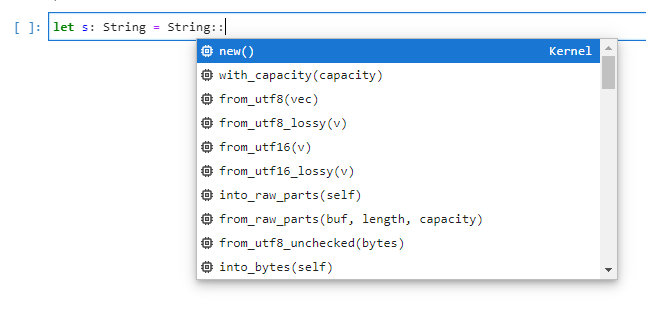

## TL;DR

For use cases like quickly trying out Rust, Jupyter is a very useful environment.
By using evcxr, you can use Rust on Jupyter.
Additionally, by using `jupyter-lsp` to run rust-analyzer on Jupyter, you can improve the development experience.

Bundled with `polars`, you can see a working example in the following repository:

::gh-card[illumination-k/polars-pandas]

## Creating an Image for evcxr

For installing evcxr_jupyter itself, the [official documentation](https://github.com/google/evcxr/blob/main/evcxr_jupyter/README.md) is detailed.
I added `libzmq3-dev` because I got errors without it.

In addition to installing evcxr_jupyter, we'll also install `jupyter-lab`, `jupyter-lsp`, and `rust-analyzer`.

```docker title=Dockerfile
FROM rust:1.56 as rust

USER root

# Install dependencies
RUN apt-get update -y --fix-missing && \
    apt-get install -y build-essential cmake jupyter-notebook libzmq3-dev

# Install evcxr_jupyter
RUN rustup component add rust-src && \
    cargo install evcxr_jupyter && \
    evcxr_jupyter --install

# Install pip
RUN wget https://bootstrap.pypa.io/get-pip.py && \
    python3 get-pip.py && rm -f get-pip.py && \
    pip install jupyterlab && pip install -U jupyter_client

# Install LSP-related packages
RUN pip install jupyter-lsp jupyterlab-lsp && \
    curl -L https://github.com/rust-analyzer/rust-analyzer/releases/latest/download/rust-analyzer-x86_64-unknown-linux-gnu.gz | \
    gunzip -c - > /usr/local/bin/rust-analyzer && \
    chmod +x /usr/local/bin/rust-analyzer

CMD [ "jupyter", "lab", "--port", "8888", "--ip=0.0.0.0", "--allow-root" ]
```

## Configuration for jupyter-lsp

For major Jupyter languages like `python` and `r`, the LSP is detected automatically, but for Rust, you need to write the configuration yourself.

Using the Scala example from [jupyter-lsp configuring](https://github.com/jupyter-lsp/jupyterlab-lsp/blob/master/docs/Configuring.ipynb) as a reference, create a configuration file.
Create a `jupyter_server_config.d` directory under one of the directories shown by `jupyter --paths`, and place the file there.

In this case, we'll place it at `${HOME}/.jupyter/jupyter_server_config.d/rust-analyzer.json`.

```json title=rust-analyzer.json
{
  "LanguageServerManager": {
    "language_servers": {
      "rust-analyzer": {
        "version": 2,
        "argv": ["/usr/local/bin/rust-analyzer"],
        "languages": ["rust"],
        "mime_types": ["text/x-rust"]
      }
    }
  }
}
```

## docker-compose Configuration

As mentioned above, place rust-analyzer.json at `${HOME}/.jupyter/jupyter_server_config.d/rust-analyzer.json`.
Also, mount the `work` directory to share it with the local filesystem.

```yaml title=docker-compose.yaml
version: "3"
services:
  jupyter:
    build:
      context: .
      dockerfile: Dockerfile
    image: jupyter
    environment:
      - TZ=Asia/Tokyo
      - JUPYTER_ENABLE_LAB=yes
    ports:
      - 8888:8888
    volumes:
      - ${PWD}/work:/work
      - "${PWD}/jupyter_server_config.d:/root/.jupyter/jupyter_server_config.d"
    working_dir: "/work"
```

### Creating a Cargo.toml

`rust-analyzer` itself can work without Cargo in a project ([reference](https://rust-analyzer.github.io/manual.html#non-cargo-based-projects)), but for simplicity, we'll create a `work` directory using `Cargo.toml` to share via `docker-compose.yml`.

```bash
cargo new work
```

## Running

With this, `docker-compose up` should launch Jupyter.
Completions will work as shown below:



It's not quite as good as VS Code, but it feels more comfortable than tab completion.
