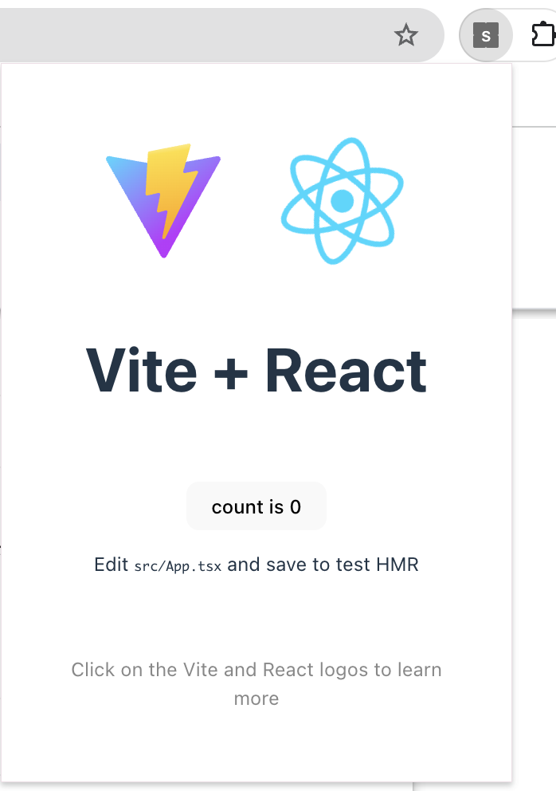

## TL;DR

React + Vite + Typescriptでchrome extensionを作成するためのテンプレートを作成しました。

また、CRXJS vite pluginsを使う方法もありますが、こちらはviteのversionが3までしか対応しておらず、またメンテもされていなかったので基本的に依存はReact, vite, typescriptのみになっています。

::gh-card[illumination-k/chrome-extension-templates]

## 作成したTemplateの機能・使い方

### 1. background, content-scripts, popupの一括ビルド

UIを構成する部分はReactを使っています。これらは`popup`以下で管理されます。


その他のDOM操作を行うためのContent Scriptsは`content-script`以下で管理し、Service workerを利用するためのコードは`background`以下で管理してあります。


これらは`pnpm build`でまとめて`dist`以下にビルドされ、Chrome extensionの開発者モードでアップロードすればすぐに利用できます。



### 2. formatter, linterのセットアップ

以下のツールを利用しています。

- [biome](https://biomejs.dev)によるTypescriptのformat, lint
- [dprint](https://dprint.dev)による設定フィアル群 (markdown, json, yaml, toml)のformat, lint
- [sort-package-json](https://github.com/keithamus/sort-package-json)による`package.json`の順序のsort

これらは`pnpm fmt`, `pnpm lint`のような形で利用できます。

### 3. 基本的なGithub Actionsの設定

- [actionlint](https://github.com/rhysd/actionlint)によるGithub Actionsのlint
- ソースコード自体への[biome](https://biomejs.dev), [dprint](https://dprint.dev), [sort-package-json](https://github.com/keithamus/sort-package-json)によるlint

を行うCIをセットアップしてあります。

## 中身について

### 構成

以下のような構成になっています。
基本的には、background, content-scripts, popupは別ディレクトリで実装できるようにしており、buildで全てdist以下にまとめて配置します。

```
./
├── background/
│  └── background.ts
├── biome.json
├── content-scripts/
│  ├── content-scripts.ts
│  └── main.ts
├── dprint.json
├── LICENSE
├── package.json
├── pnpm-lock.yaml
├── popup/
│  ├── index.html
│  └── src/
│     ├── App.css
│     ├── App.tsx
│     ├── assets/
│     │  └── react.svg
│     ├── index.css
│     ├── main.tsx
│     └── vite-env.d.ts
├── public/
│  ├── manifest.json
│  └── vite.svg
├── README.md
├── tsconfig.app.json
├── tsconfig.json
├── tsconfig.node.json
├── vite-background.config.ts
├── vite-content.config.ts
└── vite.config.ts
```

### `manifests.json`

version 3を使っています。また、reactで使う関係上`public/manifest.json`として管理してあります。

::gh[https://github.com/illumination-k/chrome-extension-templates/blob/main/public/manifest.json]

### 設定ファイル

`vite.config.ts`でPopupの設定を行なっています。
Reactを利用するのもここだけです。

::gh[https://github.com/illumination-k/chrome-extension-templates/blob/main/vite.config.ts]

`vite-background.config.ts`及び`vite-content-scripts.config.ts`はほぼ同じで、distに出力するアウトプットを設定してあるだけです。

::gh[https://github.com/illumination-k/chrome-extension-templates/blob/main/vite-background.config.ts]

::gh[https://github.com/illumination-k/chrome-extension-templates/blob/main/vite-content-scripts.config.ts]
