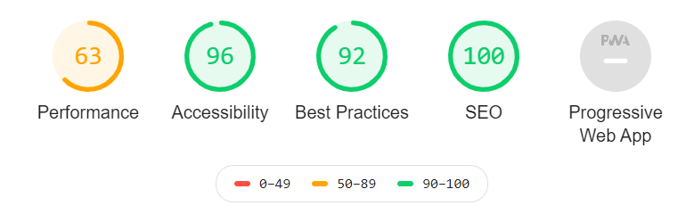
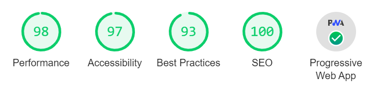

## TL;DR

WordPressが激重だしこんなに機能はいらないな、と思ったので、1からブログでも作るか、と思いました。
後、VScodeで記事を書きたいので、markdownとかそのへんをpushして終わりにしたい。コピペしたくない。
WordpressはPHPがわからなくてカスタマイズが進まない。ブラックボックスが多すぎる。

Wordpressのトップ画面はこんな感じなので、これよりはよくしたい。あとWordpressはAMPにフルでは対応できていない（数式とか）なので、そのへんも頑張りたい。

現状のブログコードはこちら

[illumination-k/blog](https://github.com/illumination-k/blog)

**Before**

**After 2020/09/30**

## 要件

ということで、要件としては、以下のものがほしいです。とはいえ全部できてから公開だと永遠に終わりそうにないので、順次作成していきます。

### ブログ機能

- [x] Verticalでホスティング
- [x] カスタムドメイン
- [x] markdownとmdxで記事を書いてGithubにpushすれば自動で更新される。
- [x] Toc機能
- [x] Qiitaみたいなサイドバー
- [x] category別に別れた記事一覧
- [x] 記事の検索機能
- [ ] tag機能
- [x] gitと連動したhistory機能
- [ ] 連載機能（連載タグがついた記事が順番にページネーションできる、みたいな。長い記事を書きがちなので）

### スタイル

- [x] material-ui
- [x] Prism.jsでのcode syntax
- [x] amp-mathmlでの数式
- [x] Github markdown css

### Google関係

- [x] SEO
- [x] Google Analytics
- [x] AMP対応
- [x] PWA対応
- [x] Google Adsense

### その他の希望

- ある程度の理解を伴った上で作成できる

## Framework

個人的によく触っているのが`React`なので、`React`のフレームワークから選びたいです。よく話に出てくるのは

- Gatsby
- Next.js

かなあ、と思います。ブログ作るだけなら`Gatsby`が有力だと思うんですが、以下の理由からnext.jsを選びました。

- AMP対応が楽そう
- 今後に活かせそう
- 構成がシンプルで好き
- Gatsby使うとプラグイン関係で結局ブラックボックスになりそう

ということで、ブログ作っていきます。ついでなので、悪戦苦闘している分を記事にして残しておきたいと思っています。

## 実際の作業へのリンク

- [#2 MDX or Markdown ?](https://illumination-k.dev/posts/frontend/make_blog_2)
- [#3 Next.jsで作ったブログにStyleを適用していく](https://illumination-k.dev/posts/frontend/make_blog_3)
- [#4 Next.jsでカスタムローダーを使ってmdxをAMP対応させる](https://illumination-k.dev/posts/frontend/make_blog_4)
- [#5 next.jsで作ってみたブログに検索機能を導入する](https://illumination-k.dev/posts/frontend/make_blog_5)
- [#6 next.jsで作ってみたブログにamp-sidebarを導入する](https://illumination-k.dev/posts/frontend/make_blog_6)
- [#7 Next.jsで作ったブログをAMPとPWAに対応させる](https://illumination-k.dev/posts/frontend/make_blog_7)
