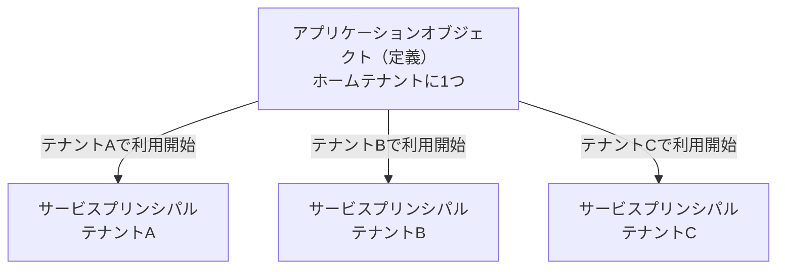
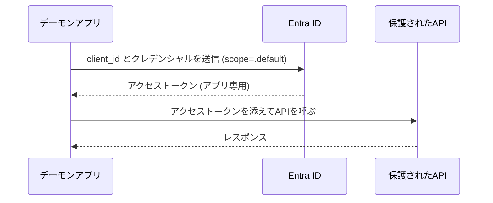
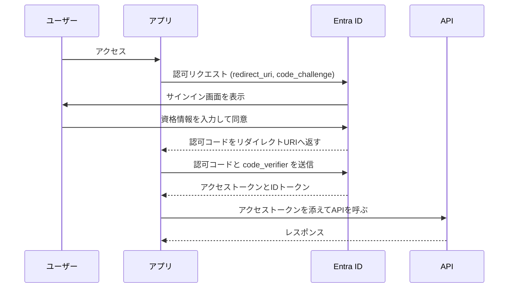
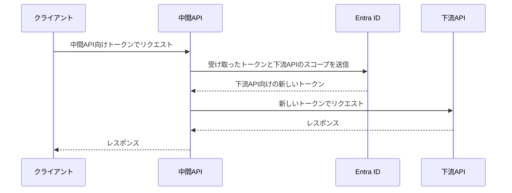

Azureでアプリケーションに認証を組み込もうとすると、最初に「アプリの登録（App Registration）」に行き当たります。本記事は、App Registrationを主軸に、サービスプリンシパルやエンタープライズアプリケーション、Entra IDがそれぞれ何を指し、どう関係しているのかを整理する記事です。Azureの認証まわりの用語に振り回されている開発者を読者に想定しています。

## TL;DR

- App Registration（アプリの登録）はアプリケーションの「定義」、サービスプリンシパルはテナント内でその定義が動くための「実体」。Entra ID上では別々のオブジェクトとして存在する
- Azureポータルの「アプリの登録」ブレードはアプリケーションオブジェクトの一覧、「エンタープライズアプリケーション」ブレードはサービスプリンシパルの一覧。自分で登録したアプリは両方に表示されるため、ここが混乱の最大の原因になる
- App RegistrationはOAuth2/OIDCのクライアント設定そのもの。クレデンシャル、リダイレクトURI、APIのアクセス許可、公開するAPI、アプリロールといった項目を持つ
- client credentials、authorization code + PKCE、on-behalf-ofといった主要な認証フローが、App Registrationのどの設定を使うのかを押さえると認証系の全体像がつながる

## 背景: なぜ App Registration は分かりにくいのか

Azureでアプリに認証を組み込む第一歩が「アプリの登録（App Registration）」です。ところがこの周辺は用語が多く、初見では関係がつかみにくいです。

混乱の1つ目の原因は、Azureポータルに入口が2つあることです。Entra IDの管理画面には「アプリの登録」と「エンタープライズアプリケーション」という別々のメニューがあり、しかも自分で作ったアプリは両方に出てきます。「登録したばかりなのにエンタープライズアプリケーションにも同じ名前がある、これは別物なのか」という疑問は、多くの人が一度は持つはずです。

2つ目の原因は、似た言葉が並ぶことです。テナント、ディレクトリ、アプリケーションオブジェクト、サービスプリンシパル、クライアント、リソース。どれも認証の文脈で登場しますが、それぞれが何を指すのかは整理しないと頭に入りません。

本記事ではApp Registrationを主軸に置きながら、次の4つの関係を整理します。

- Entra IDとテナント
- App Registration（アプリケーションオブジェクト）
- サービスプリンシパル
- 「エンタープライズアプリケーション」というポータル上の呼び名

そのうえで、App Registrationの各設定がOAuth2/OIDCの認証フローのどこで使われるのかを結びつけます。

一方で、次の話題は扱いません。条件付きアクセスなどのセキュリティポリシー、SAMLベースのシングルサインオンの詳細設定、Microsoft Graph APIの網羅的な使い方です。これらはApp Registrationの理解とは別の軸の話なので、必要になったら公式ドキュメントを参照してください。

なお、記事中の用語と画面名は2026年5月時点のものです。Entra IDは画面の更新が比較的多いため、細部は変わる可能性があります。

## Entra ID とテナントの基礎

Microsoft Entra IDは、Microsoftが提供するクラウドのIDプロバイダー（IdP）です。2023年にAzure Active Directory（Azure AD）から名称が変わりました。古い記事やツールでは今も「Azure AD」と書かれていることがありますが、指しているものは同じです。

Entra IDの役割は「誰が、何に、どうアクセスしてよいか」を一元管理することです。ユーザーがサインインするときの認証、アクセストークンの発行、アプリケーションへのアクセス制御などを担います。

テナントは、組織ごとに割り当てられるEntra IDのインスタンスです。ディレクトリと呼ばれることもあります。会社がMicrosoft 365やAzureを契約すると、その組織専用のテナントが1つ用意され、ユーザーやグループはそのテナントの中に登録されます。テナントは互いに独立していて、別テナントのユーザーは原則として見えません。

ここで重要なのは、テナントに登録されるのはユーザーやグループだけではない、という点です。アプリケーションも、ユーザーと同じようにテナント内に登録される第一級の存在です。アプリにもIDが割り当てられ、権限が与えられ、サインインのログが残ります。App Registrationとは、この「アプリをテナントに登録する」作業のことだと考えると、以降の話が理解しやすくなります。

## App Registration とは — アプリケーションオブジェクト

「アプリの登録」を行うと、Entra ID上に**アプリケーションオブジェクト**が作られます。これがアプリケーションのグローバルな定義です。

アプリケーションオブジェクトは、アプリを開発した組織のテナント（ホームテナント）に1つだけ存在します。「このアプリは何という名前で、どんな認証方式を使い、どんな権限を必要とし、どこにトークンを返すのか」というアプリの仕様を一箇所にまとめたものです。プログラミングにたとえると、アプリケーションオブジェクトはクラス定義に近い存在だといえます。

アプリケーションオブジェクトが持つ主な情報は次のとおりです。

- Application (client) ID: アプリを一意に識別するID。OAuth2の `client_id` がこれにあたる
- Object ID: アプリケーションオブジェクト自体を指すID。後述するサービスプリンシパルのObject IDとは別物
- クレデンシャル: アプリが自分を証明するためのクライアントシークレットや証明書
- リダイレクトURI: 認証後にトークンや認可コードを受け取るURL
- APIのアクセス許可: このアプリが他のAPIに対して要求する権限
- 公開するAPIとスコープ: このアプリ自身がAPIを提供する場合の保護設定
- アプリロール: アプリが定義するロール
- サポートするアカウントの種類: 自テナントのみか、全テナントか、個人Microsoftアカウントも含むか

最後の「サポートするアカウントの種類」をマルチテナントに設定すると、1つのアプリケーションオブジェクトを複数の組織が利用できます。このとき定義は依然としてホームテナントに1つだけです。各組織のテナントには、定義の実体としてサービスプリンシパルが作られます。

az CLIでアプリケーションオブジェクトを作る最小のコマンドは次のとおりです。

```bash
az ad app create --display-name "my-sample-app"
```

このコマンドは新しいApplication (client) IDを払い出し、アプリケーションオブジェクトを作成します。ここで作られるのはアプリケーションオブジェクトだけで、サービスプリンシパルはまだ作られない点に注意してください。この挙動は後の節で実際に確認します。

## サービスプリンシパルとは — テナント内の実体

アプリケーションオブジェクトが「定義」なら、**サービスプリンシパル**はその定義がテナントの中で実際に動くための「実体」です。

サービスプリンシパルは、利用される各テナントに作られます。ユーザーにとってのアカウントに相当する存在だと考えると分かりやすいです。テナント内でアプリに対して行う操作、たとえば次のようなものは、すべてアプリケーションオブジェクトではなくサービスプリンシパルに紐づきます。

- サブスクリプションやリソースへのロール割り当て（Azure RBAC）
- APIのアクセス許可に対する管理者の同意
- サインインログや監査ログ
- アプリをテナント内で有効・無効にする切り替え

つまり「このアプリがこのテナントで何をできるか」を決めているのはサービスプリンシパルです。アプリケーションオブジェクトは仕様を定義するだけで、権限そのものを持つわけではありません。

自分のテナントで「アプリの登録」を行うと、アプリケーションオブジェクトとサービスプリンシパルが同時に作られます。両者はApplication (client) IDを共有しますが、Object IDはそれぞれ別に振られます。同じアプリを指していても、参照しているオブジェクトは2つあるということです。

マルチテナントアプリの場合、関係は次の図のようになります。定義はホームテナントに1つ、実体は利用される各テナントに1つずつです。



別テナントのユーザーがマルチテナントアプリに初めてサインインし、管理者が同意すると、そのタイミングでそのテナントにサービスプリンシパルが作られます。SalesforceのようなSaaSをEntra IDと連携するとき「エンタープライズアプリケーション」へ追加する操作も、実体としては自テナントにそのアプリのサービスプリンシパルを作る操作です。

サービスプリンシパルにはいくつか種類があります。

:::details[サービスプリンシパルの種類]
サービスプリンシパルの `servicePrincipalType` には、主に次の値があります。

- Application: 通常のアプリ登録に対応するサービスプリンシパル。本記事で扱うのは主にこれ
- ManagedIdentity: マネージドIDに対応するサービスプリンシパル。Azureリソースに自動で割り当てられ、クレデンシャルの管理が不要になる
- Legacy: 現在のApp Registrationの仕組みが整う前に作られた古い形式

マネージドIDは「クレデンシャルを持たないサービスプリンシパル」と捉えると位置づけが分かりやすいです。
:::

az CLIで、既存のアプリケーションオブジェクトに対してサービスプリンシパルを作るには、Application (client) IDを指定します。

```bash
az ad sp create --id "$APP_ID"
```

`$APP_ID` は `az ad app create` が返したApplication (client) IDです。

## 「エンタープライズアプリケーション」の正体

ここまで来ると、ポータルの入口が2つある理由を説明できます。

Entra ID管理画面の「アプリの登録」ブレードは、**アプリケーションオブジェクト**の一覧です。正確には、自分のテナントがホームテナントとして所有しているアプリケーションオブジェクトが並びます。

一方「エンタープライズアプリケーション」ブレードは、**サービスプリンシパル**の一覧です。自分のテナントに存在するサービスプリンシパル、つまりこのテナントで実際に使われているアプリの実体が並びます。

両者の関係を整理すると次のようになります。

| 観点                             | アプリの登録                                               | エンタープライズアプリケーション           |
| -------------------------------- | ---------------------------------------------------------- | ------------------------------------------ |
| 表示しているオブジェクト         | アプリケーションオブジェクト                               | サービスプリンシパル                       |
| 役割                             | アプリの定義                                               | テナント内の実体                           |
| 主に設定するもの                 | クレデンシャル、リダイレクトURI、要求する権限、公開するAPI | ユーザー割り当て、ロール、同意、サインオン |
| 自分で開発したアプリ             | 表示される                                                 | 表示される                                 |
| 他社製のSaaS（ギャラリーアプリ） | 表示されない                                               | 表示される                                 |

自分で開発したアプリは、アプリケーションオブジェクトとサービスプリンシパルの両方が自テナントにあるため、両方のブレードに同じ名前で表示されます。これが「登録したアプリがエンタープライズアプリケーションにもある」という混乱の正体です。別物ではなく、同じアプリを別の角度から見ているだけです。

逆に、SalesforceやSlackのようなギャラリーアプリを導入した場合を考えます。ギャラリーアプリは、他社が開発してEntra IDに統合済みのSaaSです。このときアプリケーションオブジェクトは開発元のテナントにあり、自分のテナントにはサービスプリンシパルだけが作られます。そのため、ギャラリーアプリは「エンタープライズアプリケーション」にだけ現れます。

おおまかな使い分けはこうです。アプリを作る、定義するときは「アプリの登録」を見ます。アプリを自テナントで使う、管理するときは「エンタープライズアプリケーション」を見ます。

## App Registration の構成要素と認証の対応

App Registrationの各設定が認証のどこで効くのかを見ていきます。App Registrationは、見方を変えればOAuth2/OIDCのクライアント設定をまとめたものです。

### クレデンシャル（client secret / 証明書 / federated credential）

クレデンシャルは、アプリが「自分は確かにそのclient IDの持ち主だ」とEntra IDに証明するための手段です。後述するclient credentialsフローやon-behalf-ofフローで使います。

設定できるクレデンシャルは3種類あります。

- クライアントシークレット: 文字列のパスワード。手軽だが有効期限があり、漏洩リスクもあるため本番では避けたい選択肢
- 証明書: 公開鍵をアプリに登録し、対応する秘密鍵でアプリ側が署名する。シークレットより安全
- フェデレーション資格情報（federated credential）: 外部のIdPが発行したトークンを信頼する設定。GitHub ActionsやKubernetesなどから、シークレットを一切持たずに認証できる。Workload Identity Federationと呼ばれる仕組み

シークレットや証明書ではアプリ自身が秘密の値を持ちますが、フェデレーション資格情報ではそれを持たずに済む点が大きな違いです。新しく組むなら、可能な場所ではフェデレーション資格情報を検討する価値があります。

az CLIでクライアントシークレットを追加するには次のようにします。

```bash
az ad app credential reset --id "$APP_ID"
```

### リダイレクト URI とプラットフォーム

リダイレクトURIは、ユーザーのサインインが終わったあとにEntra IDが認可コードやトークンを返す先のURLです。authorization codeフローで使います。

Entra IDは、認証リクエストに含まれるリダイレクトURIが、App Registrationに登録済みのものと一致するかを検証します。一致しなければ認証は失敗します。これは、攻撃者が用意したURLにトークンが送られるのを防ぐための仕組みです。

リダイレクトURIは「プラットフォーム」ごとに登録します。プラットフォームの選択は、アプリがクレデンシャルを安全に保持できるかどうかに対応します。

- Web: サーバーサイドで動くWebアプリ。クレデンシャルを保持できる「コンフィデンシャルクライアント」
- シングルページアプリケーション（SPA）: ブラウザ上で動くJavaScriptアプリ。クレデンシャルを隠せない「パブリッククライアント」で、PKCEが前提
- モバイル / デスクトップ: ネイティブアプリ。こちらもパブリッククライアント

### API のアクセス許可（API permissions）

APIのアクセス許可は、このアプリが他のAPI（Microsoft Graphや自社API）に対して要求する権限です。ここで最も重要なのが、許可に2種類あることです。

- 委任されたアクセス許可（delegated permission）: サインインしているユーザーの代理としてアプリがAPIを呼ぶときの権限
- アプリケーションの許可（application permission）: ユーザーが介在せず、アプリ自身としてAPIを呼ぶときの権限

両者の違いを整理すると次のようになります。

| 観点           | 委任されたアクセス許可               | アプリケーションの許可           |
| -------------- | ------------------------------------ | -------------------------------- |
| 使う場面       | ユーザーがサインインして操作する     | ユーザーなしでアプリが単独で動く |
| 実効的な権限   | アプリの権限とユーザーの権限の重なり | アプリに与えられた権限そのまま   |
| 対応するフロー | authorization code、on-behalf-of     | client credentials               |
| 同意できる人   | ユーザーまたは管理者                 | 管理者のみ                       |

委任されたアクセス許可では、実際にできることが「アプリに許可された権限」と「サインインしているユーザーの権限」の重なった範囲に制限されます。一般ユーザーがサインインしているなら、アプリがどれだけ広い許可を持っていても、そのユーザーにできないことはできません。

アプリケーションの許可にはこの絞り込みがありません。「すべてのユーザーのメールを読む」のような広い権限になり得るため、アプリケーションの許可には必ず管理者の同意が必要です。委任されたアクセス許可も、影響範囲の大きいものは管理者の同意を求められます。

### API の公開（Expose an API）とスコープ

ここまでは「他のAPIを呼ぶ側」の設定でした。逆に、自分が作ったAPIを保護対象にしたい場合は「APIの公開（Expose an API）」を設定します。

ここでは、APIが受け付けるスコープ（委任されたアクセス許可に対応）と、アプリロール（アプリケーションの許可に対応）を定義します。たとえば自社APIに `Tasks.Read` というスコープを定義しておくと、クライアント側のアプリはその名前を指定して、アクセス許可を要求できるようになります。

APIを公開すると、そのAPIはOAuth2でいう「リソース」になります。クライアントはEntra IDから「このAPI向けのトークン」を取得し、それを添えてAPIを呼びます。

### アプリロール（App roles）

アプリロールは、アプリが定義するロールです。用途は2つあります。

- ユーザーやグループに割り当てると、そのユーザーのトークンの `roles` クレームに入り、アプリ側でロールベースの認可に使える
- アプリケーションの許可として公開すると、client credentialsフローで他のアプリに付与する権限になる

委任されたアクセス許可がスコープ、アプリケーションの許可がアプリロール、という対応で覚えておくと混乱しません。

## 主要な認証フローと App Registration の対応

最後に、代表的な3つの認証フローを見ます。それぞれがApp Registrationのどの設定を使うのかに注目してください。

### Client credentials grant（デーモン / サービス間）

client credentialsは、ユーザーが関与しないフローです。バッチ処理やバックグラウンドサービスなど、アプリが自分自身としてAPIを呼ぶ場面で使います。



アプリは自分のclient IDとクレデンシャルをEntra IDに提示し、アプリ専用のアクセストークンを受け取ります。このトークンの権限は、App Registrationのアプリケーションの許可（アプリロール）で決まります。ユーザーがいないため、委任されたアクセス許可は使えません。

curlでトークンを取得する例は次のとおりです。

```bash
TENANT_ID="<your-tenant-id>"
CLIENT_ID="<your-client-id>"
CLIENT_SECRET="<your-client-secret>"

curl -X POST "https://login.microsoftonline.com/${TENANT_ID}/oauth2/v2.0/token" \
  -d "client_id=${CLIENT_ID}" \
  -d "client_secret=${CLIENT_SECRET}" \
  -d "scope=https://graph.microsoft.com/.default" \
  -d "grant_type=client_credentials"
```

`scope` に指定している `.default` は「このApp Registrationに設定済みのアクセス許可をすべて使う」という意味の特別な値です。client credentialsフローではこの形を使います。

### Authorization code flow + PKCE（ユーザーが絡む Web / SPA）

authorization codeフローは、ユーザーがサインインして使うWebアプリやSPAで使う、最も一般的なフローです。



アプリはまず、ユーザーのブラウザをEntra IDの認可エンドポイントへ送ります。ユーザーはEntra IDの画面でサインインし、求められればアプリへのアクセスに同意します。Entra IDは認可コードを、App Registrationに登録済みのリダイレクトURIへ返します。アプリはその認可コードを、アクセストークンと交換します。

このフローが使うApp Registrationの設定は、リダイレクトURIと委任されたアクセス許可です。得られるトークンは、ユーザーの代理として振る舞うトークンになります。

PKCE（Proof Key for Code Exchange）は、認可コードの横取りを防ぐ仕組みです。アプリは認可リクエストの時点でランダムな値（code verifier）のハッシュ（code challenge）を送り、トークン交換のときに元の値を提示します。両者が対応していなければトークンは発行されません。

SPAはブラウザ上で動くため、クライアントシークレットを安全に保持できません。そのためSPAではシークレットを使わず、PKCEだけで認可コードの正当性を担保します。サーバーサイドのWebアプリはシークレットを保持できるので、シークレットとPKCEを併用します。

### On-behalf-of flow（API が別の API を呼ぶ）

on-behalf-of（OBO）フローは、APIが別のAPIを「同じユーザーの代理として」呼ぶときに使います。



たとえば、フロントエンドが中間APIを呼び、その中間APIがさらにMicrosoft Graphを呼ぶケースを考えます。中間APIが受け取ったトークンは中間API向けに発行されたものなので、そのままではGraphを呼べません。そこで中間APIは、受け取ったトークンをEntra IDに提示し、下流API向けの新しいトークンに交換します。これがOBOです。

OBOでは、中間APIのApp Registrationにクレデンシャルと、下流APIに対する委任されたアクセス許可が必要です。ユーザーのIDをフロー全体で引き継げるため、下流APIでもユーザー単位の権限制御ができます。

## az CLI で2つのオブジェクトを確かめる

最後に、アプリケーションオブジェクトとサービスプリンシパルが本当に別オブジェクトであることを、az CLIで確認します。

まず、アプリケーションオブジェクトだけを作ります。

```bash
APP_ID=$(az ad app create --display-name "object-check-demo" --query appId -o tsv)
echo "appId: ${APP_ID}"
```

この時点でサービスプリンシパルを探しても、まだ存在しません。

```bash
az ad sp list --filter "appId eq '${APP_ID}'" --query "[].id" -o tsv
# 何も出力されない
```

`az ad app create` はアプリケーションオブジェクトを作るだけで、サービスプリンシパルは作らないことが分かります。サービスプリンシパルは、明示的に作成します。

```bash
az ad sp create --id "${APP_ID}"
```

ここで、アプリケーションオブジェクトとサービスプリンシパルそれぞれのObject IDを見比べます。

```bash
az ad app show --id "${APP_ID}" --query "{type:'application', objectId:id, appId:appId}"
az ad sp show  --id "${APP_ID}" --query "{type:'servicePrincipal', objectId:id, appId:appId}"
```

`appId`（Application ID）は両者で同じですが、`objectId` は異なる値になります。同じアプリを指していても、Entra IDの中には定義（アプリケーションオブジェクト）と実体（サービスプリンシパル）という2つのオブジェクトが存在することが、これで具体的に確認できます。

ポータルで「新規登録」を押したときは、この2ステップが内部でまとめて実行されています。だからこそ、登録したアプリは「アプリの登録」と「エンタープライズアプリケーション」の両方に現れるわけです。

確認に使ったオブジェクトは、不要なら削除しておきます。

```bash
az ad app delete --id "${APP_ID}"
```

アプリケーションオブジェクトを削除すると、対応するサービスプリンシパルも一緒に削除されます。

## まとめ

App Registration周辺の関係を整理すると、次のようになります。Entra IDは組織ごとのテナントを持つIDプロバイダーで、その中にアプリも登録されます。「アプリの登録」で作られるアプリケーションオブジェクトはアプリの定義で、ホームテナントに1つだけ存在します。サービスプリンシパルはその定義がテナント内で動くための実体で、権限や同意やログはこちらに紐づきます。ポータルの「エンタープライズアプリケーション」は、このサービスプリンシパルの一覧ビューにすぎません。

実務で迷ったときの指針をいくつか挙げます。

- 自分のアプリを新しく作るときは「アプリの登録」から始める。サービスプリンシパルは同時に作られる
- ロール割り当てや同意の状況を確認したいときは「エンタープライズアプリケーション」を見る
- APIのアクセス許可を設定するときは、委任されたアクセス許可とアプリケーションの許可を取り違えない。ユーザーが操作するなら前者、アプリ単独で動くなら後者
- クレデンシャルは、可能ならクライアントシークレットより証明書やフェデレーション資格情報を選ぶ

App Registrationを「OAuth2/OIDCのクライアント設定」、サービスプリンシパルを「テナント内のアカウント」と捉え直すと、認証フローのどの設定がどこで効くのかが見通しやすくなります。

## 参考

- [アプリケーション オブジェクトとサービス プリンシパル オブジェクト - Microsoft Entra ID](https://learn.microsoft.com/ja-jp/entra/identity-platform/app-objects-and-service-principals)
- [Microsoft ID プラットフォームにアプリケーションを登録する](https://learn.microsoft.com/ja-jp/entra/identity-platform/quickstart-register-app)
- [OAuth 2.0 クライアント資格情報フロー](https://learn.microsoft.com/ja-jp/entra/identity-platform/v2-oauth2-client-creds-grant-flow)
- [Microsoft ID プラットフォームと OAuth 2.0 認証コード フロー](https://learn.microsoft.com/ja-jp/entra/identity-platform/v2-oauth2-auth-code-flow)
- [Microsoft ID プラットフォームでの OAuth 2.0 オンビハーフフロー](https://learn.microsoft.com/ja-jp/entra/identity-platform/v2-oauth2-on-behalf-of-flow)
- [ワークロード ID のフェデレーション](https://learn.microsoft.com/ja-jp/entra/workload-id/workload-identity-federation)
