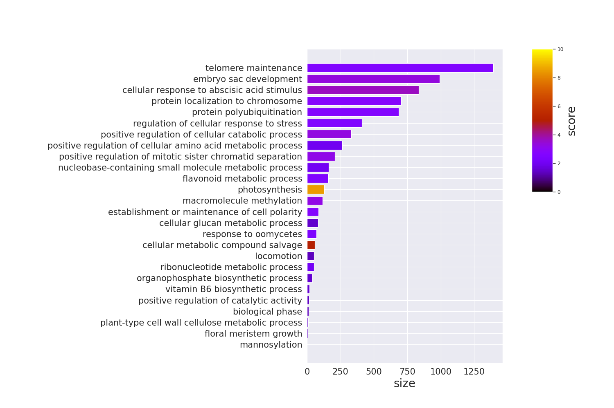
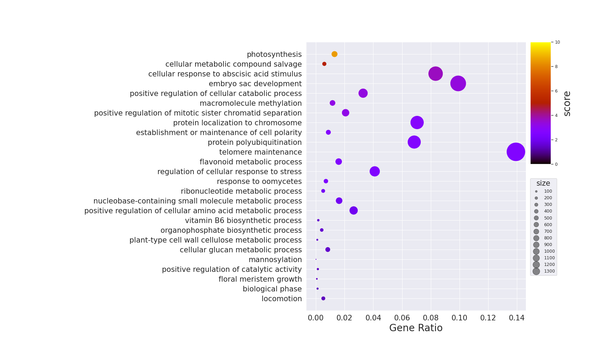
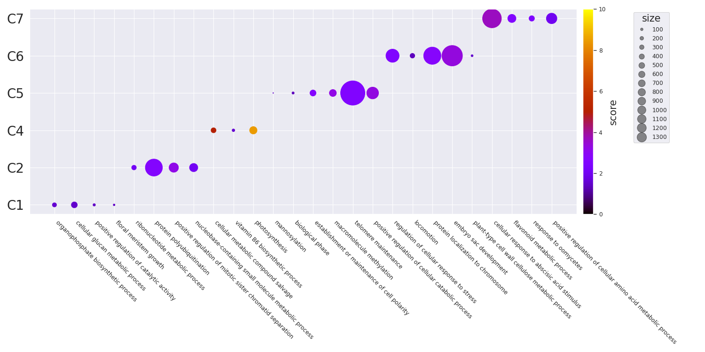
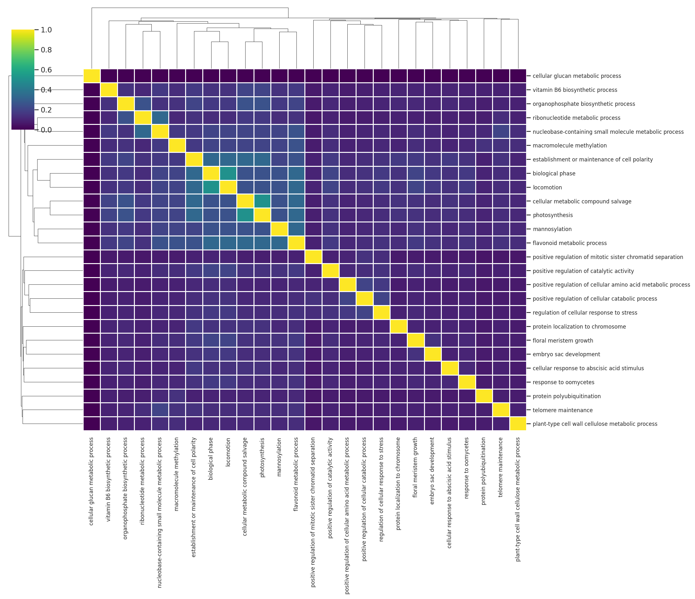
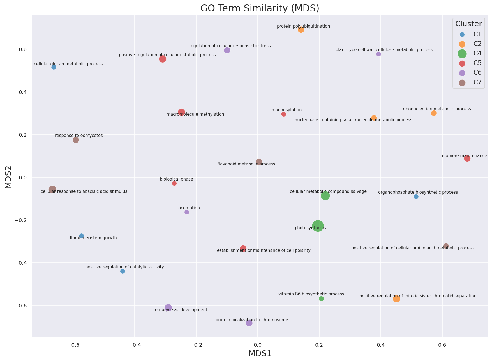
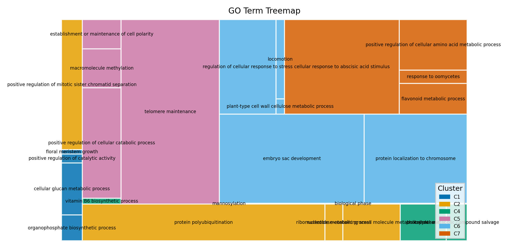
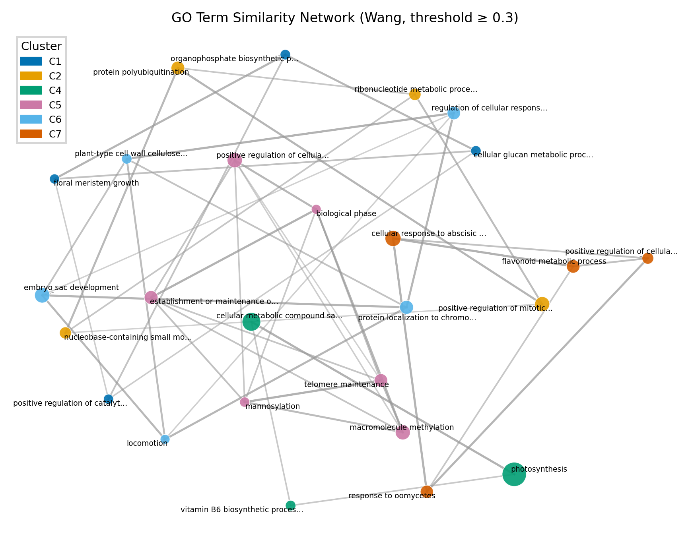

## TL;DR

RにはGO Enrichmentの結果をいい感じに図示してくれるライブラリがいくつかありますが(e.g., clusterProfiler, rrvgo etc.,)、Pythonにはありません。そこで、似たような図の作成方法をメモとしてまとめます。

個人的に図の微調整などはPythonのほうが知識もあって楽なのでPythonで書きたいという動機がありますが、ggplotが好きな人/Rに詳しい人は最初からRを使うのがおすすめです。

また、個人の趣味でpandasではなくpolarsを使用しています。polars、非常に体験がよいのでおすすめです。

## Dataset

列の意味としては以下を想定しています。

- term: GO Term ID
- score: -log10(padj)を想定
- size: アノテーションに含まれる遺伝子数)
- name: Go Termの名前。ラベルに使う。
- cluster: 適当なクラスターの名前

:::details[CSV data]

`example.csv`

```csv
term,score,size,name,cluster
GO:0090407,1.5297085894511266,41,organophosphate biosynthetic process,C1
GO:0006073,1.5163222189613395,83,cellular glucan metabolic process,C1
GO:0043085,1.44498285471817,14,positive regulation of catalytic activity,C1
GO:0010451,1.42343275529096,7,floral meristem growth,C1
GO:0009259,2.08444273888555,51,ribonucleotide metabolic process,C2
GO:0000209,2.626510646478822,685,protein polyubiquitination,C2
GO:1901970,3.197995679060633,207,positive regulation of mitotic sister chromatid separation,C2
GO:0055086,2.043050310202272,162,nucleobase-containing small molecule metabolic process,C2
GO:0043094,4.978646909720386,59,cellular metabolic compound salvage,C4
GO:0042819,1.5612111272483267,17,vitamin B6 biosynthetic process,C4
GO:0015979,8.466807502800558,130,photosynthesis,C4
GO:0097502,1.45417892854421,1,mannosylation,C5
GO:0044848,1.36510627820935,12,biological phase,C5
GO:0007163,2.6923744596164827,87,establishment or maintenance of cell polarity,C5
GO:0043414,3.215776159654917,116,macromolecule methylation,C5
GO:0000723,2.572069750528699,1393,telomere maintenance,C5
GO:0031331,3.2990295934320666,329,positive regulation of cellular catabolic process,C5
GO:0080135,2.5196148192030727,410,regulation of cellular response to stress,C6
GO:0040011,1.35544252617625,52,locomotion,C6
GO:0034502,2.739128030964704,705,protein localization to chromosome,C6
GO:0009553,3.35598374726875,991,embryo sac development,C6
GO:0052541,1.5212716561130444,10,plant-type cell wall cellulose metabolic process,C6
GO:0071215,3.6449534934267973,834,cellular response to abscisic acid stimulus,C7
GO:0009812,2.5663773876723597,159,flavonoid metabolic process,C7
GO:0002239,2.42790703640653,70,response to oomycetes,C7
GO:0045764,1.9573492416484901,263,positive regulation of cellular amino acid metabolic process,C7
```

:::

## Import & 設定

defaultでは以下の設定・ライブラリを利用している。

```python
import seaborn as sns
import matplotlib.pyplot as plt
import matplotlib as mpl
import polars as pl

print(sns.__version__)
# 0.11.2
print(pl.__version__)
# 0.13.36
print(mpl.__version__)
# 3.4.3

# seabornの設定。お好みで
sns.set(style="darkgrid", palette="muted", color_codes=True)
sns.set_context("paper")
```

## 単純なプロット

### Barplot



:::details[Code]

```python
# y軸にGO Termの名前を置きたいので、余白を多めにとる
plt.rcParams['figure.subplot.left'] = 0.5

df = pl.read_csv("./example.csv").sort("size")

terms = df.select("name").to_series().to_list()
sizes = df.select("size").to_series().to_list()

fig = plt.figure(figsize=(15, 10))
xgs = 10

# colorbarを手動で置く必要があるので、gridspecを使う
# colorbarは上半分くらいでいいので、y側も2分割
gs = fig.add_gridspec(2, xgs)

# colorbar部分を開けておく
ax = fig.add_subplot(gs[0:2, 0:xgs-2])

# scoresをrgbaに変換
cmap = plt.get_cmap("gnuplot")
norm = mpl.colors.Normalize(vmin=0, vmax=10)
scores = df.select("score").to_series().apply(lambda x: cmap(norm(x))).to_list()

# barplot
ax.barh(terms, sizes, color=scores)
ax.tick_params(axis="x", labelsize=15)
ax.set_xlabel("size", fontsize=20)
ax.tick_params(axis="y", labelsize=15)

# colorbar作成
cbar = fig.add_subplot(gs[0, xgs-1])
mpl.colorbar.Colorbar(
    cbar,
    mappable=mpl.cm.ScalarMappable(norm=norm, cmap=cmap),
    orientation="vertical",
).set_label("score", fontsize=20)

plt.show()
```

:::

### dotplot



:::details[Code]

```python
# y軸にGO Termの名前を置きたいので、余白を多めにとる
plt.rcParams['figure.subplot.left'] = 0.5

background_gene = 10000

df = pl.read_csv("./example.csv").sort("score")

terms = df.select("name").to_series().to_list()
sizes = df.select("size").to_series().to_list()
ratio = list(map(lambda x: x / background_gene, sizes))

vmin = 0
vmax = 10

fig = plt.figure(figsize=(17.5, 10))
xgs = 10

# colorbarを手動で置く必要があるので、gridspecを使う
# colorbarは上半分くらいでいいので、y側も2分割
gs = fig.add_gridspec(2, xgs)

# colorbar部分を開けておく
ax = fig.add_subplot(gs[0:2, 0:xgs-1])

cmap = plt.get_cmap("gnuplot")
scores = df.select("score").to_series().to_list()

# barplot
scatter = ax.scatter(ratio, terms, c=scores, s=sizes, cmap=cmap, vmin=vmin, vmax=vmax)
ax.tick_params(axis="x", labelsize=15)
ax.set_xlabel("Gene Ratio", fontsize=20)
ax.tick_params(axis="y", labelsize=15)

handles, labels = scatter.legend_elements(prop="sizes", alpha=0.5)
legend = ax.legend(
    handles,
    labels,
    # 単純な位置指定だといい位置にいかないので、bbox_to_anchorでマニュアル調整
    bbox_to_anchor=(1.15, 0.5),
    title="size",
    title_fontsize=15,
    markerscale=0.4
)

cbar = fig.add_subplot(gs[0, xgs-1])

# colorbarをつける
# 位置を好き勝手したいので、ColorbarBaseを使用
norm = mpl.colors.Normalize(vmin=vmin, vmax=vmax)
mpl.colorbar.Colorbar(
    cbar,
    mappable=mpl.cm.ScalarMappable(norm=norm, cmap=cmap),
    orientation="vertical",
).set_label("score", fontsize=20)

plt.show()
```

:::

### グループごとのdotplot



:::details[Code]

```python
# seabornの設定はお好みで
sns.set(style="darkgrid", palette="muted", color_codes=True)
sns.set_context("paper")

# x軸にGO Termの名前を置きたいので、余白を多めにとる
plt.rcParams['figure.subplot.bottom'] = 0.5

df = pl.read_csv("example.csv")

terms = df.select("name").to_series().to_list()
clusters = df.select("cluster").to_series().to_list()

fig = plt.figure(figsize=(15, 7.5))
ax = fig.add_subplot(111)

# 後でcolorbarを加えるために取得する
cmap = plt.get_cmap("gnuplot")
scatter = ax.scatter(
    terms,
    clusters,
    s=df.select(pl.col("size")).to_series().to_list(),
    c=df.select("score"),
    cmap=cmap,
    vmin=0,
    vmax=10,
)

# axisのラベル制御
# rotationするときは開始位置をhaで適切に指定する必要がある
# e.g., 315 -> left, 45 -> right
ax.set_xticklabels(terms, rotation=315, ha="left")
ax.tick_params(axis="y", labelsize=20)

# sizeのlegendを作成しておく
handles, labels = scatter.legend_elements(prop="sizes", alpha=0.5)
legend = ax.legend(
    handles,
    labels,
    # 単純な位置指定だといい位置にいかないので、bbox_to_anchorでマニュアル調整
    bbox_to_anchor=(1.175, 1),
    title="size",
    title_fontsize=15,
    markerscale=0.4
)

# colorbarをつける
fig.colorbar(scatter, ax=ax, pad=0.01).set_label("score", size=15)

fig.tight_layout()

plt.show()
```

:::

## Similarityを利用したプロット

GO Termにはsimilarityがあります。[Overview of semantic similarity analysis](https://yulab-smu.top/biomedical-knowledge-mining-book/semantic-similarity-overview.html)あたりが詳しいです。これは、Pythonでは`goatools`を利用することで計算できます。Rだと`GoSemSim`が利用できます。

`goatools`では、以下の手法をサポートしているようです。

**IC Base**

- Resnik
  - Philip, Resnik. 1999. “Semantic Similarity in a Taxonomy: An Information-Based Measure and Its Application to Problems of Ambiguity in Natural Language.” Journal of Artificial Intelligence Research 11: 95–130.
- Lin
  - Lin, Dekang. 1998. “An Information-Theoretic Definition of Similarity.” In Proceedings of the 15th International Conference on Machine Learning, 296—304. https://doi.org/10.1.1.55.1832.

**Graph Base**

- wang
  - Wang, James Z, Zhidian Du, Rapeeporn Payattakool, Philip S Yu, and Chin-Fu Chen. 2007. “A New Method to Measure the Semantic Similarity of GO Terms.” Bioinformatics (Oxford, England) 23 (May): 1274–81. https://doi.org/btm087.

Similarityベースの可視化では、追加で以下のライブラリを使用します。

```bash
pip install goatools scikit-learn squarify adjustText networkx
```

### Similarity Matrixの計算

まず、GO Term間のペアワイズなsemantic similarityを計算します。Wang法はグラフ構造のみを利用するため、アノテーションデータが不要で手軽に使えます。IC-based（Resnik, Lin）を使いたい場合は、別途アノテーションコーパスと`TermCounts`の準備が必要です。

:::details[Code]

```python
from goatools.obo_parser import GODag
from goatools.semantic import semantic_similarity
import numpy as np
import polars as pl

# go-basic.oboをダウンロードしておく
# curl -L -o go-basic.obo "https://release.geneontology.org/2024-06-17/ontology/go-basic.obo"
godag = GODag("go-basic.obo")

df = pl.read_csv("example.csv")
go_terms = df.select("term").to_series().to_list()

n = len(go_terms)
sim_matrix = np.zeros((n, n))

for i in range(n):
    for j in range(i, n):
        if i == j:
            sim_matrix[i][j] = 1.0
        else:
            try:
                # Wang法（グラフベース）でsimilarityを計算
                sim = semantic_similarity(go_terms[i], go_terms[j], godag)
                sim_matrix[i][j] = sim
                sim_matrix[j][i] = sim
            except KeyError:
                # obsoleteなtermなどはスキップ
                sim_matrix[i][j] = 0.0
                sim_matrix[j][i] = 0.0
```

:::

### クラスタリング

Similarity matrixからクラスタを自動生成することもできます。サンプルデータにはすでにcluster列がありますが、実データではsimilarityに基づいてクラスタリングするのが一般的です。`scipy`の階層クラスタリングを利用します。

:::details[Code]

```python
from scipy.cluster.hierarchy import linkage, fcluster

# similarity → distanceに変換して階層クラスタリング
Z = linkage(1 - sim_matrix, method="ward")

# 閾値でクラスタを切り出す（閾値は適宜調整）
clusters = fcluster(Z, t=0.7, criterion="distance")
df = df.with_columns(pl.Series("cluster", [f"C{c}" for c in clusters]))
```

:::

### Similarity Heatmap

Similarity matrixをヒートマップとして可視化します。seabornの`clustermap`を使うと、階層クラスタリングの樹形図（デンドログラム）も同時に表示できるので、GO Term間の関係が直感的にわかります。



:::details[Code]

```python
import seaborn as sns
import matplotlib.pyplot as plt

names = df.select("name").to_series().to_list()

# Nature style: sans-serif, 7pt
plt.rcParams.update({
    "font.family": "sans-serif",
    "font.sans-serif": ["Arial", "Helvetica", "DejaVu Sans"],
    "font.size": 7,
    "axes.labelsize": 8,
    "figure.dpi": 300,
    "savefig.dpi": 300,
    "pdf.fonttype": 42,
})

# single column: 89mm ≈ 3.5in, double column: 183mm ≈ 7.2in
COL2 = 183 / 25.4

g = sns.clustermap(
    sim_matrix,
    xticklabels=names,
    yticklabels=names,
    cmap="viridis",
    figsize=(COL2, COL2 * 0.85),
    dendrogram_ratio=(0.12, 0.12),
    linewidths=0.2,
    linecolor="white",
    cbar_kws={"label": "Wang similarity"},
    method="average",
)

g.ax_heatmap.tick_params(axis="x", labelsize=5, rotation=90)
g.ax_heatmap.tick_params(axis="y", labelsize=5)

plt.show()
```

:::

### MDSによるScatter Plot

Similarity matrixをMDS（Multi-Dimensional Scaling）で2次元に圧縮し、散布図として可視化します。Rの`rrvgo`のscatter plotに相当するものです。意味的に近いGO Termが近くに配置されるので、enrichmentの全体像を把握するのに便利です。



:::details[Code]

```python
from sklearn.manifold import MDS
from adjustText import adjust_text
import matplotlib.pyplot as plt
import seaborn as sns

# similarity → distanceに変換
dist_matrix = 1 - sim_matrix
np.fill_diagonal(dist_matrix, 0)
dist_matrix = np.clip(dist_matrix, 0, None)

mds = MDS(n_components=2, dissimilarity="precomputed", random_state=42, normalized_stress="auto")
coords = mds.fit_transform(dist_matrix)

df_plot = df.with_columns([
    pl.Series("x", coords[:, 0]),
    pl.Series("y", coords[:, 1]),
])

# Nature colorblind-safe palette (Wong 2011)
WONG_COLORS = ["#0072B2", "#E69F00", "#009E73", "#CC79A7",
               "#56B4E9", "#D55E00", "#F0E442", "#000000"]

COL2 = 183 / 25.4
fig, ax = plt.subplots(figsize=(COL2, COL2 * 0.65))

clusters = sorted(df_plot.select("cluster").to_series().unique().to_list())

for i, cluster in enumerate(clusters):
    subset = df_plot.filter(pl.col("cluster") == cluster)
    ax.scatter(
        subset.select("x").to_series().to_list(),
        subset.select("y").to_series().to_list(),
        s=[v * 25 for v in subset.select("score").to_series().to_list()],
        label=cluster,
        color=WONG_COLORS[i % len(WONG_COLORS)],
        alpha=0.85,
        edgecolors="white",
        linewidths=0.3,
    )

# ラベルの重なりをadjustTextで自動調整
texts = []
for row in df_plot.iter_rows(named=True):
    texts.append(ax.text(
        row["x"], row["y"], row["name"],
        fontsize=4.5, ha="center", va="bottom",
    ))
adjust_text(texts, ax=ax, arrowprops=dict(arrowstyle="-", color="grey", lw=0.3))

ax.legend(title="Cluster", frameon=True, edgecolor="0.8", fancybox=False)
ax.set_xlabel("MDS1")
ax.set_ylabel("MDS2")
sns.despine(ax=ax)

plt.tight_layout()
plt.show()
```

:::

MDSの代わりにUMAPを使うこともできます。特にGO Termの数が多い場合はUMAPのほうが適切な場合があります。

```python
# UMAPを使う場合
# pip install umap-learn
from umap import UMAP

reducer = UMAP(metric="precomputed", random_state=42)
coords = reducer.fit_transform(dist_matrix)
```

### Treemap

Treemapは各GO Termを矩形として描画し、面積でサイズ（遺伝子数）を、色でクラスタを表現します。Rの`rrvgo`における`treemapPlot`に相当する可視化です。enrichmentされたGO Termの全体的な構成を俯瞰するのに適しています。



:::details[Code]

```python
import squarify
import matplotlib.pyplot as plt
import matplotlib.patches as mpatches

WONG_COLORS = ["#0072B2", "#E69F00", "#009E73", "#CC79A7",
               "#56B4E9", "#D55E00", "#F0E442", "#000000"]

COL2 = 183 / 25.4
fig, ax = plt.subplots(figsize=(COL2, COL2 * 0.55))

df_sorted = df.sort("cluster", "score", descending=[False, True])

sizes = df_sorted.select("size").to_series().to_list()
labels = df_sorted.select("name").to_series().to_list()
clusters_list = df_sorted.select("cluster").to_series().to_list()

unique_clusters = sorted(set(clusters_list))
color_map = {c: WONG_COLORS[i % len(WONG_COLORS)] for i, c in enumerate(unique_clusters)}
colors = [color_map[c] for c in clusters_list]

sizes_safe = [max(s, 1) for s in sizes]

squarify.plot(
    sizes=sizes_safe,
    label=labels,
    color=colors,
    alpha=0.85,
    ax=ax,
    text_kwargs={"fontsize": 4.5, "wrap": True},
    ec="white",
    linewidth=1,
)

handles = [mpatches.Patch(color=color_map[c], label=c) for c in unique_clusters]
ax.legend(handles=handles, title="Cluster", frameon=True,
          edgecolor="0.8", fancybox=False, loc="lower right", fontsize=5)
ax.axis("off")
ax.set_title("GO Term Treemap")

plt.tight_layout()
plt.show()
```

:::

### Similarity Network（NetworkX）

`networkx`を使って、GO Term間のsimilarityをネットワークとして可視化することもできます。ノードがGO Term、エッジがsimilarityを表し、類似度が閾値以上のペアのみをエッジとして描画します。ネットワークレイアウトはspring layout（force-directed）を使い、類似度が高いノード同士が近くに配置されます。



:::details[Code]

```python
import networkx as nx
import matplotlib.pyplot as plt
import matplotlib.patches as mpatches
from adjustText import adjust_text

WONG_COLORS = ["#0072B2", "#E69F00", "#009E73", "#CC79A7",
               "#56B4E9", "#D55E00", "#F0E442", "#000000"]

df = pl.read_csv("example.csv")
go_terms = df["term"].to_list()
names = df["name"].to_list()
scores = df["score"].to_list()
sizes = df["size"].to_list()
clusters = df["cluster"].to_list()

unique_clusters = sorted(set(clusters))
ccmap = {c: WONG_COLORS[i % len(WONG_COLORS)] for i, c in enumerate(unique_clusters)}

# --- グラフ構築 ---
threshold = 0.3  # この閾値以上のsimilarityをエッジとして描画
G = nx.Graph()
n = len(go_terms)

for i in range(n):
    G.add_node(i, label=names[i], cluster=clusters[i],
               score=scores[i], size=sizes[i])

for i in range(n):
    for j in range(i + 1, n):
        if sim_matrix[i, j] >= threshold:
            G.add_edge(i, j, weight=sim_matrix[i, j])

# --- 描画 ---
COL2 = 183 / 25.4
fig, ax = plt.subplots(figsize=(COL2, COL2 * 0.75))

# spring layout: weightが大きい（類似度が高い）ノード同士を近くに配置
pos = nx.spring_layout(G, weight="weight", seed=42, k=1.5)

# エッジ: 類似度に応じて太さと透明度を変える
edges = list(G.edges(data=True))
if edges:
    weights = [d["weight"] for _, _, d in edges]
    max_w = max(weights)
    for (u, v, d) in edges:
        w = d["weight"]
        alpha = 0.15 + 0.6 * (w / max_w)
        lw = 0.3 + 1.0 * (w / max_w)
        ax.plot(
            [pos[u][0], pos[v][0]], [pos[u][1], pos[v][1]],
            color="0.6", alpha=alpha, lw=lw, zorder=0,
        )

# ノード: クラスタで色分け、scoreでサイズ
node_colors = [ccmap[G.nodes[i]["cluster"]] for i in G.nodes]
node_sizes = [G.nodes[i]["score"] * 25 for i in G.nodes]
nx.draw_networkx_nodes(G, pos, ax=ax, node_color=node_colors,
                       node_size=node_sizes, alpha=0.9,
                       edgecolors="white", linewidths=0.3)

# ラベル
texts = []
for i in G.nodes:
    short = names[i][:30] + "…" if len(names[i]) > 30 else names[i]
    texts.append(ax.text(pos[i][0], pos[i][1], short, fontsize=4.5,
                         ha="center", va="center"))
adjust_text(texts, ax=ax, arrowprops=dict(arrowstyle="-", color="grey", lw=0.3))

handles = [mpatches.Patch(color=ccmap[c], label=c) for c in unique_clusters]
ax.legend(handles=handles, title="Cluster", frameon=True,
          edgecolor="0.8", fancybox=False, loc="upper left")
ax.set_axis_off()
ax.set_title(f"GO Term Similarity Network (Wang, threshold ≥ {threshold})")

plt.tight_layout()
plt.show()
```

:::

閾値（`threshold`）を変えることでネットワークの密度を調整できます。閾値を高くすると類似度の高いペアのみがエッジとして残り、低くするとより多くの接続が表示されます。

また、エッジの重みを使ったコミュニティ検出（例: Louvainアルゴリズム）も可能です。

```python
# コミュニティ検出（Louvain法）
# pip install python-louvain
import community as community_louvain

partition = community_louvain.best_partition(G, weight="weight")
# partition: {node_id: community_id, ...}
```
