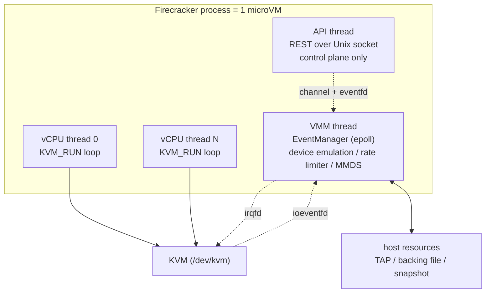
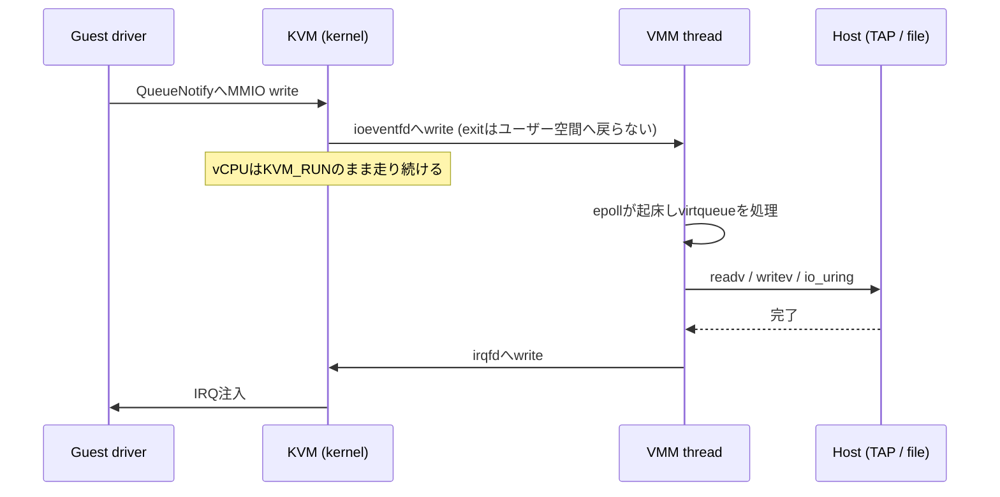

AWSがLambdaやFargateのために開発したVMM (Virtual Machine Monitor) である[Firecracker](https://github.com/firecracker-microvm/firecracker)が、KVMの上に何を積み上げてmicroVMを成立させているのかを、実際のソースコードを引用しながら追う。扱うのはFirecrackerプロセスの内側の機構であり、Kata Containersやfirecracker-containerdといった上位のオーケストレーション、および他のVMMとの性能比較は扱わない。

引用するソースはすべて`753a817` (v1.17.0-dev、2026年8月時点) のものを使う。アーキテクチャの記述は特記しない限りx86_64を前提とする。

::gh-card[firecracker-microvm/firecracker]

## TL;DR

- Firecrackerは1プロセスが1つのmicroVMを持ち、その中にAPIスレッド、VMMスレッド、vCPUスレッド (最大32本) だけが走る。APIスレッドはI/Oのファストパスに一切登場しない
- BIOSもブートローダも持たず、VMMがカーネルイメージをゲストメモリへ直接展開し、zero pageやhvm_start_infoを組み立て、vCPUのレジスタをブートプロトコルが要求する状態 (Linuxブートなら64bitモードに入り終えた状態) に設定してから走らせる。これが起動時間125ms以下という数字を成立させる前提の1つになっている
- virtioのデータパスはioeventfdとirqfdに載っている。ゲストがvirtqueueへ通知を書くとKVMがカーネル内でeventfdを叩き、VMMスレッドのepollが起きる。KVM exitがユーザー空間まで戻らないので、vCPUはゲストコードの実行を続けられる
- セキュリティはKVM境界、スレッド単位のseccompフィルタ、jailerによるchroot・cgroup・namespace・権限降格の三層で構成される。vCPUスレッドは常に悪意あるコードを実行中であるという前提で設計されている
- スナップショットの復元はメモリファイルの`MAP_PRIVATE`マッピングであり、ページは触られた時点でオンデマンドにロードされる

## なぜ「機能を削ること」が設計の中心なのか

Firecrackerの設計を読むうえでの出発点は、[SPECIFICATION.md](https://github.com/firecracker-microvm/firecracker/blob/main/SPECIFICATION.md)に書かれた数値目標だ。以下の3点は`m5d.metal`と`m6g.metal`のベアメタルインスタンス上での値で、いずれも統合テストで検証される。一方、同じ文書に並ぶI/Oスループットやゲストのコンピュート性能は`[integration test pending]`のまま残っており、全項目が検証済みというわけではない。

- vCPU 1個・メモリ128MiBのmicroVMにおいて、VMMスレッド群のメモリオーバーヘッドは5MiB以下
- `InstanceStart` APIを受け取ってからゲストの`/sbin/init`が動き出すまで125ms以下。シリアルコンソールを無効にし、最小構成のカーネルとrootfsを使った場合の値になる
- Firecrackerプロセスの起動 (APIソケットが利用可能になるまで) は8 CPU ms以内

設計ドキュメントのほうには、これに加えて「ホストコア1個あたり毎秒5台のmicroVMを作り続けられる」という数字が挙がっている。36コアのホストなら毎秒180台という規模になる。

この数字を守ろうとすると、汎用VMMが持っている機能のほとんどが邪魔になる。PCIバスの列挙、BIOS、SCSIやUSBのエミュレーション、VGA、ACPIの巨大なテーブル。これらはどれも起動時間とメモリフットプリントを食い、同時に攻撃面を広げる。Firecrackerの答えは単純で、持たないか最小限まで削ることだ。ACPIは数KiBのテーブルだけを残し、PCIは既定で無効にしている。

重要なのは、この「持たない」が性能とセキュリティの両方に同時に効いている点だ。デバイスを1つ減らすと、ゲストからVMMへ到達できるコードパスが1つ減り、初期化のためのMMIOアクセスが減り、常駐するメモリが減る。Firecrackerの各機構は、この一本の軸の上に並んでいる。

## プロセスとスレッドのモデル

### 1プロセスが1つのmicroVMを持つ

Firecrackerは1プロセスにつき1つのmicroVMしか持たない。複数のVMを1プロセスで多重化する設計を最初から捨てているため、プロセス境界がそのままテナント境界になる。ホスト側でcgroupやnamespaceを掛ける単位もプロセスであり、あるVMを殺したければそのプロセスを殺せばよい。

プロセスの中に存在するスレッドは3種類しかない。



APIスレッドはUnixドメインソケット上のREST APIを提供し、コントロールプレーンだけを担当する。設計ドキュメントは「APIスレッドは仮想マシンのファストパスには決して現れない」と明言している。ゲストがディスクを読む経路にHTTPサーバは一切関与しない。

VMMスレッドはマシンモデル、最小限のレガシーデバイス、MMDS、そしてvirtioのNet・Block・Vsockデバイスのエミュレーションを持つ。I/Oのレートリミットが掛かるのもこのスレッドが担う。

vCPUスレッドはゲストのCPUコア1本につき1本作られ、`KVM_RUN`のループを回す。上限は32本に設定されている。

### EventManagerがVMMスレッドを回す

VMMスレッドの実体は、rust-vmmの`event-manager`クレートによるepollループだ。APIなしで起動する`--no-api`モードのコードを見ると、この構造がそのまま現れる。

::gh[https://github.com/firecracker-microvm/firecracker/blob/753a817/src/firecracker/src/main.rs#L670-L681]

`event_manager.run()`がepollを回し、登録されたサブスクライバ (各virtioデバイス、シリアル、メトリクス、Vmm自身) にイベントを配る。デバイスのエミュレーションは、このループから呼ばれるコールバックとして書かれている。

注目したいのは`run()`の直前に置かれた不変条件のコメントだ。

```rust
// INVARIANT: seccomp must be applied before entering the event loop.
```

ゲストのコードが動き出す前にフィルタを入れる、という順序が明示的に守られている。同じ原則はvCPUスレッドにも適用される。

## KVMをどう叩いているか

### 起動シーケンス

microVMの構築は`build_microvm_for_boot()`に集約されている。この関数の流れがそのままKVMの使い方になっている。

1. `Kvm::new()`で`/dev/kvm`を開く
2. `KvmVm::new()`で`KVM_CREATE_VM`
3. `create_vcpus()`で必要な本数の`KVM_CREATE_VCPU`
4. `register_dram_memory_regions()`でホストのmmap領域をゲスト物理アドレスに対応付ける
5. カーネルイメージをゲストメモリへロードする
6. virtioデバイスを生成し、MMIOアドレスとIRQを割り当てる
7. `configure_system_for_boot()`でCPUID・MSR・レジスタ・ブートパラメータを書き込む
8. vCPUを各スレッドへ移して起動する。ただし状態は`Paused`

::gh[https://github.com/firecracker-microvm/firecracker/blob/753a817/src/vmm/src/builder.rs#L175-L181]

順序に意味があるのは、デバイスの生成とブートパラメータの書き込みの間だ。デバイスへ割り当てたMMIOアドレスとIRQ番号はカーネルコマンドラインに載せる必要があるので、コマンドラインを確定してゲストメモリへ書くステップ7は、デバイス生成より後でなければならない。この点は後述する。

vCPUスレッドを作った時点ではまだゲストコードは走らない。`Paused`状態で作り、外から`Resume`イベントを送って初めて動き出す。スナップショットからの復元も、この一時停止した状態を利用している。

### vCPUスレッドの状態機械

vCPUスレッドのメインループは、3状態の状態機械として書かれている。

::gh[https://github.com/firecracker-microvm/firecracker/blob/753a817/src/vmm/src/vstate/vcpu.rs#L212-L237]

`Running`状態の内部にはさらにループがある。これは外部イベントがない限り状態機械を1周させないための最適化で、`run_emulation()`が`Handled`を返し続ける間は`KVM_RUN`に入り直すだけの最小の経路を回る。外部イベントのチェックはループを抜けたときにだけ`try_recv()`で行う。

VMMスレッドからvCPUへの指示 (Pause、Resume、SaveState、Finish) はチャネル経由で送られ、応答も別チャネルで返る。この非同期な作りが、後で見るスナップショットの一貫性確保に効いてくる。

### KVM exitの分岐

`KVM_RUN`から戻ったときの分岐を担うのが`handle_kvm_exit()`だ。ここが「ゲストの何がVMMまで届くか」を決めている。

::gh[https://github.com/firecracker-microvm/firecracker/blob/753a817/src/vmm/src/vstate/vcpu.rs#L440-L462]

`MmioRead`と`MmioWrite`は`mmio_bus`へディスパッチされる。これはアドレス範囲をキーにデバイスを引く単純なバスで、virtioのMMIOトランスポートやブートタイマーが載っている。x86_64のシリアルとi8042はポートI/Oなので`mmio_bus`ではなく`pio_bus`側に登録され、`IoIn`/`IoOut` exitとしてアーキテクチャ固有の経路で処理される。注意したいのは、この処理がVMMスレッドではなくvCPUスレッド自身の上で走る点だ。デバイスは`Arc<Mutex<...>>`で共有されており、vCPUスレッドがロックを取って設定レジスタを読み書きする。ここに来るのはvirtioデバイスの初期化やステータス更新のような低頻度のアクセスであり、データパスの通知は次節のioeventfdへ逃がされている。

`SystemEvent`のうち`KVM_SYSTEM_EVENT_RESET`と`KVM_SYSTEM_EVENT_SHUTDOWN`は正常な停止として扱われる。ただしx86_64ではゲストのリブート要求はここには来ない。i8042デバイスのエミュレーションがVMMスレッドへ直接シグナルを送る経路になっており、コード中のコメントもその旨を断っている。

`FailEntry`と`InternalError`はエラー扱いになる。前者はハードウェアレベルでのVMエントリ失敗、後者はKVM側の問題を指す。どちらもmicroVMを落とす。

### 動いているvCPUを外から止める

`KVM_RUN`はゲストが自発的にexitしない限り戻ってこない。スナップショットのために一時停止したい場合、外からvCPUスレッドを蹴り出す必要がある。Firecrackerはリアルタイムシグナルを使う。

::gh[https://github.com/firecracker-microvm/firecracker/blob/753a817/src/vmm/src/vstate/vcpu.rs#L121-L132]

シグナルハンドラは`fence(Ordering::Acquire)`を実行するだけで、何もしない。実際の停止は、シグナルの配送によって`KVM_RUN`が`EINTR`で戻ることと、事前に別スレッドから書き込まれた`immediate_exit`フラグの組み合わせで達成される。ハンドラのfenceは、そのフラグの書き込みが確実に見えるようにするためにある。

## ゲストメモリとアドレス空間

ゲストメモリは、ホスト側で`mmap`した匿名privateマッピングをKVMのメモリスロットとして登録したものだ。

::gh[https://github.com/firecracker-microvm/firecracker/blob/753a817/src/vmm/src/vstate/memory.rs#L885-L898]

これを受け取る`create()`は、渡されたフラグにさらに`MAP_NORESERVE`を足して各リージョンを確保する。匿名privateマッピングなので、物理ページはゲストが最初にそのページへ触った時点でフォルト経由で割り当てられる。`MAP_NORESERVE`のほうは、ホストカーネルにスワップやcommitの予約を先に取らせないために効く。設計ドキュメントが言う「microVMはホストのCPUとメモリをオーバーサブスクライブできる」のうち、メモリ側はこのデマンドページングとホストのovercommitに乗ったものになる。なお匿名マッピングになるのは既定の構成の場合で、vhost-userデバイスを1つでも使うとmemfdを`MAP_SHARED`で貼る経路に切り替わる。

ゲスト物理アドレス空間のレイアウトは`layout.rs`に定数として並んでいる。x86_64の主要なものを抜き出すと以下になる。

| アドレス             | 用途                                      |
| -------------------- | ----------------------------------------- |
| `0x6000`             | `hvm_start_info` (PVHブート時)            |
| `0x7000`             | zero page (Linuxブートプロトコル時)       |
| `0x8ff0`             | ブート用スタックポインタ                  |
| `0x20000`            | カーネルコマンドライン (最大2048バイト)   |
| `0x9fc00`〜`0xe0000` | MPTableやACPIテーブルなどのシステムデータ |
| `0x100000`           | ハイメモリの開始                          |
| `0xc0000000`〜       | 32bit MMIO領域 (1GiB)                     |

PVHのメモリマップテーブルとLinuxブートプロトコルのzero pageは、どちらも同じ`0x7000`に置かれている。この2つは排他なので重ねてよい、とソース中のコメントが明記している。`hvm_start_info`本体は`0x6000`にあり、zero pageとは重ならない。

このレイアウトはe820テーブル (Linuxブート時) またはメモリマップテーブル (PVH時) としてゲストへ渡される。システムデータ領域とPCI MMCONFIG領域を`RESERVED`として明示的に登録することで、ゲストのカーネルがそこをRAMとして使わないようにしている。

## ブート: BIOSもブートローダも無い

### カーネルイメージを直接ロードする

Firecrackerが最も明確に「削った」のがブート経路だ。BIOSもUEFIもGRUBも存在しない。VMMがカーネルイメージを読み、ゲストメモリの規定のアドレスへ展開する。

::gh[https://github.com/firecracker-microvm/firecracker/blob/753a817/src/vmm/src/arch/x86_64/mod.rs#L450-L520]

まずELFとしてロードを試み、ELFマジックがなければbzImageローダにフォールバックする。つまり非圧縮の`vmlinux`と`bzImage`の両方を受け付ける。ただしbzImageはブートプロトコル2.12以上で`XLF_KERNEL_64`を広告しているものに限られ、満たさなければエラーになる (現代のdistroカーネルは満たす)。bzImageの場合は`XLF_KERNEL_64`フラグを確認したうえで、ロードアドレスから`0x200`進んだ64bitエントリポイントへ直接飛ぶ。リアルモードから始まる従来のブート経路はまるごと迂回される。

### LinuxBootとPVHの分岐

ELFのロードに成功した場合、Firecrackerは`pvh_boot_cap`を見てエントリポイントを切り替える。カーネルが`XEN_ELFNOTE_PHYS32_ENTRY`ノートを持っていればPVHブートプロトコル、なければ従来のLinuxブートプロトコルを使う。

どちらを選んでも、VMMがブートパラメータ構造体をゲストメモリに書き込む点は変わらない。PVHなら`hvm_start_info`とメモリマップテーブルを`0x6000`と`0x7000`へ、Linuxブートなら`boot_params` (zero page) を`0x7000`へ書く。本来ブートローダがやる仕事を、VMMが起動前に済ませている。

### レジスタを「起動済み」の状態にして始める

ブートの省略が最も露骨に現れるのがレジスタの初期化だ。

::gh[https://github.com/firecracker-microvm/firecracker/blob/753a817/src/vmm/src/arch/x86_64/regs.rs#L86-L113]

Linuxブートプロトコルでは`rsi`にzero pageのアドレスを、PVHでは`rbx`に`hvm_start_info`のアドレスを入れる。いずれもプロトコルが要求するABIそのものだ。

さらに`setup_sregs()`がセグメントレジスタと制御レジスタを構成する。Linuxブートプロトコルの場合は`CR0`に`PE`と`PG`、`CR4`に`PAE`、`EFER`に`LME`と`LMA`を立て、ゲストメモリ上にPML4・PDPT・ページディレクトリの3段のページテーブルを用意する。ページディレクトリの512エントリが2MiBページを直接指すので4段目は要らず、仮想アドレスの先頭1GiBだけがマップされた状態で起動する。つまりvCPUは最初の1命令目から64bitロングモードで動き出す。PVHの場合はABIの規定どおりページング無効の32bitプロテクトモードで開始する。いずれにせよ、リアルモードから順にモードを切り替えていく通常のブートストラップは、KVMのioctl数回に置き換えられている。

### デバイスの存在をカーネルに伝える

PCIバスを列挙しないので、ゲストのカーネルはvirtioデバイスの在り処を自力で発見できない。Firecrackerはカーネルコマンドラインに書き込むことで解決する。

::gh[https://github.com/firecracker-microvm/firecracker/blob/753a817/src/vmm/src/device_manager/mmio.rs#L231-L250]

`virtio_mmio.device=<size>K@<baseaddr>:<irq>`という形式で、デバイスごとに1エントリが追加される。デバイスを追加してからカーネルコマンドラインを確定させ、それをゲストメモリの`0x20000`へ書く、という順序が必要なのはこのためだ。PCIを有効化していない場合は`pci=off`も併せて挿入され、ゲストがPCIの列挙に時間を使わないようにしている。

## デバイスモデル

### レガシーデバイスはシリアルとi8042だけ

x86_64のmicroVMがゲストへ見せるレガシーデバイスは、シリアルポートとi8042 (キーボードコントローラ) の2つに絞られる。しかもi8042は本来の用途では使われない。設計ドキュメントの表現を借りれば、Firecracker内でのi8042の目的は「ゲストがリブートを要求したことをmicroVMへ伝えること」だけだ。ゲストがi8042のステータスポートへCPUリセットコマンド`0xFE`を書くと、エミュレーション側が`reset_evt`のeventfdを叩き、VMMがこれをシャットダウン要求として扱う。さきほど「i8042がVMMスレッドへ直接シグナルを送る」と書いた経路の実体がこれになる。逆方向には、ホストから`SendCtrlAltDel`アクションを送るとi8042がキーボード割り込みを注入し、ゲストのカーネルがそれをリブート要求として解釈する。

このほかにKVMが提供するPIC、IOAPIC、PITがゲストから見える。クロックソースはx86_64ではkvm-clockとTSCの2つで、Linux 5.10以降のゲストはTSCが安定していればそちらを選ぶ。

### virtqueueとMMIOトランスポート

ストレージとネットワークはvirtioで提供される。トランスポートはMMIOとPCIeの両方が実装されているが、既定ではMMIOが使われる。

MMIOトランスポートでは1デバイスあたり`0x1000`バイトの領域と、レガシーGSI 1本が割り当てられる。x86_64でレガシー割り込みに使えるGSIは5番から23番までの19本しかない (0番から4番は予約) ので、この方式で載せられるvirtioデバイスの数には上限がある。PCIトランスポートを使う場合は`--enable-pci`フラグが必要で、有効にするとすべてのvirtioデバイスがPCI経由になりMSI-Xが使われる。デバイスのホットプラグもPCIトランスポートでのみ提供される (執筆時点ではdeveloper preview)。

`Queue`構造体はvirtqueueの3つのリング (ディスクリプタテーブル、availableリング、usedリング) のゲスト物理アドレスと、それに対応するホスト仮想アドレスのポインタを保持する。ゲストメモリへのアクセスは毎回のアドレス変換を避けて生ポインタ経由で行われる。

ここで`pop()`にある防御的なチェックが面白い。

::gh[https://github.com/firecracker-microvm/firecracker/blob/753a817/src/vmm/src/devices/virtio/queue.rs#L479-L499]

availableリングの未処理エントリ数がキューサイズを超えていたら、それはドライバの不正な振る舞いを意味する。ゲストは信頼されないので、VMM側でハングやDoSに陥る前にエラーとして弾く。virtioの実装全体がこの姿勢で書かれている。

### ioeventfdとirqfd

virtioのデータパスの中心はここにある。virtioデバイスを登録するコードを見ると、2種類のeventfdがKVMへ渡されている。virtqueueごとに1本のioeventfdと、デバイスごとに1本のirqfdだ。

::gh[https://github.com/firecracker-microvm/firecracker/blob/753a817/src/vmm/src/device_manager/mmio.rs#L199-L214]

`register_ioevent()`は、MMIOアドレス`device_addr + 0x50` (`NOTIFY_REG_OFFSET`、virtio-mmioのQueueNotifyレジスタ) への書き込みをKVMのカーネル内で捕捉し、対応するeventfdへ書き込むよう登録する。`register_irq()`は逆方向で、eventfdへの書き込みをゲストへのIRQ注入に変換する。

これによりI/Oのラウンドトリップは次のようになる。



重要なのは、通知の往路でKVM exitがユーザー空間まで戻らない点だ。vCPUスレッドは`KVM_RUN`の中に留まったままゲストコードの実行を続け、I/Oの実処理は別スレッドが引き受ける。復路の割り込み注入も同様にカーネル内で完結する。ユーザー空間への復帰とゲストへの再突入が、往復とも省ける構造になっている。

MMIOトランスポートの割り込みは`IrqTrigger`という小さな構造体で表現されており、中身は`irq_status`のアトミック変数と`irq_evt`のeventfdの2つしかない。virtio-mmioのInterruptStatusレジスタの意味論をアトミック変数で保持し、実際の通知はeventfdへの書き込み1回で済ませている。

### レートリミッタ

マルチテナントで動かす以上、1台のmicroVMがホストのI/O帯域を占有してはならない。Firecrackerはブロックデバイスとネットワークインタフェースのそれぞれに、トークンバケットを2本持つレートリミッタを掛けられる。

::gh[https://github.com/firecracker-microvm/firecracker/blob/753a817/src/vmm/src/rate_limiter/mod.rs#L53-L76]

2本のバケットはそれぞれ「秒間の操作回数」と「秒間のバイト数」に対応する。`one_time_burst`は補充されない初期クレジットで、起動直後のバースト的なI/Oを許すために使う。

ネットワークデバイスでの消費のしかたに実装上の工夫がある。

```rust
fn rate_limiter_consume_op(rate_limiter: &mut RateLimiter, size: u64) -> bool {
    if !rate_limiter.consume(1, TokenType::Ops) {
        return false;
    }
    if !rate_limiter.consume(size, TokenType::Bytes) {
        rate_limiter.manual_replenish(1, TokenType::Ops);
        return false;
    }
    true
}
```

操作数のトークンを先に消費し、バイト数のトークンが足りなければ操作数のトークンを戻す。2本のバケットに対する消費をアトミックに扱うための、素朴だが確実な補償処理になっている。

トークンが尽きたときはデバイスの処理を止め、`timerfd`で補充を待つ。この`timerfd`もEventManagerのepollに登録されているので、待ち合わせのための専用スレッドは要らない。

### MMDSとdumbo

MMDS (microVM Metadata Service) は、ゲストに`169.254.169.254`のHTTPエンドポイントとしてメタデータを見せる機能だ。EC2のインスタンスメタデータサービスと同じ使い勝手を、外部のネットワークサービスなしに提供する。

実装はFirecrackerプロセス内で完結している。`dumbo`と名付けられた最小のTCP/IPv4/HTTPスタックがネットワークデバイスの中に同居しており、ゲストが送出したフレームをTAPへ渡す前に横取りする。

::gh[https://github.com/firecracker-microvm/firecracker/blob/753a817/src/vmm/src/devices/virtio/net/device.rs#L528-L562]

この関数のコメントは、既知のTOCTOU競合と、それを修正しない理由を率直に説明している。ヘッダを読んで宛先を判定してからTAPへ転送するまでの間に、ゲストが宛先IPを書き換えられる。悪意あるゲストはこれを利用して、ホスト自身のIMDSへパケットを送り込める。

Firecracker側の判断は3点にまとめられている。

1. MMDSを有効化していない場合、そもそも`169.254.169.254`宛はTAPへ素通しになる
2. ゲストの送出トラフィックは信頼されない前提であり、ホスト側のファイアウォールで制御すべきものになる
3. 修正のためにパケットをホストのバッファへコピーすると、ゲストからホストへのTCPスループットが大きく落ちる

これは後述する脅威モデルの引き方をよく表している。「ゲストの出力は信頼しない、フィルタリングはホストの責務」という境界が先にあり、その内側での局所的な競合は境界の外で対処されるべき問題として扱われている。

## セキュリティ境界の多層構造

### 脅威モデル

設計ドキュメントの前提は明快だ。

> all vCPU threads are considered to be running malicious code as soon as they have been started

vCPUスレッドは起動した瞬間から悪意あるコードを実行しているとみなす。この前提から、信頼ゾーンを入れ子にして境界を積む設計が導かれる。

### 第1層: KVM境界

最も内側の境界はハードウェア仮想化そのものだ。ゲストのメモリアクセスはEPT/NPTで制限され、特権命令はVM exitを引き起こす。この境界自体を破るにはKVMかCPUの脆弱性が要る。ただしゲストは境界を破らなくても、MMIOアクセスとvirtqueueに置いたディスクリプタを通じて、VMMプロセスのユーザー空間コードへ入力を届けられる。さきほどの`pop()`の防御的チェックは、まさにこの攻撃面があるから書かれている。後続の2層は、VMMプロセス自体が侵害されうるという前提に立っている。

### 第2層: スレッド単位のseccompフィルタ

Firecrackerはseccompフィルタを既定で有効にし、しかもスレッドの役割ごとに別のフィルタを掛ける。フィルタはJSONで記述され、`seccompiler`がビルド時にBPFへコンパイルしてバイナリへ埋め込む。

x86_64向けの既定フィルタで許可されているシステムコールの数を次に示す。

| スレッド | 許可されるシステムコール数 | ルール数 | 既定動作 |
| -------- | -------------------------- | -------- | -------- |
| vmm      | 50                         | 76       | trap     |
| api      | 31                         | 36       | trap     |
| vcpu     | 27                         | 49       | trap     |

既定動作は`trap`、すなわち許可されていないシステムコールを呼ぶと`SIGSYS`でプロセスが落ちる。ルール数がシステムコール数を上回るのは、同じシステムコールに対して引数の値まで含めた条件が複数書かれているためだ。たとえば`ioctl`はKVMの特定のリクエスト番号に限定される。

フィルタを適用するタイミングも厳密に決まっている。VMMスレッドはイベントループに入る直前、APIスレッドはHTTPサーバを起動する直前、vCPUスレッドはゲストコードを実行する直前になる。

::gh[https://github.com/firecracker-microvm/firecracker/blob/753a817/src/vmm/src/vstate/vcpu.rs#L217-L227]

`apply_filter`が失敗したらpanicする。フィルタなしでゲストコードを走らせる中途半端な状態を許さない、という判断だ。

なお、デバッグビルドと実験的なGNUターゲットでは既定フィルタが入らない。本番用途ではmusl向けのリリースビルドを使う必要がある。

### 第3層: jailer

`jailer`はFirecrackerを起動する別のバイナリで、特権が必要な準備を済ませてから権限を落として`exec`する。本番環境ではjailer経由での起動が推奨されている。

jailerが行う主な処理を挙げる。

- `close_range`システムコールでfd 3以降をすべて閉じる (`docs/jailer.md`には`/proc/<pid>/fd`の走査と書かれているが、現行の実装は`close_range`一発になっている)
- 親プロセスから受け継いだ環境変数をすべて消す
- `<chroot_base>/<exec_file_name>/<id>/root`を作り、Firecrackerバイナリをそこへコピーする
- `setrlimit()`でファイルサイズとファイルディスクリプタ数の上限を設定する。既定では`no-file`が2048
- cgroupのサブフォルダを作り、自身のPIDを書き込む。cgroup v1とv2の両方に対応する
- `unshare()`で新しいmount namespaceへ入り、`pivot_root()`でルートを差し替え、古いルートをunmountする
- `mknod`でjail内に`/dev/kvm`と`/dev/net/tun`を作り、指定されたuid/gidに`chown`する
- 必要ならnetwork namespaceへ参加し、`--new-pid-ns`が指定されていれば`CLONE_NEWPID`付きの`clone()`で新しいPID namespaceを作る
- uid/gidを落としてから`exec`する

バイナリをjail内にコピーする理由が興味深い。同じ実行ファイルをmmapすれば複数のFirecrackerプロセスがページキャッシュを共有してしまう。それを避けるために、あえてコピーを作ってメモリ共有を断ち切っている。

これらの前処理を経たFirecrackerプロセスは、chroot内で非特権ユーザとして動き、seccompで50個以下のシステムコールしか呼べず、cgroupでCPUとメモリを制限され、namespaceでホストのプロセスやネットワークから隔離されている。

### Firecrackerがやらないこと

境界を理解するには、Firecrackerが引き受けない責務も知る必要がある。

- **ネットワークのフィルタリング** — ゲストからの送出トラフィックはすべて信頼されないものとして扱われるが、Firecracker自身はフィルタしない。ホスト側でiptablesなどを設定するのは利用者の仕事である
- **スナップショットファイルの保護** — 完全性チェックは64bit CRCのみで、暗号的な検証はない。認証と暗号化は利用者が実装する
- **ホストのネットワーク構成** — TAPデバイスの作成やルーティングはFirecrackerの外側にある
- **ログの収集** — 名前付きパイプへ吐くところまでがFirecrackerの担当で、その先は利用者が用意する

## スナップショットと復元

### 保存

スナップショットの取得は、まずmicroVMを一時停止するところから始まる。`PATCH /vm`で`Paused`に遷移させ、`PUT /snapshot/create`を呼ぶ。

::gh[https://github.com/firecracker-microvm/firecracker/blob/753a817/src/vmm/src/persist.rs#L168-L194]

保存されるのはゲストメモリと、エミュレートされたハードウェアの状態 (KVM側とFirecracker側の両方) だ。出力は「メモリファイル」と「VM状態ファイル」の2つに分かれる。ディスクイメージは含まれず、利用者が自分で管理する。

`save_state()`の中に順序に関する注意深いコメントがある。

```rust
// We need to save device state before saving KVM state.
// Some devices, (at the time of writing this comment block device with async engine)
// might modify the VirtIO transport and send an interrupt to the guest.
```

デバイス状態をKVM状態より先に保存する。逆順にすると、保存処理の途中でデバイスが発行した割り込みが、復元後のゲストへ届かなくなるからだ。

### 復元はmmapの遅延ロード

復元側はより単純で、そして速い。

::gh[https://github.com/firecracker-microvm/firecracker/blob/753a817/src/vmm/src/vstate/memory.rs#L900-L928]

メモリファイルの内容を読み込むのではなく、`MAP_PRIVATE`でマップするだけだ。ページはゲストが実際に触った時点でページフォルト経由でロードされ、書き込みはコピーオンライトで匿名メモリへ逃げる。これにより復元のレイテンシはメモリサイズにほとんど依存しなくなる。

代償として、復元したmicroVMが生きている間はメモリファイルを保持し続ける必要がある。内容を書き換えればそのままゲストのメモリが壊れるし、ディスク領域もマッピングが解放されるまで戻らない。またページフォルトのコストが実行中に分散して現れるため、レイテンシに敏感なワークロードでは`userfaultfd`を使った事前ロードが選択肢になる (公式ドキュメントに専用の解説がある)。

なお、この経路の速さは細部にも配慮されている。`main.rs`にあるファイルディスクリプタテーブルのリサイズ処理には、次の理由が書かれている。

> reallocating the fdtable while a lot of file descriptors are active (due to being eventfds/timerfds registered to epoll) incurs a penalty of 30ms-70ms on the snapshot restore path

カーネルのfdtableは初期サイズが64で、超えると再確保が起きる。デバイスごとに複数のeventfdを持つ構成では簡単に超えるため、起動時に`dup2`と`close`を使って一度テーブルを最大サイズまで広げている。この30msから70msはブート時間ではなくスナップショット復元パスのコストで、本来mmap一発で済むはずの経路にとっては支配的になりうる大きさだ。

### クローンの落とし穴

1つのスナップショットから複数のmicroVMを復元すると、それらは同一の状態から始まる。ここには複数の罠がある。

- **エントロピー** — 復元された全クローンが同じ乱数状態を共有する。ゲスト内でシードを取り直す必要がある
- **VMGenID** — 復元時にFirecrackerは16バイトの世代IDを更新し、vCPUを再開する前にゲストへ割り込みを注入する。ゲスト側 (Linuxなら`random`ドライバ) はこれを契機に状態を作り直せる。ただしカーネルの起動途中でスナップショットを取ると割り込みハンドラが未整備でクラッシュしうるため、公式には起動完了後に取ることが推奨されている
- **ネットワーク** — 同じMACアドレスとIPを持つクローンが同時に走ると衝突する。公式ドキュメントはnetwork namespaceとNATを組み合わせる手法を示している
- **vsock** — スナップショット時に開いていたvsock接続は閉じられる。ただしlistenソケットは生き残り、復元後に新しい接続を受け付けられる

スナップショットの安全な使い方については、公式ドキュメントに`Snapshot security and uniqueness`という節が独立して用意されている。クローンを本番で使うなら目を通しておきたい。

なお、差分スナップショット (diff snapshot) は執筆時点でもdeveloper preview扱いになっている。`guest_memfd`対応とどう組み合わせるかを検討中のため、と説明されている。

## まとめ

Firecrackerを読んでいて一貫して感じるのは、「速さ」と「安全」が別々の目標として追求されているのではなく、同じ1つの方針の別の側面として現れている点だ。

- デバイスを削る → 起動が速くなり、同時に攻撃面が減る
- BIOSとブートローダを削る → 起動が速くなり、同時に信頼すべきコードが減る
- ioeventfdとirqfdへ寄せる → I/Oが速くなり、同時にVMMのコードパスが単純になる
- プロセスを1 microVMに閉じる → 状態が単純になり、同時にOSの隔離機構をそのまま境界として使える

汎用VMMとして見れば機能不足だが、「信頼できないコードを大量に速く安全に起動する」という一点に対しては、あらゆる判断がその方向に揃っている。設計ドキュメントとソースコードの距離が近く、コメントに判断の理由が書かれていることも多いので、VMMの実装を読んでみたい場合の題材としても勧められる。

### 参考資料

- [firecracker-microvm/firecracker](https://github.com/firecracker-microvm/firecracker) — 本文中の引用はすべて`753a817`時点のもの
- [Firecracker Design](https://github.com/firecracker-microvm/firecracker/blob/main/docs/design.md) — スレッドモデルと脅威封じ込めの公式解説
- [SPECIFICATION.md](https://github.com/firecracker-microvm/firecracker/blob/main/SPECIFICATION.md) — 性能とオーバーヘッドの数値目標
- [The Firecracker Jailer](https://github.com/firecracker-microvm/firecracker/blob/main/docs/jailer.md) — jailerの動作の詳細
- [Firecracker Snapshotting](https://github.com/firecracker-microvm/firecracker/blob/main/docs/snapshotting/snapshot-support.md) — スナップショットの設計と制約
- [Seccomp in Firecracker](https://github.com/firecracker-microvm/firecracker/blob/main/docs/seccomp.md) — フィルタの適用方針
- [microVM Metadata Service](https://github.com/firecracker-microvm/firecracker/blob/main/docs/mmds/mmds-design.md) — MMDSとdumboの設計
- [Firecracker: Lightweight Virtualization for Serverless Applications](https://www.usenix.org/conference/nsdi20/presentation/agache) — NSDI '20の原論文
