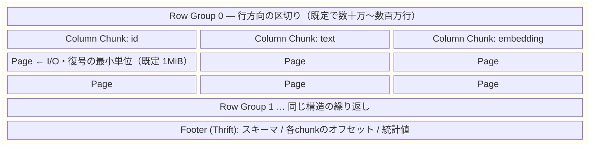
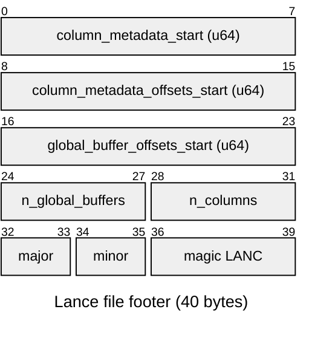
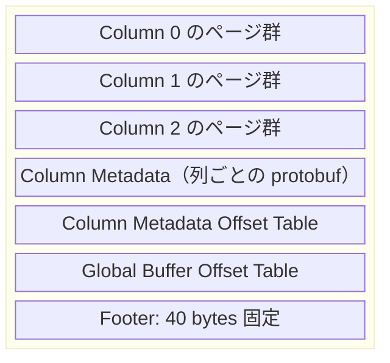
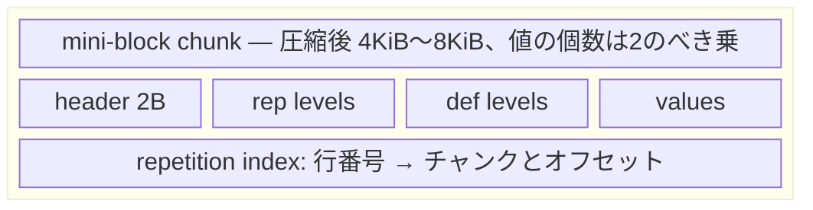
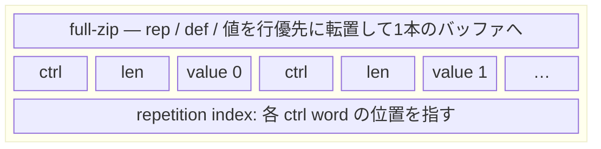

列指向フォーマットのLanceが、Parquetと比べて何を変えたのかを扱う。ファイルフォーマットとしての内部構造、とくにランダムアクセス性能を左右するstructural encodingの設計を中心に見ていく。Lanceの立ち位置を測る第3の基準点としてArrow IPC（Feather v2）も比較に入れた。一方、LanceDBのベクトル検索APIの使い方やANNインデックスのチューニングは扱わない。

計測に使ったコードはすべてこの記事のcompanionディレクトリに置いてあり、`nix develop`と`uv run --frozen`で再現できる。

## TL;DR

- LanceはParquetの置き換えを狙ったフォーマットではなく、Parquetが構造的に苦手な「特定の行IDの集合を取り出す」処理のために設計されている
- 差を生んでいるのはmini-blockとfull-zipという2つのstructural encoding。ページ全体を伸長しないと1値を取り出せないParquetに対し、Lanceは1〜2回のI/Oで1行に到達する
- 20万行で実測したところ、1行取得あたりの読み取りバイト数はParquet（pyarrowデフォルト設定）の6741KiBに対しLanceは3.0KiB、512バイトのベクトル列では0.5KiB、つまり値そのもののサイズちょうどまで落ちた
- Parquet側もページサイズとrow groupサイズを詰めれば20倍以上まで改善する。ただしファイルサイズとスキャン性能を犠牲にするトレードオフになる
- Arrow IPC（Feather v2）も比較に入れると全スキャンは最速だが、ランダムアクセスは1行あたり36MB読む。Lance 2.0のエンコーディングはこのArrow風のレイアウトで、2.1はそれを意図的に捨てている

## 背景: 全スキャンからランダムアクセスへ

Parquetが想定している典型的なアクセスは「大量の行を読んで集約する」処理になる。`WHERE`で行を絞り、必要な列だけを読み、合計や平均を計算する。列指向のレイアウト、row group単位の統計値によるスキップ、列ごとの圧縮は、すべてこのパターンに向けて最適化されている。

ところが機械学習まわりのワークロードでは、主役が別のパターンに移っている。

- **ベクトル検索** — ANNインデックスが返すのは行IDのリストであり、その後に「この100行の本文とメタデータを取ってこい」という取り出しが続く
- **学習データローダー** — エポックごとにシャッフルした順序で読むため、アクセスは定義上ランダムになる
- **マルチモーダルなデータ** — 画像・音声・埋め込みベクトルのように、1行1列の値が数KB〜数MBある

いずれも「行IDを指定して少数の行を取り出す」処理、いわゆる`take`が支配的になる。そしてこれはParquetがもっとも苦手とする操作にあたる。

### LanceとLanceDBの関係

用語を先に整理しておく。「Lance」と呼ばれるものは実際には3層に分かれている。

- **Lanceファイルフォーマット** — 拡張子`.lance`の単一ファイルの中身の規約。この記事の主題
- **Lanceテーブルフォーマット** — 複数のデータファイル、manifest、バージョン履歴、二次インデックスをまとめたディレクトリ構造
- **LanceDB** — 上の2つの上に載るデータベース。ベクトル検索やフルテキスト検索のAPIを提供する

Parquetと直接比較できるのは1層目にあたる。2層目はIcebergやDelta Lakeと同じレイヤーにあたり、3層目にいたってはフォーマットの話ではない。「LanceDBはParquetより速い」という主張を見かけたら、どの層の話なのかを確認したほうがよい。

## Parquetの構造をおさらいする

Lanceが何を変えたのかを理解するには、まずParquetがどう組み立てられているかを押さえる必要がある。

### row group / column chunk / page の三層

Parquetファイルは行方向と列方向の二重の分割になっている。



重要なのは、**pageがエンコードとI/Oの最小単位になっている**という点にある。ある1行の値を読みたいとき、実際に読んで復号されるのはその行を含むpage全体になる。

### ランダムアクセスが効かない4つの理由

この構造からランダムアクセスの弱さが導かれる。[Lanceの論文](https://arxiv.org/abs/2504.15247)は理由を次のように整理している。

**1. pageサイズぶんの読み取り増幅が発生する。** 1KBの値を1つ読むために1MiBのpageを読むなら、読み取り量は1000倍に増幅される。pageを小さくすればこれは減るが、後述の副作用がある。

**2. 圧縮がopaqueになっている。** SnappyやZstdでpage全体を圧縮すると、1つの値を取り出すためにpage全体を伸長する必要がある。論文の表現では「単一の値の伸長は不可能であり、1つの値にアクセスするために複数の値を伸長しなければならない」となる。デルタ長エンコーディングのようなpage内エンコーディングも同じ性質を持つ。

**3. definition / repetition levelがpage内にインラインで置かれている。** これはネストした型をフラットな列に落とすDremelの仕組みで、`List<String>`のような型では各値に対応するlevel情報がpageの中に埋め込まれる。levelはRLEで符号化されているため、page内のN番目の値の位置を知るにはpageの先頭からlevelを復号していくことになる。ネストが深くなるほどこのコストは効いてくる。

**4. row groupサイズをファイル全体で1つしか選べない。** 論文が指摘するのは、型ごとに最適なrow groupサイズが違うという点にある。小さい型は大きいrow groupを好み、大きい型は小さいrow groupを好む。1つのファイルに両方の列があると、どちらかを諦めることになる。

これに加えて、page単位でのスキップを可能にするpage indexにもコストがある。論文によると、parquet-rsの実装ではオフセットインデックスがpageあたり20バイトを消費する。値あたり128バイト以上の大きな型を10億行ぶん格納すると、インデックスだけで20GiBのメモリが必要になる計算になる。

### pageを小さくすると何が改善し、何を失うか

ここが個人的にいちばん面白かったところで、論文はParquetを一方的に古いフォーマット扱いしていない。むしろ**適切に設定すればParquetのランダムアクセス性能は既定値の60倍以上まで改善する**と述べている。

つまり「Parquetはランダムアクセスが遅い」という要約では足りない。「Parquetの既定の設定がランダムアクセスに向いておらず、向けようとするとスキャン性能とメモリ使用量を犠牲にする」と言うほうが正確になる。Lanceが主張しているのは、そのトレードオフを踏まずに済ませられるという点にある。

## Lanceの構造

### 40バイトの固定長フッター

Lanceのデータファイルは、末尾が40バイトの固定長フッターで終わる。可変長のThriftメタデータを持つParquetと違って、フッターの読み方が固定されているので、`struct`だけでパースできる。



図中の数字はフッター先頭（ファイル末尾から40バイト手前）を0としたバイトオフセットになる。この並びはそのまま`struct`の書式文字列に写せる。

::file[./lance-vs-parquet/src/footer.py#L7-L25]

先ほどのベンチマークで書き出したファイルに対して実行すると、こうなる。

```text
bench-data/data.lance/data/0111...02.lance (107,646,768 bytes)
  column_metadata_start          107643964
  column_metadata_offsets_start  107646664
  global_buffer_offsets_start    107646712
  num_global_buffers             1
  num_columns                    3
  major_version                  2
  minor_version                  1
  magic                          b'LANC'

  data   107,643,964 bytes (99.9974% of file)
  meta   2,804 bytes
```

`major_version`が2、`minor_version`が1なので、pylance 10.0.0はファイルフォーマット2.1で書き出していることが確認できる。ファイル全体のレイアウトは次のようになっている。



列メタデータが列ごとに分かれていて、そのオフセット表が別にあるところがポイントになる。3列のうち1列だけ読みたいとき、読むべきメタデータはその列のぶんだけで済む。列数が数千に及ぶワイドなスキーマでは、フッター全体をThriftで復号しなければならないParquetとの差が効いてくる。

### mini-block: 小さい値のための構造

Lance 2.1は、列の値の大きさに応じて2つのstructural encodingを使い分ける。[公式ドキュメント](https://lance.org/format/file/encoding/)によると、切り替えのしきい値は値あたり256バイトである（論文では実験にもとづく値として128バイトが挙げられており、実装とは数字が異なる）。

小さい値に使われるのがmini-blockになる。データを小さなチャンクに分割し、各チャンクが独立に復号できるようにする。

- チャンクは圧縮後で4KiB〜8KiB、つまりディスクセクタ1〜2個に収まるサイズを狙う
- チャンク内の値の個数は2のべき乗で、既定の上限は4096個（環境変数`LANCE_MINIBLOCK_MAX_VALUES`で調整できる）
- 各チャンクはrepetition level、definition level、値のバッファを個別に持ち、8バイト境界にそろえられる



Parquetとの決定的な違いは、repetition indexを別に持っている点にある。これは「何番目の行がどのチャンクのどこから始まるか」を引くための索引で、これがあるおかげでチャンクの中身を先頭から復号しなくても目的の行に到達できる。結果として、**ネストが何段あってもランダムアクセスは1回のI/Oで済む**。Parquetがネストの深さに応じて悪化するのと対照的な挙動になる。

チャンクを小さくすると索引が肥大化しそうに思えるが、論文はここも実測している。mini-blockの探索用メタデータはチャンクあたり24バイト、repetition indexを含めても41バイトで、10億行でも最大1.28GiBに収まる。先ほどのParquetの20GiBと比べると桁が違う。

### full-zip: 大きい値のための構造

256バイトを超える値、たとえば埋め込みベクトルや画像バイナリにはfull-zipが使われる。こちらは発想がかなり違う。

mini-blockが「バッファを種類ごとに並べたチャンク」なのに対し、full-zipは**repetition level、definition level、値をすべて行優先に転置して1本のバッファにまとめる**。各値の直前には、その値のrepetition情報とdefinition情報をビットパックした1〜4バイトのcontrol wordが置かれる。可変長の値の場合は、オフセット配列ではなく長さを値の直前に持たせる。



こうすると、ある1行のデータが物理的に連続した1区間になる。あとはrepetition indexでその区間の開始位置を引けばよく、**可変長の列でもランダムアクセスは最大2回のI/Oで完結する**。論文が示す「ネストの深さに依存しない」という性質はここから来ている。

### transparentな圧縮とopaqueな圧縮

Lanceがもう1つこだわっているのが圧縮の透過性になる。ドキュメントに挙がっている圧縮方式は次のとおりで、多くは「どこからどこまでが何番目の値か」をメタデータから計算できる。

- **bitpacking** — 固定長の値から使っていない上位ビットを削る。圧縮後のビット幅はメタデータに明示される
- **FSST** — 可変長の文字列向けの高速な圧縮
- **RLE** — 同じ値の連続を畳む。既定では圧縮率が0.5を下回る場合に採用される
- **dictionary** — 値の種類が少ない列で辞書に置き換える

LZ4やZstdのような汎用圧縮も選べるが、それを使った時点でブロック全体を伸長する必要が生じる。Parquetの既定がまさにこの状態にあるわけで、Lanceは「1値だけ取り出せる圧縮」を優先している。

### Arrowレイアウトとの距離

ここまでのレイアウトは、Arrowを知っている人ほど既視感があるはずで、実際に外形はよく似ている。ただし「LanceはArrowに似ている」という言い方は3つの層を混ぜてしまうので、分けたほうがよい。

**メモリ表現としてのArrowは、Lanceの前提になっている。** LanceはArrowと競合していない。`lance.write_dataset`はArrowのテーブルを受け取り、`take`はArrowのテーブルを返し、スキーマもArrowのスキーマで表現される。だからこそ後述するように、Parquetからの移行が実質2行で書ける。

**ファイルフォーマットとしてのArrow IPC（Feather v2）は、ParquetやLanceと同じ土俵に乗る。** こちらはrecord batchを連結してフッターを付けた構造で、Lanceの「ページ群 + 列メタデータ + フッター」という外形とは確かに近い。ただし設計目標が違う。Arrow IPCが狙っているのは、メモリ上の表現をできるだけ変換せずにディスクへ書き、読むときもできるだけ変換せずに戻すことにある。読み取りの単位はrecord batchで、pyarrowのIPCリーダーには列プロジェクションの機能すらない。この性質は後述のベンチマークにそのまま数字として出る。

**エンコーディングとしてのArrowは、Lanceが2.1で捨てたものになる。** ここがいちばん面白いところで、**Lance 2.0のエンコーディングはまさにArrow風だった**。論文はLance 2.0を「Arrow-style encoding」と呼んで測定対象に含めており、スカラー型ではParquetを上回る一方、文字列とネストした型では大きく劣化したと報告している。

原因はArrowのレイアウトそのものにある。Arrowは1つの論理的な値を複数のバッファに分散させる。`List<String>`なら、validityビットマップ、リストのオフセット、文字列側のvalidity、文字列のオフセット、文字列本体で5本になる。全部を順に読むなら理想的な形で、各バッファが連続しているのでSIMDがそのまま効く。しかし1行だけ取り出すには5回のI/Oが必要になり、ネストが1段深くなるごとに悪化する。

full-zipの「rep / def / 値を行優先に転置する」という設計は、このArrow的なレイアウトの逆張りにあたる。列指向フォーマットの中に、ランダムアクセスされる列だけ行指向の島を作っている、と言ってもいい。つまり「LanceはArrowに似ている」は外側については正しく、中身については**2.0までは正しかった**ということになる。

## 実測してみる

### 何を測るか

ここが計測設計でいちばん悩んだところで、最初は素直に実行時間を測っていた。しかしコンテナ上での実行時間はディスクの性質、ページキャッシュの状態、そしてpyarrowの並列度に強く引きずられ、走らせるたびに2倍以上ぶれた。

そこで主軸に据えたのが`/proc/self/io`の`rchar`になる。これはプロセスが`read()`系のシステムコールで読み取ったバイト数の累計で、ページキャッシュにヒットした読み取りも計上される。つまり**ディスクの速度に依存せず、フォーマットの構造だけで決まる読み取り増幅を測れる**。

::file[./lance-vs-parquet/src/bench.py#L47-L53]

比較する構成は4つにした。

::file[./lance-vs-parquet/src/bench.py#L103-L122]

`parquet(default)`はpyarrowの既定値をそのまま使う。20万行程度ではrow groupが1つしか作られず、1行を読むためにcolumn chunk全体を読むことになる。`parquet(tuned)`はpageを8KiB、row groupを8192行まで小さくし、page indexも書き出した設定にあたる。`arrow-ipc`はFeather v2、つまりArrow IPCファイルで、こちらも既定値のまま（LZ4圧縮、64K行のrecord batch）にした。

データは20万行、`id`（int64）、`text`（約110バイトの文字列）、`embedding`（`fixed_size_list<float32, 128>`、512バイト）の3列にした。textはmini-block、embeddingはfull-zipの領域に入る。

ランダムアクセスの測定はこの部分になる。

::file[./lance-vs-parquet/src/bench.py#L161-L193]

pyarrowには行単位でpageを取りに行くAPIがないため、Parquet側はrow groupを特定して`read_row_group`で読み、そこから1行を切り出している。これはPython環境から実際に得られる挙動であり、row groupを小さくしないとランダムアクセスが成立しないという事情がそのまま数字に出る。Arrow IPCも同じ方針でrecord batchを特定して`get_batch`で読んでいるが、こちらは列を選べないため、目的の列だけでなくbatch全体が読まれる。

### 結果

環境はlance 10.0.0 / pyarrow 25.0.1 / Python 3.12を使った。

まずファイルサイズ。

| 構成             | ファイルサイズ | ブロック数       |
| ---------------- | -------------- | ---------------- |
| parquet(default) | 111.1MB        | row group 1個    |
| parquet(tuned)   | 125.7MB        | row group 25個   |
| arrow-ipc        | 112.5MB        | record batch 4個 |
| lance            | 107.6MB        | -                |

ランダムアクセス向けにParquetを詰めると、ファイルサイズが111.1MBから125.7MBへ13%増えている。pageが小さくなるぶんヘッダーとpage indexのオーバーヘッドが乗るためで、これが先ほど書いたトレードオフの実体にあたる。

次に全スキャンで読まれたバイト数。

| 構成             | text  | embedding |
| ---------------- | ----- | --------- |
| parquet(default) | 7.0MB | 103.1MB   |
| parquet(tuned)   | 7.3MB | 117.0MB   |
| arrow-ipc        | 9.3MB | 102.4MB   |
| lance            | 4.8MB | 102.4MB   |

全スキャンでは、どのフォーマットもその列のぶんをまるごと読むので大差はつかない。目につくのはtext列で、Lanceの4.8MBが最小、`arrow-ipc`の9.3MBが最大になっている。Lance側はmini-blockの中でFSSTや辞書が効いており、Arrow IPCはメモリ表現に近い形を保つぶん圧縮が浅い。`parquet(tuned)`のembeddingが117.0MBと最大なのは、pageを8KiBに刻んだオーバーヘッドがそのまま読み取り量に乗るためになる。

本命の、1行取得あたりの読み取りバイト数がこちら。

| 構成             | text（約110B） | embedding（512B） |
| ---------------- | -------------- | ----------------- |
| parquet(default) | 6741.1KiB/row  | 100666.7KiB/row   |
| parquet(tuned)   | 285.4KiB/row   | 4622.7KiB/row     |
| arrow-ipc        | 36014.1KiB/row | 36014.1KiB/row    |
| lance            | **3.0KiB/row** | **0.5KiB/row**    |

embeddingの0.5KiB、つまり512バイトは、値そのもののサイズと一致する。full-zipのレイアウトが読み取り増幅をほぼゼロにしている、ということが数字として出た。textの3.0KiBもmini-blockのチャンクサイズ（4KiB〜8KiBを狙う設計）と整合する。

`arrow-ipc`の行は、2つの列でバイト数が1バイトも違わない。これは偶然ではなく、IPCリーダーが列を選べないことの直接の帰結にあたる。どの列を要求しても、そのrecord batchの全列がまるごと読まれる。前のセクションで書いた「Arrow IPCはランダムアクセスを想定していない」という話が、いちばんはっきり出た数字だと思う。

参考までに1行あたりの所要時間も載せておく。

| 構成             | text          | embedding      |
| ---------------- | ------------- | -------------- |
| parquet(default) | 34601.8us/row | 290433.0us/row |
| parquet(tuned)   | 1982.8us/row  | 8914.7us/row   |
| arrow-ipc        | 11503.1us/row | 12278.6us/row  |
| lance            | 538.1us/row   | 501.3us/row    |

Parquetもチューニングによってembeddingで30倍改善しており、論文の「既定値の60倍以上」という主張と方向は一致している。それでもLanceとはさらに1桁の差が残った。

### この数字から言えること、言えないこと

読み取りバイト数のほうは、3回走らせても1バイトも変わらなかった。これはフォーマットのレイアウトから決まる量なので当然で、だからこそ環境が変わっても再現する数字として信頼できる。

一方、全スキャンについては読み取りバイト数だけを出して、実行時間の表は作らなかった。理由は、この数字がフォーマットよりも実装の並列度を測ってしまうところにある。実際に測ると、embedding列の全スキャンは`parquet(default)`が627ms、`parquet(tuned)`が69ms、`arrow-ipc`が40ms、Lanceが528msだった。`parquet(default)`が遅いのはrow groupが1つしかなく単一スレッドで復号されるからで、pyarrowはrow group単位で並列化する。row groupを25個に割った`parquet(tuned)`が一気に速くなるのも同じ理由による。

`arrow-ipc`が最速なのは設計どおりで、メモリ表現に近い形で置いてあるものをほぼ変換せずに返しているためになる。ただしここでLanceが528msと遅く出ている点については、原因を切り分けられていない。列を1つだけ持つデータセットで測り直すと順位が入れ替わってLanceが速くなる場面もあり、この条件下でのスキャン時間の比較はフォーマットの優劣というより設定と並列度の話になっている。論文はLance 2.1がParquetの1.3〜2.0倍のスキャン性能を出すと報告しているが、それを手元の環境で再現したとは言えないので、ここでは主張しないでおく。

## Lanceはテーブルフォーマットでもある

ここまではファイル1つの話だったが、`lance.write_dataset`が作るのはディレクトリになる。

```text
data.lance/
├── data/
│   └── 0111...02.lance          ← 実データ（fragment）
├── _versions/
│   ├── 18446744073709551614.manifest
│   └── latest_version_hint.json
└── _transactions/
    └── 0-8b991fe3-....txn
```

manifestがスキーマとfragmentの一覧を持ち、書き込みのたびに新しいバージョンが積まれる。これはIcebergやDelta Lakeがやっていることとほぼ同じで、つまりLanceは**ファイルフォーマットとテーブルフォーマットを1つのプロジェクトで垂直に設計している**。ここがParquetとの構図の違いとしては最大かもしれない。

Parquet側は分業になっている。ファイルフォーマットはParquet、テーブルフォーマットはIcebergやDelta Lake、ベクトルインデックスはさらに別のシステムという構成で、それぞれ独立に進化してきた。相互運用性という意味では大きな強みになる。一方で、ベクトルインデックスが返した行IDから実データを取りに行くところは層をまたぐので、そこの最適化は誰の担当でもなくなる。Lanceはその一連の流れを1つの設計に閉じ込めた、と理解している。

## 使い分けの指針

書いてきた内容をふまえると、選択の基準はかなりはっきりしている。

**Parquetを選ぶべき場合。** データウェアハウスやデータレイクの共有フォーマットとして置く場合は、まずParquetでよい。エコシステムの広さは他に代えがたく、Spark、DuckDB、BigQuery、Snowflake、Polars、pandasのすべてが読める。アクセスパターンが全スキャンと集約に寄っているなら、Lanceに移る動機はそもそも薄い。

**Lanceを選ぶべき場合。** 行IDを指定した取り出しがワークロードの主役になっているなら、検討する価値がある。具体的にはベクトル検索の実データ取得、学習データローダー、大きな値を持つマルチモーダルデータセットあたりが該当する。バージョニングを含めて1つのシステムで完結させたい場合もこちら。

**Arrow IPCを選ぶべき場合。** プロセス間でデータを受け渡す、あるいは中間結果を一時的に置くだけなら、Arrow IPCで足りる。今回の計測でも全スキャンは最速だった。ただしランダムアクセスは設計の対象外にあり、record batch単位でしか読めず列も選べない。長期保存の共有フォーマットとして置くにはParquetほどのエコシステムもない。

**移行のコストは低い。** LanceはArrowをそのまま受け取れるので、変換は実質2行で済む。

```python
import lance
import pyarrow.parquet as pq

lance.write_dataset(pq.read_table("data.parquet"), "data.lance", mode="overwrite")
```

読み出し側もDuckDB、Polars、pandas、PyTorchから使えるので、Parquetを捨てずに「ランダムアクセスが必要なデータセットだけLanceに置く」という併用が現実的だと思う。実際、Lanceのリポジトリ自身が「2行のコードでParquetから変換できる」と宣伝している。

::gh-card[lancedb/lance]

## 再現手順

companionディレクトリの`flake.nix`はnixpkgsをコミットで固定し、Pythonインタプリタとuvだけを供給する。pylanceはnixpkgsに入っていないので、Pythonの依存関係は`uv.lock`側で固定する二段構えにした。

::file[./lance-vs-parquet/flake.nix]

::file[./lance-vs-parquet/pyproject.toml]

```bash
cd posts/techblog/ja/development/lance-vs-parquet
nix develop
uv run --frozen src/bench.py
uv run --frozen src/footer.py bench-data/data.lance/data/*.lance
```

## 終わりに

調べる前は「新しいフォーマットが出てきて、ベクトル検索向けに速いらしい」くらいの認識だったが、論文を読むと話がかなり違った。Parquetのランダムアクセスの弱さはpageサイズという設定の問題として説明でき、実際に設定を詰めれば10〜30倍まで改善する。そのうえで、改善するとスキャン性能とメモリを失う。Lanceが解こうとしているのはこのトレードオフそのものにあたる。この構図が見えたのが収穫になった。

もう1つ意外だったのが、Arrowとの関係になる。Lanceは外形がArrowに似ているし、APIもArrowで揃えてある。それでいてエンコーディングのレイヤーでは、Arrow風だった2.0の設計をランダムアクセスのために捨てている。「バッファを種類ごとに連続させる」というArrowの美点が、そのままランダムアクセスの弱点になっているという構図は、言われてみればあたりまえなのに自分では気づいていなかった。

ファイルフォーマットの設計を「どのアクセスパターンにどれだけのI/O回数を割り当てるか」という問題として見ると、mini-blockとfull-zipの使い分けはかなり素直な結論に見える。値が小さいならまとめて読んだほうが得で、値が大きいなら1つずつ取り出せたほうが得、というだけの話でもある。

なお、Lanceのファイルフォーマットは2.2の議論が進んでおり、この記事の内容は2.1時点のものになる。

- [Lance: Efficient Random Access in Columnar Storage through Adaptive Structural Encodings (arXiv:2504.15247)](https://arxiv.org/abs/2504.15247)
- [Lance file format specification](https://lance.org/format/file/)
- [Encoding Strategy - Lance](https://lance.org/format/file/encoding/)
