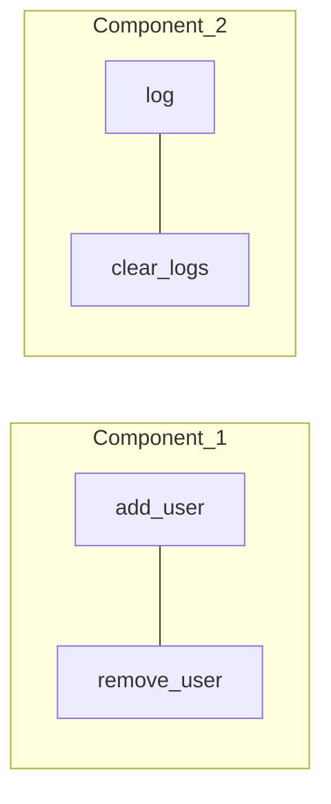

## TL;DR

- **LCOM**（Lack of Cohesion of Methods）はクラス内のメソッドが共通のインスタンス属性をどれだけ参照しているかを測る、CKメトリクス由来の凝集度指標
- 主要バリアントは3系統。**LCOM1/2**（Chidamber-Kemererによるペアカウント）／**LCOM4**（Hitz-Montazeriによるグラフ連結成分）／**LCOM96**（Henderson-Sellersによる $[0, 1]$ 正規化）
- 「値が小さい=凝集度が高い」という方向は共通だが、スケールも0の意味も違うので、複数のクラスを比較するときはバリアントを揃えること
- Pythonの`ast`モジュールだけで、4種類のLCOMを計算する100行程度のスクリプトが書ける

## 凝集度（cohesion）とは

オブジェクト指向設計の経験則として「**高凝集・低結合**」がよく挙げられます。凝集度（cohesion）は1つのモジュール（クラス）内の要素がどれだけ強く関連しているかを表す概念で、Single Responsibility Principle（SRP）と表裏の関係にあります。1つのクラスが複数の責務を持つほど、内部のメソッド群は別々のサブグループに分かれていくはずだ、という発想です。

問題は、これを定量的に測りたいときに「関連している」をどう定義するかです。LCOMはこれを「**共通のインスタンス属性を参照していれば関連している**」と単純化することで計算可能にしました。逆向きの命名（cohesionではなく*lack of* cohesion）になっているのは、後述するLCOM1の定義上、値が大きいほど凝集度が低くなるためです。

## LCOM の系譜

LCOMはこれまでに何度も再定義されており、文献によって「LCOMx」の番号付けが揺れる厄介なメトリクスです。代表的なものを時系列で並べると以下のようになります。

| 年    | 提案者                      | 名称           | 計算方法              | 値域            |
| ----- | --------------------------- | -------------- | --------------------- | --------------- |
| 1991  | Chidamber & Kemerer         | LCOM1          | 非共有ペア数          | $[0, \infty)$   |
| 1994  | Chidamber & Kemerer（改訂） | LCOM2          | $\max(P - Q, 0)$      | $[0, \infty)$   |
| 1995  | Hitz & Montazeri            | LCOM4          | グラフの連結成分数    | $[0, m]$        |
| 1996  | Henderson-Sellers           | LCOM\* / LCOM96 | 属性ごとの平均利用率  | $[0, 1]$ 程度   |

以下、それぞれの定義と問題点を見ていきます。表記を揃えるため、本記事ではクラス内のメソッド集合を $M$、属性集合を $A$ と書きます。メソッド数を $|M| = m$、属性数を $|A| = k$ とし、メソッド $m_i$ が参照する属性集合を $I_i \subseteq A$ で表します。

## LCOM1（Chidamber & Kemerer 1991）

最初のLCOMはシンプルです。「**共通の属性を参照していないメソッドペアの個数**」をそのままLCOMと定義します。

$$
\text{LCOM1} = |\{ (m_i, m_j) \mid i < j, \; I_i \cap I_j = \emptyset \}|
$$

理屈としては「メソッド同士が同じ属性を触っていない＝関連が薄い」ペアを数え上げる、というだけです。

### 問題点

LCOM1には2つの大きな弱点があります。

**1つ目: 値が大きすぎて実質的に区別がつかない**。属性をまったく共有しないクラスでは ${}_n C_2$ になり、メソッド数が10個あればLCOM1は45です。10メソッドで45も20メソッドで190も「悪い」としか言えず、優劣を比較できません。

**2つ目: 共有ペアの存在が反映されない**。属性を共有するペアがいくつあろうと、非共有ペアの数しか見ていないため、内部構造の違いを潰してしまいます。これを是正したのがLCOM2です。

## LCOM2（Chidamber & Kemerer 1994）

CKメトリクスの論文の改訂版で再定義されたバリアントです。共有ペア数 $Q$ と非共有ペア数 $P$ の差を取ります。

$$
\text{LCOM2} = \max(P - Q, \; 0)
$$

ここで $P = |\{(m_i, m_j) \mid I_i \cap I_j = \emptyset\}|$、 $Q = |\{(m_i, m_j) \mid I_i \cap I_j \neq \emptyset\}|$ です。 $P < Q$（共有が非共有を上回る）の場合は0にクリップされます。

### 問題点

「凝集度が十分高いクラスはみんな0」という縮退が起きやすく、結果としてリファクタリング候補を絞り込めない、という批判があります。これをきっかけに、$[0, 1]$ にスケールする正規化型のメトリクスが提案されていきます。

## LCOM4（Hitz & Montazeri 1995）

グラフ理論を持ち込んだバリアントで、最も直感的な定義のひとつです。

メソッドをノードとし、以下の条件のいずれかを満たすメソッドペアにエッジを張ったグラフを構成します。

1. 共通のインスタンス属性を参照している
2. 一方が他方を直接呼び出している（`self.method()`）

このグラフの**連結成分数**がLCOM4です。



連結成分が1ならクラスは分割できない、2以上なら成分ごとに別クラスに切り出せる、という解釈になります。「2以上ならSRP違反の可能性がある」という運用上の閾値が明確で、リファクタリングの起点として使いやすいのがこのバリアントの強みです。

メソッド呼び出しもエッジに含める点が重要で、これによって「ヘルパーメソッドは引数しか触らないので属性ベースだと孤立する」という偽陽性を緩和できます。

## LCOM96 / LCOM\*（Henderson-Sellers 1996）

Henderson-Sellersが1996年の著書 *Object-Oriented Metrics: Measures of Complexity* で提案したバリアントで、文献によっては **LCOM5**、**LCOM\***、**LCOM-HS**、**LCOM96** と呼ばれます。本記事では「96年提案である」ことが分かりやすいLCOM96を採用します。

属性 $a_j$ を参照するメソッド数を $\mu(a_j)$、メソッド数を $m$、属性数を $k$ とすると、LCOM96は次のように定義されます。

$$
\text{LCOM96} = \frac{m - \dfrac{1}{k} \sum_{j=1}^{k} \mu(a_j)}{m - 1}
$$

分子の $\frac{1}{k} \sum \mu(a_j)$ は「**1つの属性を平均何個のメソッドが参照しているか**」を表します。すべてのメソッドがすべての属性を参照する完全凝集の場合、この値は $m$ になり、LCOM96は0になります。逆にどのメソッドも互いに別々の属性しか触らない場合、$\mu(a_j) = 1$ で平均は1、LCOM96は1に近づきます。

### LCOM96 の利点と注意点

$[0, 1]$ にほぼ正規化されているため、メソッド数の異なるクラス同士でも値を比較しやすいのが最大の利点です。

ただし「ほぼ」と書いたのは、$\mu(a_j)$ の平均が1未満の場合（つまり多くの属性を1つのメソッドだけが触る、より極端なケース）、LCOM96は1を超えうるためです。文献によっては $[0, 2]$ と書かれているのはこのためで、実装する側は値域を $[0, 1]$ に決め打ちしないほうが安全です。

なお属性数が0のクラス（例えば純粋なユーティリティクラス）では分母が壊れるので、別途扱う必要があります。

## Pythonでの簡易実装

実際に動かしてみましょう。`ast` 標準モジュールだけで、Pythonソースコードを解析してLCOM1 / LCOM2 / LCOM4 / LCOM96を計算するスクリプトを書きます。

### 設計方針

- `ast.parse` でモジュールをパースし、`ClassDef` を取り出す
- 各メソッドの本体を `ast.walk` で歩き、`self.<attr>` 形式の属性アクセスを集める
- 属性ベースで4種類のLCOMを計算する
- LCOM4のみ、メソッドの直接呼び出し（`self.method()`）もエッジに含める

`__init__` は属性を*定義する*ためのメソッドで、利用するメソッドではないため、慣例に従って解析対象から外します。

### 実装

```python title=lcom.py
import ast
from collections import defaultdict
from itertools import combinations


def _self_attrs(node: ast.AST) -> set[str]:
    """self.<attr> として参照されている属性名の集合。"""
    attrs = set()
    for n in ast.walk(node):
        if (
            isinstance(n, ast.Attribute)
            and isinstance(n.value, ast.Name)
            and n.value.id == "self"
        ):
            attrs.add(n.attr)
    return attrs


def _self_calls(node: ast.AST, method_names: set[str]) -> set[str]:
    """self.method() として呼ばれているメソッド名の集合。"""
    calls = set()
    for n in ast.walk(node):
        if (
            isinstance(n, ast.Call)
            and isinstance(n.func, ast.Attribute)
            and isinstance(n.func.value, ast.Name)
            and n.func.value.id == "self"
            and n.func.attr in method_names
        ):
            calls.add(n.func.attr)
    return calls


def analyze(cls: ast.ClassDef) -> tuple[dict[str, set[str]], dict[str, set[str]]]:
    methods: dict[str, ast.AST] = {}
    for item in cls.body:
        if isinstance(item, (ast.FunctionDef, ast.AsyncFunctionDef)):
            if item.name == "__init__":
                continue
            methods[item.name] = item

    names = set(methods)
    attr_use = {n: _self_attrs(node) - names for n, node in methods.items()}
    call_use = {n: _self_calls(node, names) for n, node in methods.items()}
    return attr_use, call_use


def lcom1(attr_use: dict[str, set[str]]) -> int:
    vs = list(attr_use.values())
    return sum(1 for a, b in combinations(vs, 2) if a.isdisjoint(b))


def lcom2(attr_use: dict[str, set[str]]) -> int:
    vs = list(attr_use.values())
    p = q = 0
    for a, b in combinations(vs, 2):
        if a.isdisjoint(b):
            p += 1
        else:
            q += 1
    return max(p - q, 0)


def lcom4(attr_use: dict[str, set[str]], call_use: dict[str, set[str]]) -> int:
    names = list(attr_use)
    parent = {n: n for n in names}

    def find(x: str) -> str:
        while parent[x] != x:
            parent[x] = parent[parent[x]]
            x = parent[x]
        return x

    def union(x: str, y: str) -> None:
        rx, ry = find(x), find(y)
        if rx != ry:
            parent[rx] = ry

    for a, b in combinations(names, 2):
        if not attr_use[a].isdisjoint(attr_use[b]):
            union(a, b)
    for caller, callees in call_use.items():
        for callee in callees:
            union(caller, callee)

    return len({find(n) for n in names})


def lcom96(attr_use: dict[str, set[str]]) -> float:
    m = len(attr_use)
    if m <= 1:
        return 0.0
    counts: dict[str, int] = defaultdict(int)
    for attrs in attr_use.values():
        for a in attrs:
            counts[a] += 1
    k = len(counts)
    if k == 0:
        return 1.0
    mean_mu = sum(counts.values()) / k
    return (m - mean_mu) / (m - 1)
```

メソッド名と属性名の名前空間が混ざらないよう、`attr_use` からメソッド名集合 `names` を引いている点だけ注意してください。`self.foo()` の `foo` は属性アクセスとしても拾われるので、ここで明示的に除外しています。

### 動作確認

凝集度の高い `Counter` と、責務が混ざっている `Toolbox` の2クラスで値を比較してみます。

```python title=sample.py
class Counter:
    def __init__(self):
        self.count = 0
        self.history = []

    def increment(self):
        self.count += 1
        self.history.append(self.count)

    def reset(self):
        self.count = 0
        self.history.clear()

    def latest(self):
        return self.history[-1] if self.history else None


class Toolbox:
    def __init__(self):
        self.users = []
        self.logs = []

    def add_user(self, name):
        self.users.append(name)

    def remove_user(self, name):
        self.users.remove(name)

    def log(self, msg):
        self.logs.append(msg)

    def clear_logs(self):
        self.logs.clear()
```

これを `lcom.py` で解析した結果が以下です。

| クラス  | メソッド数 | LCOM1 | LCOM2 | LCOM4 | LCOM96 |
| ------- | ---------- | ----- | ----- | ----- | ------ |
| Counter | 3          | 0     | 0     | 1     | 0.250  |
| Toolbox | 4          | 4     | 2     | 2     | 0.667  |

`Counter` は3メソッドすべてが `count` か `history` を共有しており、LCOM4 = 1（連結成分1つ）。LCOM1 / LCOM2も0で、LCOM96も0.25と低めです。

一方 `Toolbox` は `users` 系の2メソッドと `logs` 系の2メソッドが互いに独立しており、LCOM4 = 2が2つのサブクラスに分割可能であることをはっきり示しています。LCOM96も0.667とCounterのおよそ2.7倍で、定量的にも凝集度が低いと判断できます。「LCOM4が2以上」というシグナルだけでも、`Toolbox` を `UserRegistry` と `Logger` に分けるリファクタリング候補に挙げる根拠になります。

## LCOM の限界

LCOMには静的解析メトリクス全般に共通する限界があります。

**継承を考慮しない**。親クラスで定義された属性へのアクセスは、子クラス側からは `self.attr` として見えますが、ASTレベルでは親クラスのメソッドが何を参照しているか分からないので、子クラスのみを解析するLCOMでは継承属性の共有関係が落ちます。

**動的属性に弱い**。`setattr(self, name, value)` や `self.__dict__[k] = v` のような動的代入は静的に追えません。Python以外でも、リフレクションを多用するコードではLCOM全般が過小評価される傾向があります。

**「属性を共有している」≠「概念的に関連している」**。LCOMは構文ベースの粗い近似で、属性名が同じでも文脈が違うケース、逆に別名でも実質同じ意味のケースを区別できません。最終判断は必ずコードを読んで人間が下す必要があります。

これらの限界を踏まえて、より洗練されたメトリクスとしてTCC（Tight Class Cohesion）/ LCC（Loose Class Cohesion）[Bieman & Kang 1995]や、メソッド呼び出しグラフを重視した変種が提案されています。ただし「単純さ」と「ある程度のシグナル性」のバランスでは、LCOM4 / LCOM96がいまだに使い勝手のよい選択肢です。

## まとめ

LCOMは1991年から30年以上にわたって改訂されてきたメトリクスで、定義の系譜を知らずに値だけ見ると判断を誤ります。実務で使うなら、以下の2つを併用するのがシンプルかつ実用的だと考えています。

- **どのリファクタリング候補を優先するか**を絞り込むLCOM4
- **クラス間の比較**をするための正規化済みLCOM96
`ast` モジュールだけで100行程度の実装ができるので、自分のプロジェクトに合った形に拡張して使うのがいちばん筋がよさそうです。値は絶対指標ではなく、コードを読み直すきっかけとして使いましょう。

### 参考文献

- Chidamber, S. R., & Kemerer, C. F. (1991). *Towards a metrics suite for object oriented design.* OOPSLA '91.
- Chidamber, S. R., & Kemerer, C. F. (1994). *A Metrics Suite for Object Oriented Design.* IEEE TSE.
- Hitz, M., & Montazeri, B. (1995). *Measuring coupling and cohesion in object-oriented systems.* ISACC '95.
- Henderson-Sellers, B. (1996). *Object-Oriented Metrics: Measures of Complexity.* Prentice Hall.
- Bieman, J. M., & Kang, B.-K. (1995). *Cohesion and reuse in an object-oriented system.* SSR '95.
