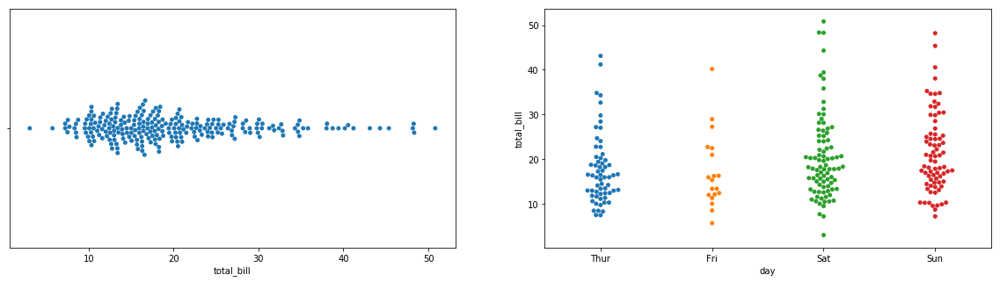
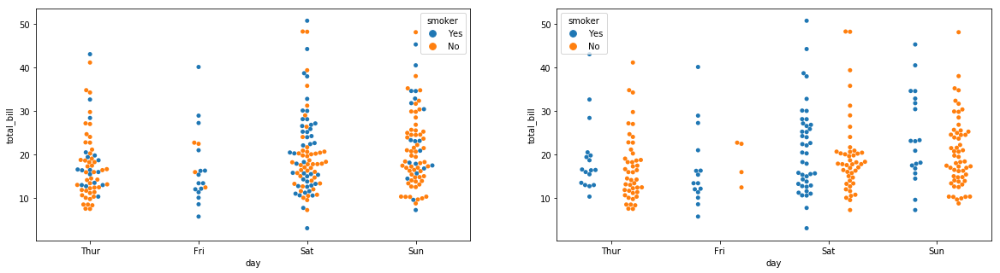
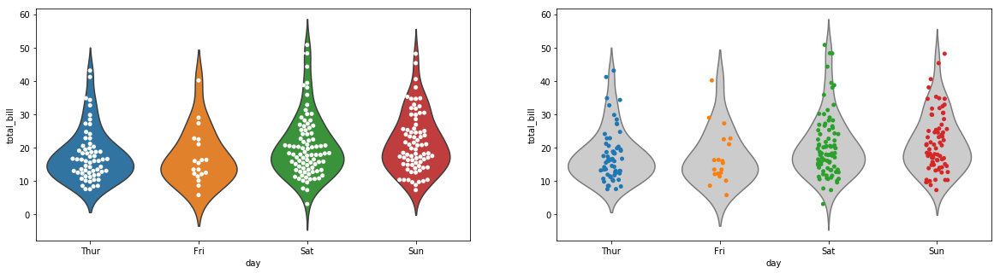

## TL;DR

統計要約量とかを特に考慮せずに、ただデータを概観したいということがあります。データの分布を概観するときには、ビースウォームプロットが便利です。seabornを使うことでPythonでもビースウォームプロットを簡単に使えます。

また、ビースウォームプロットは、ヴァイオリンプロットなどと同時に使うことで、データの分布と統計要約量をスマートに表現できます。

Rについては、[このサイト](https://stats.biopapyrus.jp/r/graph/beeswarm.html)で解説されているので参照してください。また、[公式Docs](https://seaborn.pydata.org/generated/seaborn.swarmplot.html)もわかりやすいのでおすすめです。

## 準備

### seabornのインストール

```bash
pip install seaborn
```

### データのロード

```python
import seaborn as sns

tips = sns.load_dataset("tips")
print(tips.head())

"""
   total_bill   tip     sex smoker  day    time  size
0       16.99  1.01  Female     No  Sun  Dinner     2
1       10.34  1.66    Male     No  Sun  Dinner     3
2       21.01  3.50    Male     No  Sun  Dinner     3
3       23.68  3.31    Male     No  Sun  Dinner     2
4       24.59  3.61  Female     No  Sun  Dinner     4
"""
```

このtipsデータセット、公式が提供しているだけあって非常にseabornのデモに向います。sklearnのなんかで置き換えようかと思ったのですが、tipsが強すぎました。

## 基本のプロット

```python
import matplotlib.pyplot as plt
fig = plt.figure(figsize=(20, 5))

# 1カテゴリ分のbeeswarm plot
ax1 = fig.add_subplot(121)
ax1 = sns.swarmplot(x=tips["total_bill"]) #
# 複数カテゴリのbeeswarm plot
ax2 = fig.add_subplot(122)
ax2 = sns.swarmplot(x="day", y="total_bill", data=tips) #
plt.show()
```

**出力**



## hueで分離

seabornの他のグラフと同様、hueを使うことで色分けできます。また、dodge引数を使えば、グラフ内で混在させるか分けて表示するかを選択できます。

```python
fig = plt.figure(figsize=(20, 5))
ax1 = fig.add_subplot(121)

# hueで色分け dodgeはデフォルトではFalse
ax1 = sns.swarmplot(x="day", y="total_bill", hue="smoker",
                    data=tips) #

ax2 = fig.add_subplot(122)
# hueごとに分けて表示
ax2 = sns.swarmplot(x="day", y="total_bill", hue="smoker",
                    data=tips, dodge=True) #
plt.show()
```

**出力**



## violinplotと合わせて表示する

他のプロットとあわせるとデータサイエンスしてる感が出てきます。
ヴァイオリンプロットを使います。また、こういう時に同様の用途で使われるstripplotと比較してみます。

```python
fig = plt.figure(figsize=(20, 5))

# beeswarm plot with violin plot
ax1 = fig.add_subplot(121)
ax1 = sns.violinplot(x="day", y="total_bill", data=tips, inner=None)
ax1 = sns.swarmplot(x="day", y="total_bill", data=tips,
                    color="white", edgecolor="gray")

# strip plot with violin plot
ax2 = fig.add_subplot(122)
ax2 = sns.violinplot(x="day", y="total_bill", data=tips,
                     inner=None, color=".8")
ax2 = sns.stripplot(x="day", y="total_bill", data=tips, jitter=True)
plt.show()
```

**出力**



なんとなく分布感まで見られるbeeswarm plotのほうが見やすい感じを受けます。数が多すぎると表示しきれなくなるのが難点です。この辺は表現したいデータによっても変わりそうで難しいところですが、beeswarm plotも選択肢としては有力です。

## Reference

- [seaborn.swarmplot](https://seaborn.pydata.org/generated/seaborn.swarmplot.html)
