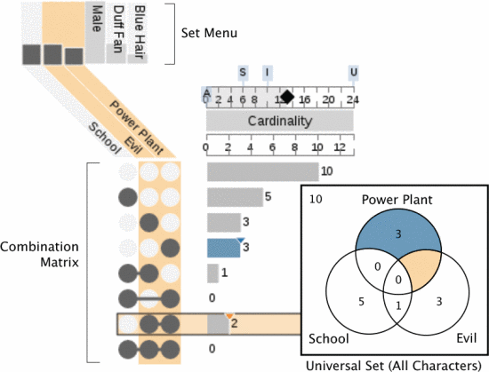
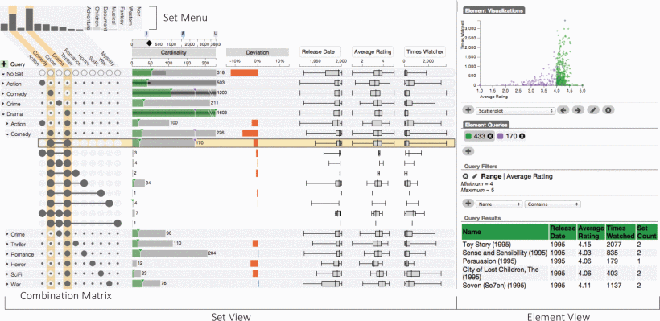
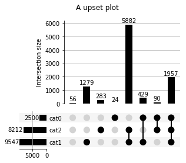
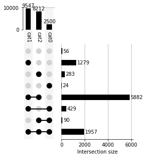
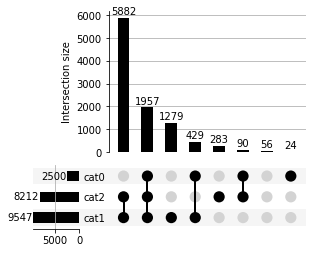
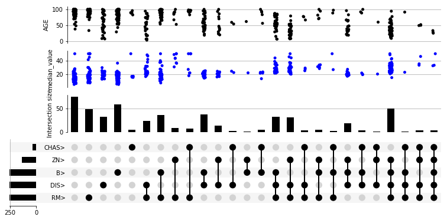
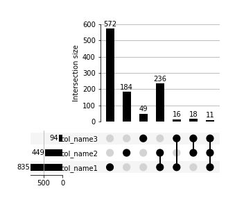

## TL;DR

集合関係の包含関係を示す際、2つや3つならベン図がわかりやすいですが、集合関係の数が増えてくるとベン図だと理解しにくくなることがあります。そこで便利なのが、Alexander Lexが2014年に提唱したUpSetPlotです。Pythonで利用する場合は以下のパッケージが定期的にメンテされており安心です（2021/8現在）

::gh-card[jnothman/UpSetPlot]

Rでの実装例は[こちらのサイト](https://stats.biopapyrus.jp/r/graph/upset.html)を参考にしてください。

## upset plotとベン図

まず、ベン図とUpset Plotが比較されている図を見てみます。


図1. venn図とupsetplot(Lex et al., 2014 Fig. 4)

3つくらいだと一長一短という感じです。集合の量的関係を見る文にはUpset Plotのほうが向いていそうです。

また、upsetplotのメリットは、拡張性が高いということです。というのは、集合関係を行で表しているため、その行に別のデータを挿入できます。例えば以下のように拡張できます。


図2. upsetplotの拡張性(Lex et al., 2014 Fig. 1)

また、集合間の量的関係を表すため、集合に属する数によってソートをかけるといったことも可能です。もちろん、拡張したデータに対してソートできます。


図3. upsetplotのソート(Lex et al., 2014 Fig. 6)

## Pythonによる実装

### Install

```bash
pip install upsetplot
```

### サンプルデータの生成

upsetplotパッケージはサンプルデータを生成できるので、まずはサンプルデータで試してみます。

```python
from upsetplot import generate_counts

examples = generate_counts()
print(examples)

""" 出力
cat0   cat1   cat2 
False  False  False      56
              True      283
       True   False    1279
              True     5882
True   False  False      24
              True       90
       True   False     429
              True     1957
Name: value, dtype: int64
"""
```

### 基本的なUpset PlotとVenn図の描画

#### venn図

サンプルデータを使ってベン図を作成します。ベン図の作成には、matplotlibのvenn3を使用します。

```python
from matplotlib_venn import venn3 
venn3(subsets=(24, 1279, 429, 28, 90, 5882, 1957), 
                set_labels=("cat0", "cat1", "cat2"))
plt.show()
```

**出力**


量が歪だと少しわかりにくいです。

#### Upset Plot

サンプルデータを使って、同様にUpset Plotを作成します。

```python
from upsetplot import plot

plot(examples, show_counts="%d")
plt.suptitle("A upset plot")
plt.show()
```

**出力**



量的関係と集合関係を分離させることで、量的関係の視覚的な理解が容易くなっています。逆に集合関係は少し理解が難しくなります。

向きを変えたり、ソートしたりも簡単にできます。

```python
plot(examples, orientation="vertical", show_counts="%d")
plot(examples, sort_by="cardinality", show_counts="%d")
plt.show()
```





### Upset Plotの拡張

scikit-learnに登録されているbostonの住宅データを使ってupsetplotの拡張を試してみましょう。

scikit-learnがない場合はインストールします。またデータ操作にpandasを使うのでpandasもインストールします。

```bash
pip install scikit-learn pandas
```

拡張には`UpSet`クラスを作成し、`add_catplot`メソッドを使用します。

```python
import pandas as pd
from sklearn.datasets import load_boston
import matplotlib.pyplot as plt 
from upsetplot import UpSet

boston = load_boston()
boston_df = pd.DataFrame(boston.data, columns=boston.feature_names)

# speamanの相関係数が高いものを上から5つとってくる
correls = boston_df.corrwith(pd.Series(boston.target), method="spearman").sort_values()
top_features = correls.index[-5:]

# とってきた特徴量に対してmedianより高いものをTrue or Falseで取得
boston_above_avg = boston_df > boston_df.median(axis=0)
boston_above_avg = boston_above_avg[top_features]
boston_above_avg = boston_above_avg.rename(columns=lambda x: x + '>')

# True or Falseでとってきたものをmulti indexとして設定
boston_df = pd.concat((boston_df, boston_above_avg), axis=1) 
boston_df = boston_df.set_index(list(boston_above_avg.columns))
boston_df = boston_df.assign(median_value=boston.target)

# 描画 add_catplot methodを使うことでupsetplotを拡張できる
upset = UpSet(boston_df, subset_size='count', intersection_plot_elements=3)
upset.add_catplot(value='median_value', kind='strip', color='blue')
upset.add_catplot(value='AGE', kind='strip', color='black')
upset.plot()
plt.show()
```



### カテゴリのリストからUpset Plotを作成する

実際のデータ(RNA-seqの発現変動遺伝子etc.,)などでは、カテゴリ列から集合関係を作成する事が多いです。そのため、カテゴリが含まれる集合からUpset Plotを作成する方法につていも記載しておきます。

カテゴリの集合をそれぞれ`category_n`として、3つのカテゴリの集合についてUpset Plotを作成します。

```python
import pandas as pd
import upsetplot

# listをpandas Seriesに変換し、初期値をTrueにする
category_1_df = pd.Series(index=category_1, data=[True]*len(category_1))
category_2_df = pd.Series(index=category_2, data=[True]*len(category_2))
category_3_df = pd.Series(index=category_3, data=[True]*len(category_3))

# それぞれのpandas Seriesを結合する。その際にTrueでない部分はNaNになるので、Falseで埋めておく。
upset_data = pd.concat((category_1_df, category_2_df, category_3_df), axis=1).fillna(False)

# 行名が0, 1, 2(int)になっているので、任意の名前に変更する
mapper = {0:"col_name1", 1:"col_name2", 2:"col_name3"}
upset_data = upset_data.rename(columns=mapper)

# upsetplot.plotメソッドを使うにはmulti indexがTrue or Falseで設定されている必要があるので、set_indexメソッドを使ってmulti indexを設定
upset_data = upset_data.set_index(list(upset_data.columns))
upsetplot.plot(upset_data, subset_size="count", show_counts="%d", sort_categories_by=None)
```



慣れてしまえばデータフレーム操作は簡単ですが、最初結構戸惑ったのでメモ代わりに残しておきます。最初にTrueで初期化するのが重要です。

## Reference

- [upsetplot Documentation](https://buildmedia.readthedocs.org/media/pdf/upsetplot/latest/upsetplot.pdf)
- Alexander Lex, Nils Gehlenborg, Hendrik Strobelt, Romain Vuillemot, Hanspeter Pfister,UpSet: Visual-ization of Intersecting Sets, IEEE Transactions on Visualization and Computer Graphics (InfoVis ‘14), vol.20, no. 12, pp. 1983–1992, 2014. doi: doi.org/10.1109/TVCG.2014.2346248
