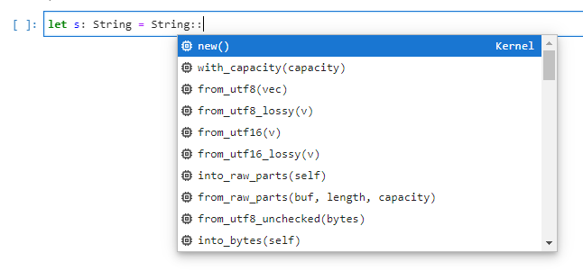

## TL;DR

とりあえずRustを動かしてみたい、といった用途ではJupyterは非常に有用な環境です。
excvrを使うことでJupyter上でRustを使うことができるようになります。
また、`jupyter-lsp`を使いrust-analyzerをJupyter上で動かせるようにすることで、開発体験を向上させます。

`polars`と抱合せですが、以下のレポジトリで動作が確認できます。

::gh-card[illumination-k/polars-pandas]

## excvr用のimageの作成

evcxr_jupyter自体のインストールは[公式](https://github.com/google/evcxr/blob/main/evcxr_jupyter/README.md)が詳しいです。
`libzmq3-dev`がないとエラーしたので、加えてあります。

今回はevcxr_jupyterのインストールに加えて、`jupyter-lab`、`jupyter-lsp`、`rust-analyzer`のインストールを行っています。

```docker title=Dockerfile
FROM rust:1.56 as rust

USER root

# 依存ライブラリのインストール
RUN apt-get update -y --fix-missing && \
    apt-get install -y build-essential cmake jupyter-notebook libzmq3-dev

# evcxr_jupyterのインストール
RUN rustup component add rust-src && \
    cargo install evcxr_jupyter && \
    evcxr_jupyter --install

# pipのインストール
RUN wget https://bootstrap.pypa.io/get-pip.py && \
    python3 get-pip.py && rm -f get-pip.py && \
    pip install jupyterlab && pip install -U jupyter_client

# lsp関連のインストール
RUN pip install jupyter-lsp jupyterlab-lsp && \
    curl -L https://github.com/rust-analyzer/rust-analyzer/releases/latest/download/rust-analyzer-x86_64-unknown-linux-gnu.gz | \
    gunzip -c - > /usr/local/bin/rust-analyzer && \
    chmod +x /usr/local/bin/rust-analyzer

CMD [ "jupyter", "lab", "--port", "8888", "--ip=0.0.0.0", "--allow-root" ]
```

## jupyter-lsp用の設定

`python`や`r`など、jupyterでメジャーな言語のものは自動でlspを検出してくれるようですが、rustの場合は自前で設定を書く必要があります。

[jupyter-lsp configuring](https://github.com/jupyter-lsp/jupyterlab-lsp/blob/master/docs/Configuring.ipynb)のScalaの例を参考に設定ファイルを作成します。
以下のファイルを`jupyter --paths`で表示されるディレクトリのどれか以下に`jupyter_server_config.d`を作成し、それ以下に配置します。

今回は`${HOME}/.jupyter/jupyter_server_config.d/rust-analyzer.json`というように配置します。

```json title=rust-analyzer.json
{
  "LanguageServerManager": {
    "language_servers": {
      "rust-analyzer": {
        "version": 2,
        "argv": ["/usr/local/bin/rust-analyzer"],
        "languages": ["rust"],
        "mime_types": ["text/x-rust"]
      }
    }
  }
}
```

## docker-composeの設定

すでに書いたように、rust-analyzer.jsonを`${HOME}/.jupyter/jupyter_server_config.d/rust-analyzer.json`に配置します。
また、`work`以下をマウントして、ローカルと共有しています。

```yaml title=docker-compose.yaml
version: "3"
services:
  jupyter:
    build:
      context: .
      dockerfile: Dockerfile
    image: jupyter
    environment:
      - TZ=Asia/Tokyo
      - JUPYTER_ENABLE_LAB=yes
    ports:
      - 8888:8888
    volumes:
      - ${PWD}/work:/work
      - "${PWD}/jupyter_server_config.d:/root/.jupyter/jupyter_server_config.d"
    working_dir: "/work"
```

### Cargo.tomlの作成

`rust-analyzer`自体はCargoがないプロジェクトでも動かせるらしいですが([参考](https://rust-analyzer.github.io/manual.html#non-cargo-based-projects))、今回は面倒なので、`Cargo.toml`を使って`docker-compse.yml`で共有するための`work`ディレクトリを作成します。

```bash
cargo new work
```

## 実行

これで、`docker-compose up`でjupyterが起動するはずです。
以下のように補完が効くようになります。



VSCodeほどではないですが、tab補完よりは快適な気がします。
